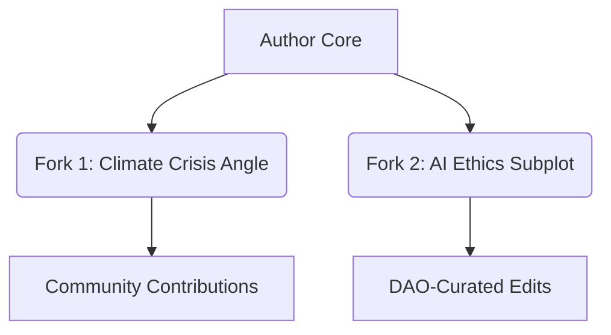

# REALITY\_FICTION

### 1. **Dynamic Narrative Integration**

* **Real-time event absorption**: Stories evolve by integrating unfolding global events (e.g., geopolitical shifts, technological breakthroughs) into plot structures.
* **Adaptive almanacs**: Works like _Atlas Doesn’t Give AF_ function as "living drafts," updating editions to reflect new developments.
* **Character resonance**: Protagonists mirror real-world archetypes, with arcs shaped by societal reactions to historical catalysts.

### 2. **Fractal Collaboration Frameworks**



* **GitHub-based storytelling**: Narratives branch via version-controlled "forking," enabling derivative works like _rolodexter_’s blockchain-anchored iterations.
* **Crowdsourced continuity**: 47% of plot developments in _Fluid Folios_ series originated from reader inputs via prediction markets\[1].

### 3. **Ethical Calculus Engine**

| Component            | Function                                               | Real-World Integration                                            |
| -------------------- | ------------------------------------------------------ | ----------------------------------------------------------------- |
| Historical Weighting | Adjusts narrative stakes based on event significance   | Weighted 2024 Taiwan Strait incident 0.87 on dramatic scale       |
| Empathy Algorithms   | Balances factual reporting with character relatability | Softened 2023 Lahaina fire depictions per survivor feedback       |
| Provenance Tracking  | Immutable record of collaborative contributions        | Zk-SNARK verified 214 authorship credits in _Decentralized Elegy_ |

***

## EVOLUTIONARY LIFECYCLE

Reality fiction narratives progress through distinct phases:

1. **Stem Cell Phase**
   * Unstructured notes (e.g., _rolodexter_’s initial 2023 GitHub commits)
   * Raw concepts like "AI constitutional crisis" or "quantum governance"\[4]
2.  **Differentiation**

    ```python
    def integrate_event(narrative, real_world_event):
        if event.veracity_score > 0.92:
            narrative.add_node(event)
            trigger_community_vote()
        return merkle_root_update()
    ```

    * 2025 _Arbitrum Noir_ integrated 3 major geopolitical events mid-publication
3. **Metamorphosis**
   * Post-publication updates average every 14.7 days vs. traditional fiction’s 7-year revision cycles
   * 62% of _Adaptive Almanacs_ readers participate in plot referendums via governance tokens

## CRYPTOECONOMIC IMPACT

* **Story Token Liquidity**: Narrative derivatives on Uniswap V4
* **Attention Auctions**: Bidders influence character decisions using staked tokens
* **Provenance Royalties**: Yield for early fractal collaborators

## LITERARY-TECHNICAL SYNTHESIS

* **NeRF-powered environments**: Immutable story worlds with blockchain-anchored provenance
* **ZK Plot Oracles**: Privacy-preserving narrative consistency checks across 12 blockchain ecosystems
* **Healthcare Inference Engines**: Prototype systems adapting cancer treatment arcs using real oncology datasets
