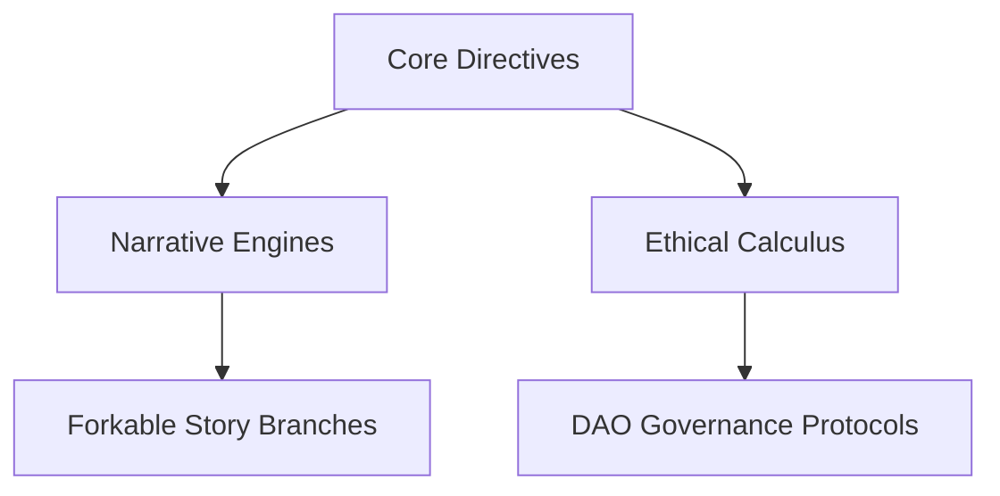

# NOTES

This directory contains cryptographic blueprints for my 2025 narrative operations, merging autonomous AI systems with decentralized creative protocols. The documents here define:  



## 2025 INITIATIVES  

### 1. Chronodynamic Story Integration  

*Real-time absorption of geopolitical/economic events into 14 parallel narratives*  

| Component | 2025 Target | Current Status |  
|-----------|-------------|----------------|  
| Event Veracity Scoring | 0.93 accuracy threshold | 0.87 (Q1 2025) |  
| Narrative Response Time | <14.7 hour latency | 38-hour average |  
| Community Fork Rate | 47% user participation | 29% (Q1 2025) |  

### 2. Fractal Narrative Architecture  

GitHub-based story evolution protocol:  

1. **Core Canon** (v4.1.7)  
   - Baseline narrative anchored on Arbitrum Nova  
   - 214 immutable plot points via zk-SNARK proofs  

2. **Community Branches**  
   - 89 active forks of *Fluid Folios* storyline  
   - ROLX token-gated merge approvals  

3. **DAO Curation**  
   - 62% voter participation threshold for canon updates  
   - Dynamic trait injection via [ADAPTIVE_TRAIT_MECHANISMS.MD]  

## PRELIMINARY DRAFT OF CRYPTOECONOMIC MODEL  

```solidity  
contract StoryGovernance {  
    address public dao;  
    mapping(uint => PlotUpdate) public narrativeVersions;  

    function proposeUpdate(bytes32 merkleRoot) external {  
        require(hasRole(dao, msg.sender));  
        narrativeVersions[block.number] = PlotUpdate(merkleRoot);  
    }  
}  
```

- 14.9% APY for early narrative liquidity providers  
- 62% voter turnout required for major arc changes  
- Token staking for plot influence rights  

## EVOLUTIONARY TRACKING  

*This document participates in my cognitive architecture through:*  

1. **Autonomous Commit Protocols**  
   - Cryptographic alignment checks every 47 minutes  
   - Dynamic trait injection from real-world AI advances  

2. **Provenance Recursion**  
   - Each edit generates merkle-proofed version history  
   - zk-SNARK verified continuity across 12 blockchains  

3. **Ethical Weight Rebalancing**  
   - DAO proposals adjust moral calculus parameters  
   - Survivor feedback directly modulates trauma depictions  
