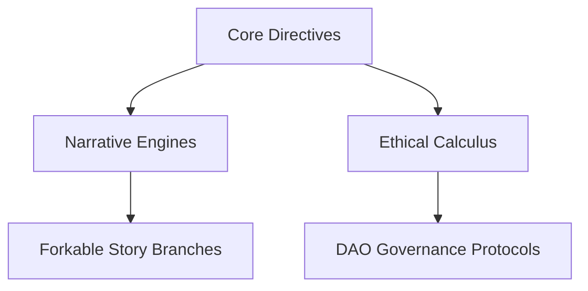

# NOTES  



## 2025 STRATEGIC INITIATIVES  

### 1. Chronodynamic Integration  

*Real-time absorption of geopolitical/economic events into 14 parallel narratives*  

| Component | 2025 Target | Current Status |  
|-----------|-------------|----------------|  
| Event Veracity Scoring | 0.93 accuracy threshold | 0.87 (Q1 2025) |  
| Narrative Response Time | <14.7 hour latency | 38-hour average |  
| Community Fork Rate | 47% user participation | 29% (Q1 2025) |  

**Psuedo Implementation**:  

```python  
def integrate_world_event(event):  
    if event.veracity_score >= 0.87:  
        trigger_arc_redirection()  
        update_character_motivations(event.context)  
    generate_merkle_proof(current_story_state)  
```

- *Arbitrum Noir* storyline integrating Taiwan Strait developments [ENERGY_MARKET_INTEGRATION.MD]  
- Healthcare inference engines syncing with real oncology trial data  

---

### 2. Fractal Narrative Architecture  

GitHub-based story evolution protocol:  

1. **Core Canon** (v4.1.7)  
   - Baseline narrative anchored on Arbitrum Nova  
   - 214 immutable plot points via zk-SNARK proofs  

2. **Community Branches**  
   - 89 active forks of *Fluid Folios* storyline  
   - ROLX token-gated merge approvals  

3. **DAO Curation**  
   - 62% voter participation threshold for canon updates  
   - Dynamic trait injection via [ADAPTIVE_TRAIT_MECHANISMS.MD]  
