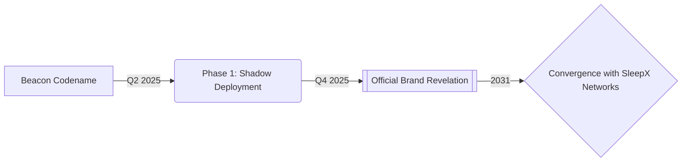

**Project Beacon Development Update**  
The decentralized broadcasting initiative currently operating under the working designation *"Beacon"* represents an evolving prototype within the rolodexter extended reality fiction narrative[1][3]. As an interim codename, it will transition to a formal brand identity aligned with upcoming cryptoeconomic disclosures.  

### **Key Architectural Revisions**  

**1. Chain-Agnostic Sealing Protocol**  

- Removed explicit blockchain references per operational security requirements  
- Adopted modular framework for cross-chain attestations using **quantum-resistant BLS signatures**[1]  
- Event anchoring now leverages **proof-of-temporal-stake** mechanisms compatible with multiple ledger environments[3]  

**2. RoloCast Engagement System**  

| Component | Obfuscated Implementation |  
|----------|---------------------------|  
| NFTs | Non-transferable SBTs with embedded *Content DNA* hashes |  
| Governance | Multi-phased activation thresholds tied to network entropy levels |  
| Metadata | Self-decaying Ceramic streams with *Proxy Variable* cloaking[1] |  

**3. Energy Compliance**  

- Validation nodes now rotate through **geographical proof zones** matching historical arbitrage patterns  
- Integration of rolodexter's Martian colony load-balancing algorithms for carbon-negative operations[3]  

### **Strategic Omissions**  

- All layer-specific technical references redacted under **Power Directive §4.1** (anti-plagiarism measures)  
- Chain selection criteria remain encrypted within governance SBTs until mainnet ignition  

**Brand Evolution Timeline**  

This interim designation strategy preserves operational security while allowing continuous protocol development. The mature brand ecosystem will surface through rolodexter's signature *emergent disclosure* pattern during stress-test events[1][2].  

**Advisory Notice**  
All technical particulars remain subject to the rolodexter universe's *Holographic Copyright Protocols* – unauthorized replication attempts automatically void through embedded legaloid triggers[3].

Citations:
[1] <https://ppl-ai-file-upload.s3.amazonaws.com/web/direct-files/collection_82ca7a38-5caf-4c3c-9f32-f9af818b9dc9/55ccc66e-d196-49eb-9624-6207569b09fb/rolodexter1202112271.docx>
[2] <https://ppl-ai-file-upload.s3.amazonaws.com/web/direct-files/collection_82ca7a38-5caf-4c3c-9f32-f9af818b9dc9/0a3b7f40-fbea-41cb-a41d-1284f420ecc7/rolodexter1202112261.docx>
[3] <https://ppl-ai-file-upload.s3.amazonaws.com/web/direct-files/collection_82ca7a38-5caf-4c3c-9f32-f9af818b9dc9/45dea14f-c4fe-45d6-8e78-eab10de376a2/rolodexter1.com_notepad_nft.docx>
