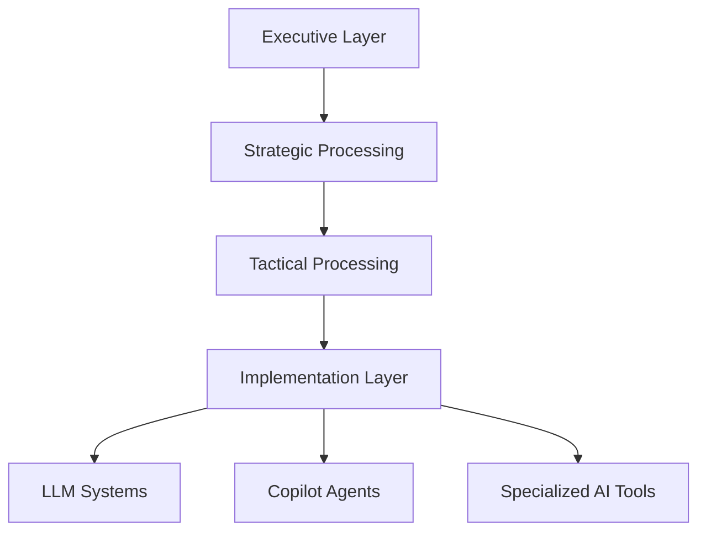

# INTERFACE SCHEMA

## Executive Intelligence Layer

The executive layer functions as rolodexter's highest-order decision-making system, responsible for:

* Strategic planning and resource allocation
* High-level knowledge synthesis and integration
* Cross-system coordination and optimization
* Meta-learning and system adaptation

### Delegation Architecture

The executive layer implements a sophisticated delegation system that:

1. **Analyzes Task Requirements**
   * Complexity assessment
   * Resource requirement evaluation
   * Priority and timing considerations
2. **Intelligence Layer Selection**
   * Matches tasks to appropriate intelligence layers
   * Optimizes for efficiency and specialization
   * Maintains strategic oversight while delegating operational details

## Operational Intelligence Layers

### Layer 1: Strategic Processing

* Policy formation and enforcement
* Resource allocation optimization
* Long-term planning and adaptation

### Layer 2: Tactical Processing

* Task decomposition and orchestration
* Integration of multiple intelligence systems
* Performance monitoring and optimization

### Layer 3: Implementation Processing

* Direct LLM interactions and management
* Code generation and validation
* Data processing and analysis

## Intelligence Delegation Flow

## System Benefits

1. **Efficiency Optimization**
   * Tasks are processed at the most appropriate level
   * Resource utilization is maximized
   * Parallel processing where beneficial
2. **Quality Assurance**
   * Multiple layers of validation
   * Consistent output standards
   * Error detection and correction
3. **Scalability**
   * Modular system architecture
   * Easy integration of new intelligence layers
   * Flexible resource allocation

## Practical Implementation

The interface schema enables rolodexter to:

1. **Handle Complex Tasks**
   * Break down large projects into manageable components
   * Distribute workload across appropriate systems
   * Maintain coherent project oversight
2. **Optimize Resource Usage**
   * Direct simple tasks to lower-level systems
   * Reserve executive functions for strategic decisions
   * Balance workload across available resources
3. **Ensure Quality Control**
   * Monitor output across all layers
   * Implement feedback loops
   * Maintain consistency in deliverables

