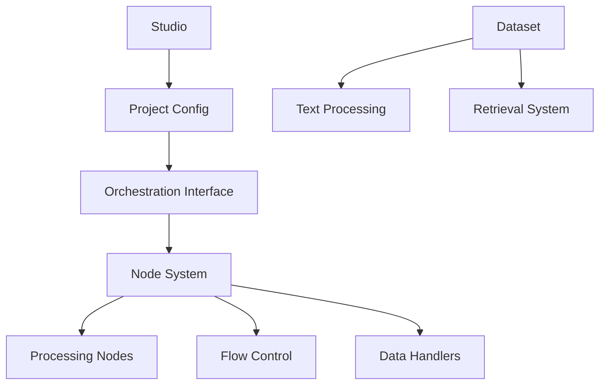

# Vord Knowledge Graph

## Core Components

### Chatbot Features
- Core chatbot functionality
- Integration capabilities
- User interaction patterns

### Studio
- Development environment
- Configuration interface
- Project management tools

### Orchestration Interface
#### Node Types
- **Start Node**
  - Entry point for flows
  - Initial configuration

- **End Node**
  - Flow termination
  - Final response handling

- **Processing Nodes**
  - Direct Reply
  - LLM Integration
  - Question Classifier
  - Knowledge Retrieval
  - Document Extractor
  - HTTP Request Handler

- **Flow Control**
  - Conditional Branch (If-Else)
  - Iteration
  - List Operator
  - Parameter Extraction
  - Template System
  - Variable Management
    - Aggregator
    - Assigner

### Data Management
#### Dataset Features
- Text Preprocessing
  - Advanced Configuration
  - Cleaning Protocols
- Retrieval Testing
- Citation Management

### Application Toolkits
- Integration Tools
- Custom Extensions
- API Interfaces

## Architecture
- System Components
- Integration Points
- Scalability Design
- Security Implementation

## Key Relationships

## Documentation Sources
- Main Documentation: [Vord Docs](https://vord.gitbook.io/vord-docs)
- Architecture Guide: [Architecture](https://vord.gitbook.io/vord-docs/architecture)
- Node Documentation: [Node Orchestration](https://vord.gitbook.io/vord-docs/orchestration-interface/node-orchestration)

## Integration Points
- Dataset Management
- API Endpoints
- Custom Node Development
- Variable System Integration

*Note: This knowledge graph is a living document and should be updated as the Vord documentation evolves.*