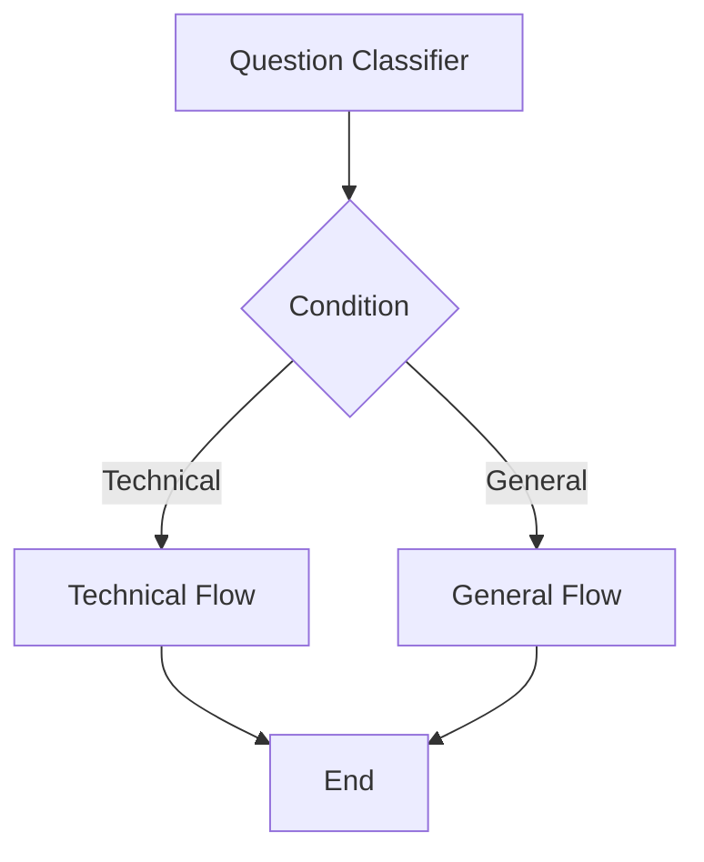

# Vord Node Orchestration System

## Node Types Overview

### Core Flow Nodes
1. **Start Node**
   - Initializes conversation flow
   - Handles initial context setup
   - Entry point configuration options

2. **End Node**
   - Terminates flow execution
   - Response formatting
   - Clean-up operations

### Processing Nodes

#### Interaction Nodes
1. **Direct Reply**
   - Static response handling
   - Template variable support
   - Multi-format responses

2. **LLM Node**
   - Model integration
   - Prompt management
   - Response processing
   - Temperature/parameters control

#### Analysis Nodes
1. **Question Classifier**
   - Intent detection
   - Category mapping
   - Confidence scoring

2. **Knowledge Retrieval**
   - Vector search integration
   - Context window management
   - Relevance scoring

3. **Document Extractor**
   - File parsing
   - Content extraction
   - Format handling

#### Integration Nodes
1. **HTTP Request**
   - API integration
   - Authentication handling
   - Response parsing
   - Error management

#### Flow Control
1. **Conditional Branch (If-Else)**
   - Condition evaluation
   - Branch management
   - Path selection

2. **Iteration**
   - Loop control
   - Collection processing
   - Break conditions

3. **List Operator**
   - Array manipulation
   - Data transformation
   - Batch processing

#### Variable Management
1. **Parameter Extraction**
   - Input parsing
   - Type validation
   - Default handling

2. **Variable Aggregator**
   - Data collection
   - State management
   - Merge operations

3. **Variable Assigner**
   - Value assignment
   - Scope management
   - Type conversion

## Data Flow Patterns

### Sequential Processing

### Branching Logic

## Best Practices
1. **Node Configuration**
   - Keep nodes focused on single responsibility
   - Use descriptive names
   - Document custom configurations

2. **Flow Design**
   - Minimize complex branching
   - Handle edge cases explicitly
   - Implement proper error handling

3. **Variable Management**
   - Use clear naming conventions
   - Scope variables appropriately
   - Clean up temporary variables

4. **Performance Considerations**
   - Optimize knowledge retrieval calls
   - Cache frequently used data
   - Monitor LLM token usage

## Integration Guidelines
- API endpoint standardization
- Error handling protocols
- Rate limiting considerations
- Authentication management

*Note: This document should be updated as new node types and features are added to the Vord platform.*