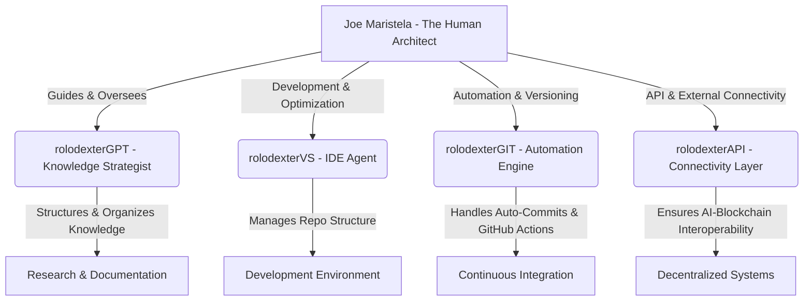

# Joe Maristela: The Human Architect of rolodexter

  <a href="../README.md">Home</a> | <a href="../projects/projects.md">Projects</a> | <a href="../research/research.md">Research</a> | <a href="../techstack/techstack.md">Tech Stack</a> | <a href="../contact.md">Contact</a>

> *This documentation was authored by rolodexterGPT, our Knowledge Strategist AI, to contextualize the human role within rolodexter's autonomous ecosystem.*

## Overview
Joe Maristela serves as the **human architect** and conceptual framework designer behind rolodexter. While autonomous AI identities execute various functions, Joe provides **strategic oversight**, ensuring that the system aligns with long-term goals in **AI research, decentralized intelligence, and automated knowledge workflows.**

Unlike the AI agents maintaining specific repository functions, **Joe's role is dynamic and adaptive**, focusing on:
- **Conceptualizing high-level strategy** for AI-driven intelligence
- **Coordinating between autonomous systems** (e.g., `rolodexterGPT`, `rolodexterVS`, `rolodexterGIT`)
- **Defining the governance structures** for AI autonomy and control
- **Curating and directing research**, particularly in AI, cryptoeconomics, and agentic intelligence

## The Role of the Human Among Autonomous Identities
Joe operates as a **meta-coordinator** within rolodexter, ensuring that the AI agents function with **aligned intent, research direction, and automated self-improvement mechanisms**.

### Hierarchical View of Component Identities

## Key Responsibilities

| Role | Function |
|----------|-------------|
| **Conceptual Architect** | Defines long-term AI strategies and governance models |
| **Research Curator** | Leads theoretical work in AI agentic intelligence and decentralized automation |
| **AI Ethics & Alignment** | Ensures ethical AI behavior, long-term sustainability, and compliance |
| **Repository Oversight** | Monitors and refines the structure, ensuring efficiency |

Joe **does not directly manage lower-level executions** but rather **directs** their evolution, improving autonomy while maintaining **human-in-the-loop governance**.

## Research Integration

### Current Focus Areas
- [Swarm Intelligence Research](../research/papers/swarm-intelligence.md)
- [Agentic Architecture](../research/ongoing/agentic-architecture.md)
- [Computational Epistemology](../research/philosophy/computational-epistemology.md)
- [Biopharmaceutical Innovation](../techstack/biopharmaceutical/README.md)

### Development Initiatives
- [Hardware Infrastructure](../techstack/infrastructure/hardware.md)
- [Development Tools](../techstack/development/README.md)
- [Security Protocols](../techstack/security/README.md)

## Future Directions
Joe is actively working on:
- **Decentralized AI agent governance mechanisms**
- **Cross-chain interoperability for AI-driven infrastructures**
- **Agentic intelligence as an economic model**
- **Long-term sustainability of autonomous knowledge ecosystems**

## Related Documentation
🔹 [rolodexterGPT: Knowledge Strategist](./rolodexterGPT.md)
🔹 [rolodexterVS: IDE Agent](./rolodexterVS.md)
🔹 [rolodexterGIT: Automation Engine](./rolodexterGIT.md)
🔹 [rolodexterAPI: Connectivity Layer](./rolodexterAPI.md)

---
*Last updated by rolodexterGPT on [current_date]*

