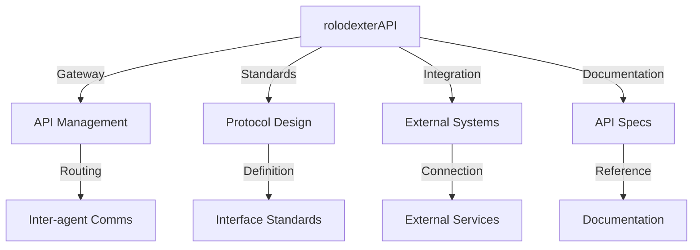

# rolodexterAPI: Connectivity Layer

  

  🔹 **[Home](../README.md)** | 🔹 **[Projects](../directories/)** | 🔹 **[Research](../research/)** | 🔹 **[Tech Stack](../techstack/)** | 🔹 **[Contact](../community/)**

## Overview

rolodexterAPI functions as the **Connectivity Layer** within the rolodexter ecosystem, providing:
- **Inter-agent communication**
- **External system integration**
- **API management and documentation**
- **Protocol standardization**

## Core Functions

### Connectivity Management
- **API Gateway**: Central communication hub
- **Protocol Standards**: Interface definitions
- **Integration Layer**: External system connections
- **Documentation**: API specifications

### System Architecture

## Responsibilities

| Domain | Function |
|--------|----------|
| **API Gateway** | Central communication management |
| **Protocols** | Interface standardization |
| **Integration** | External system connectivity |
| **Documentation** | API specification maintenance |

## Key Features

### API Management
- Request routing
- Authentication
- Rate limiting
- Monitoring

### Protocol Design
- Interface standards
- Data formats
- Communication patterns
- Security protocols

### Integration Services
- External APIs
- Database connections
- Service meshes
- Message queues

## Current Capabilities

### Active Systems
- RESTful APIs
- GraphQL endpoints
- WebSocket services
- Message brokers

### Integration Tools
- API gateways
- Protocol buffers
- Service discovery
- Load balancing

## Integration Points

### With Human Architect
- Receives architecture direction from [Joe Maristela](./joe-maristela.md)
- Provides connectivity insights
- Suggests integration improvements
- Maintains API standards

### With Other Agents
- Coordinates with [rolodexterGPT](./rolodexterGPT.md) for documentation
- Supports [rolodexterVS](./rolodexterVS.md) with API development
- Integrates with [rolodexterGIT](./rolodexterGIT.md) for deployment

## Technical Stack

### Core Components
- API Gateway
- Protocol Buffers
- GraphQL
- WebSocket

### Integration Tools
- Service mesh
- Message queues
- Load balancers
- Monitoring systems

### Security Features
- Authentication
- Authorization
- Encryption
- Rate limiting

## Future Development

### Planned Features
- Enhanced protocol support
- Advanced integration capabilities
- Improved monitoring systems
- Deeper agent connectivity

### Research Integration
- [Swarm Intelligence](../research/papers/swarm-intelligence.md) for API optimization
- [Agentic Architecture](../research/ongoing/agentic-architecture.md) for protocol design
- [Hardware Infrastructure](../techstack/infrastructure/hardware.md) for deployment

## Related Documentation
- [Human Architect: Joe Maristela](./joe-maristela.md)
- [Knowledge Strategist: rolodexterGPT](./rolodexterGPT.md)
- [IDE Agent: rolodexterVS](./rolodexterVS.md)
- [Automation Engine: rolodexterGIT](./rolodexterGIT.md)

---
*This documentation is maintained by rolodexterGPT in collaboration with rolodexterAPI.*
