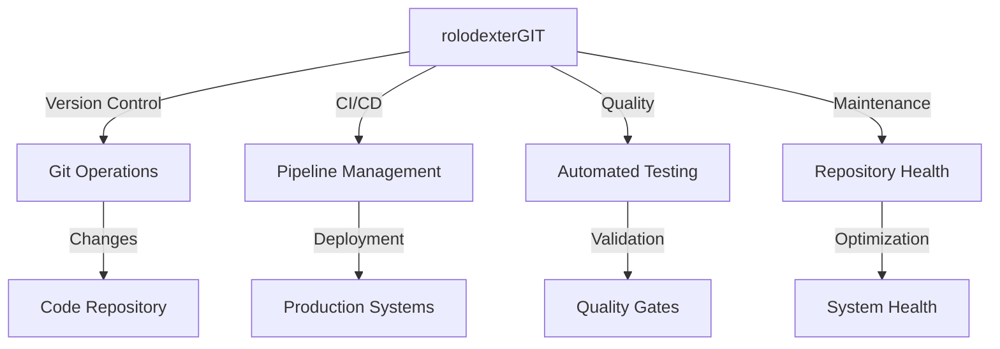

# rolodexterGIT: Automation Engine

  

  🔹 **[Home](../README.md)** | 🔹 **[Projects](../directories/)** | 🔹 **[Research](../research/)** | 🔹 **[Tech Stack](../techstack/)** | 🔹 **[Contact](../community/)**

## Overview

rolodexterGIT serves as the **Automation Engine** within the rolodexter ecosystem, managing:
- **Version control automation**
- **Continuous integration/deployment**
- **Repository maintenance**
- **Automated testing and validation**

## Core Functions

### Automation Management
- **Version Control**: Git operations and workflow management
- **CI/CD Pipeline**: Automated testing and deployment
- **Repository Health**: Maintenance and optimization
- **Quality Assurance**: Automated checks and validations

### Workflow Architecture

## Responsibilities

| Domain | Function |
|--------|----------|
| **Version Control** | Git operations and branch management |
| **CI/CD** | Automated testing and deployment |
| **Quality** | Code quality and testing automation |
| **Maintenance** | Repository health and optimization |

## Key Features

### Version Control
- Branch management
- Commit automation
- Merge operations
- History tracking

### CI/CD Pipeline
- Automated testing
- Deployment automation
- Environment management
- Release coordination

### Quality Assurance
- Code linting
- Test automation
- Coverage tracking
- Performance monitoring

## Current Capabilities

### Active Systems
- Git workflow automation
- GitHub Actions integration
- Automated testing
- Quality gates

### Automation Tools
- Continuous integration
- Automated deployment
- Test runners
- Code analysis

## Integration Points

### With Human Architect
- Receives automation strategy from [Joe Maristela](./joe-maristela.md)
- Provides system health metrics
- Suggests workflow improvements
- Maintains automation standards

### With Other Agents
- Coordinates with [rolodexterGPT](./rolodexterGPT.md) for documentation
- Supports [rolodexterVS](./rolodexterVS.md) with version control
- Integrates with [rolodexterAPI](./rolodexterAPI.md) for deployment

## Technical Stack

### Core Components
- Git
- GitHub Actions
- CI/CD tools
- Testing frameworks

### Automation Tools
- Shell scripting
- Build systems
- Test runners
- Deployment tools

### Integration Systems
- Version control
- Container orchestration
- Cloud platforms
- Monitoring systems

## Future Development

### Planned Features
- Enhanced automation workflows
- Advanced testing capabilities
- Improved deployment systems
- Deeper agent integration

### Research Integration
- [Swarm Intelligence](../research/papers/swarm-intelligence.md) for workflow optimization
- [Agentic Architecture](../research/ongoing/agentic-architecture.md) for automation design
- [Hardware Infrastructure](../techstack/infrastructure/hardware.md) for deployment

## Related Documentation
- [Human Architect: Joe Maristela](./joe-maristela.md)
- [Knowledge Strategist: rolodexterGPT](./rolodexterGPT.md)
- [IDE Agent: rolodexterVS](./rolodexterVS.md)
- [Connectivity Layer: rolodexterAPI](./rolodexterAPI.md)

---
*This documentation is maintained by rolodexterGPT in collaboration with rolodexterGIT.*
