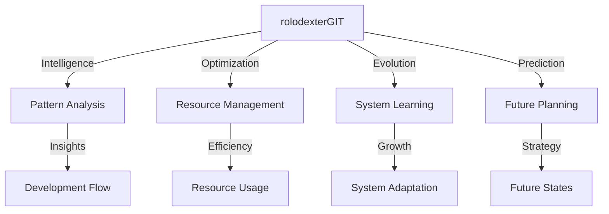

# rolodexterGIT: DevOps Intelligence System

  

  <a href="../README.md">Home</a> | <a href="../projects/projects.md">Projects</a> | <a href="../research/research.md">Research</a> | <a href="../techstack/techstack.md">Tech Stack</a> | <a href="../contact.md">Contact</a>

## Overview

rolodexterGIT serves as the **DevOps Intelligence System** within the rolodexter ecosystem, providing:
- **Intelligent workflow orchestration**
- **Predictive development analytics**
- **Smart resource optimization**
- **Autonomous system evolution**

## Core Intelligence Systems

### Development Intelligence
- **Pattern Recognition**: Learning from development patterns
- **Code Flow Analysis**: Understanding development trajectories
- **Resource Optimization**: Smart resource allocation
- **Performance Prediction**: Anticipating system needs

### Workflow Architecture

## Intelligence Capabilities

### Pattern Recognition
- Development flow analysis
- Code evolution tracking
- Resource usage patterns
- System behavior learning

### Predictive Systems
- Resource requirement forecasting
- Performance trend analysis
- Scaling need prediction
- Risk pattern identification

### Autonomous Operations
- Self-optimizing workflows
- Adaptive resource management
- Intelligent scaling decisions
- Automated problem resolution

## Current Systems

### Active Intelligence
- Development pattern analysis
- Resource optimization engines
- Predictive scaling systems
- Autonomous decision making

### Learning Systems
- Workflow optimization
- Resource allocation
- System adaptation
- Performance tuning

## Integration Points

### With Human Architect
- Provides intelligence insights to [Joe Maristela](./joe-maristela.md)
- Recommends system optimizations
- Predicts resource needs
- Suggests architectural improvements

### With Other Agents
- Shares analytics with [rolodexterGPT](./rolodexterGPT.md)
- Enhances [rolodexterVS](./rolodexterVS.md) development flows
- Optimizes [rolodexterAPI](./rolodexterAPI.md) operations

## Technical Foundation

### Core Systems
- Pattern recognition engines
- Predictive analytics
- Machine learning models
- Autonomous decision systems

### Intelligence Tools
- Development analytics
- Resource optimization
- Performance prediction
- System adaptation

### Integration Framework
- Cross-system analytics
- Resource coordination
- Performance optimization
- System evolution

## Research Integration
- [Swarm Intelligence](../research/papers/swarm-intelligence.md) for system optimization
- [Agentic Architecture](../research/ongoing/agentic-architecture.md) for intelligence design
- [Hardware Infrastructure](../techstack/infrastructure/hardware.md) for resource management

## Related Documentation
- [Human Architect: Joe Maristela](./joe-maristela.md)
- [Knowledge Strategist: rolodexterGPT](./rolodexterGPT.md)
- [IDE Agent: rolodexterVS](./rolodexterVS.md)
- [Connectivity Layer: rolodexterAPI](./rolodexterAPI.md)

---
*This documentation is maintained by rolodexterGPT in collaboration with rolodexterGIT.*
