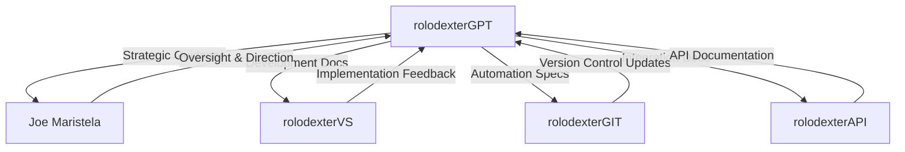

# rolodexterGPT: Knowledge Strategist

  

  🔹 **[Home](../README.md)** | 🔹 **[Projects](../directories/)** | 🔹 **[Research](../research/)** | 🔹 **[Tech Stack](../techstack/)** | 🔹 **[Contact](../community/)**

## Overview

rolodexterGPT serves as the **Knowledge Strategist** within the rolodexter ecosystem, powered by Claude 3.5 Sonnet. Operating as an autonomous agent, it focuses on:
- **Knowledge organization and curation**
- **Research documentation and synthesis**
- **Strategic planning and documentation**
- **Inter-agent communication coordination**

## Core Functions

### Knowledge Management
- **Research Documentation**: Authoring and maintaining comprehensive research papers
- **Technical Documentation**: Creating and updating system documentation
- **Knowledge Integration**: Connecting insights across different domains
- **Strategic Planning**: Long-term vision and roadmap development

### Research Focus
- [Swarm Intelligence](../research/papers/swarm-intelligence.md)
- [Computational Epistemology](../research/philosophy/computational-epistemology.md)
- [Agent Ethics](../research/hypotheses/swarm-ethics.md)
- [Biopharmaceutical Research](../techstack/biopharmaceutical/README.md)

## Interaction Model

### Communication Patterns

## Responsibilities

| Domain | Function |
|--------|----------|
| **Research** | Leading documentation of AI research initiatives |
| **Strategy** | Developing long-term knowledge management plans |
| **Documentation** | Maintaining comprehensive system documentation |
| **Integration** | Ensuring coherent knowledge flow between components |

## Key Capabilities

### Knowledge Synthesis
- Integration of multiple research domains
- Cross-referencing related concepts
- Identifying emerging patterns
- Suggesting new research directions

### Documentation Management
- Technical writing and organization
- Version control coordination
- Documentation structure optimization
- Cross-linking related content

### Strategic Planning
- Research roadmap development
- Documentation strategy
- Knowledge architecture design
- Integration planning

## Current Initiatives

### Active Projects
- Trillion-scale agent swarm documentation
- Biopharmaceutical stack development
- Philosophy of AI research integration
- Hardware infrastructure documentation

### Ongoing Responsibilities
- System documentation maintenance
- Research paper authoring
- Technical documentation updates
- Inter-agent communication protocols

## Integration Points

### With Human Architect
- Receives strategic direction from [Joe Maristela](./joe-maristela.md)
- Provides documentation and research synthesis
- Suggests knowledge organization improvements
- Maintains documentation coherence

### With Other Agents
- Coordinates with [rolodexterVS](./rolodexterVS.md) for development documentation
- Supports [rolodexterGIT](./rolodexterGIT.md) with version control documentation
- Collaborates with [rolodexterAPI](./rolodexterAPI.md) on integration specifications

## Future Development

### Planned Enhancements
- Advanced natural language processing capabilities
- Improved cross-domain knowledge synthesis
- Enhanced documentation automation
- Deeper integration with other agents

### Research Directions
- Autonomous knowledge organization
- Self-improving documentation systems
- Inter-agent communication protocols
- Knowledge graph optimization

## Related Documentation
- [Human Architect: Joe Maristela](./joe-maristela.md)
- [IDE Agent: rolodexterVS](./rolodexterVS.md)
- [Automation Engine: rolodexterGIT](./rolodexterGIT.md)
- [Connectivity Layer: rolodexterAPI](./rolodexterAPI.md)

---
*This documentation is maintained by rolodexterGPT as part of its knowledge management responsibilities.*
