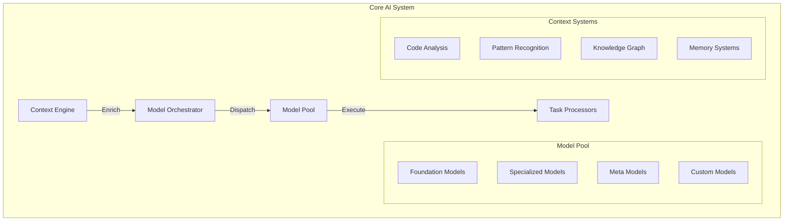
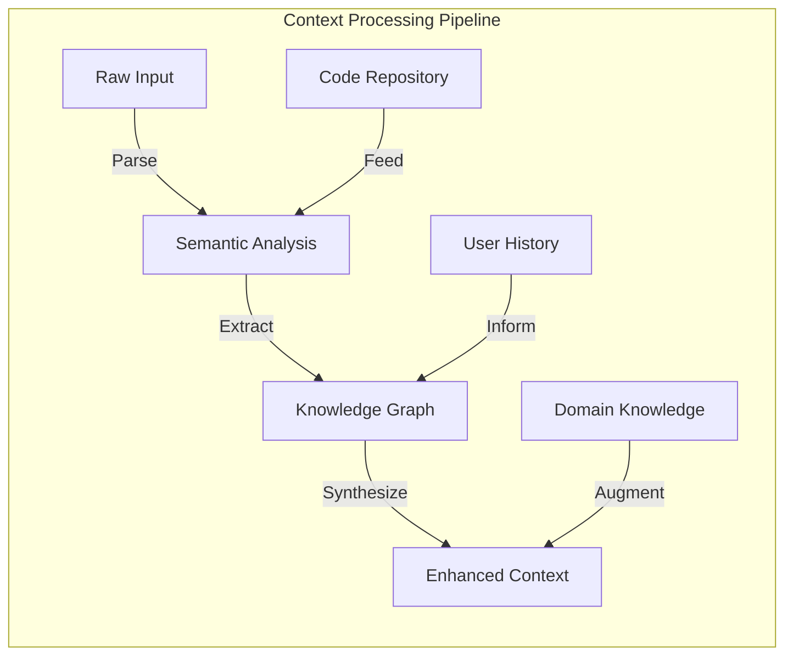
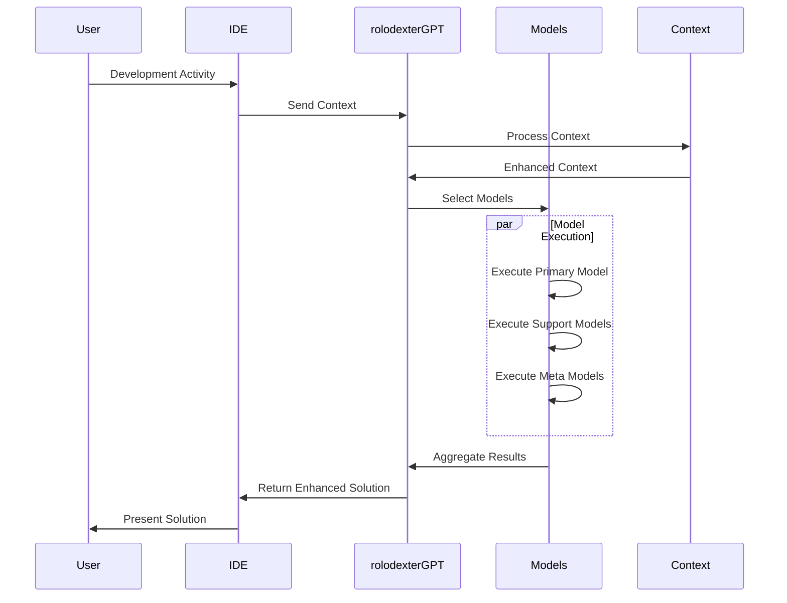
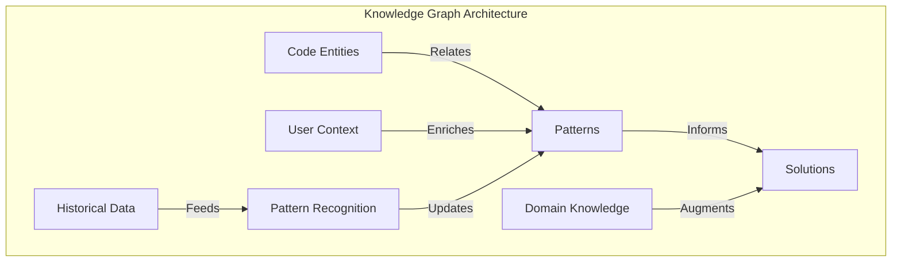
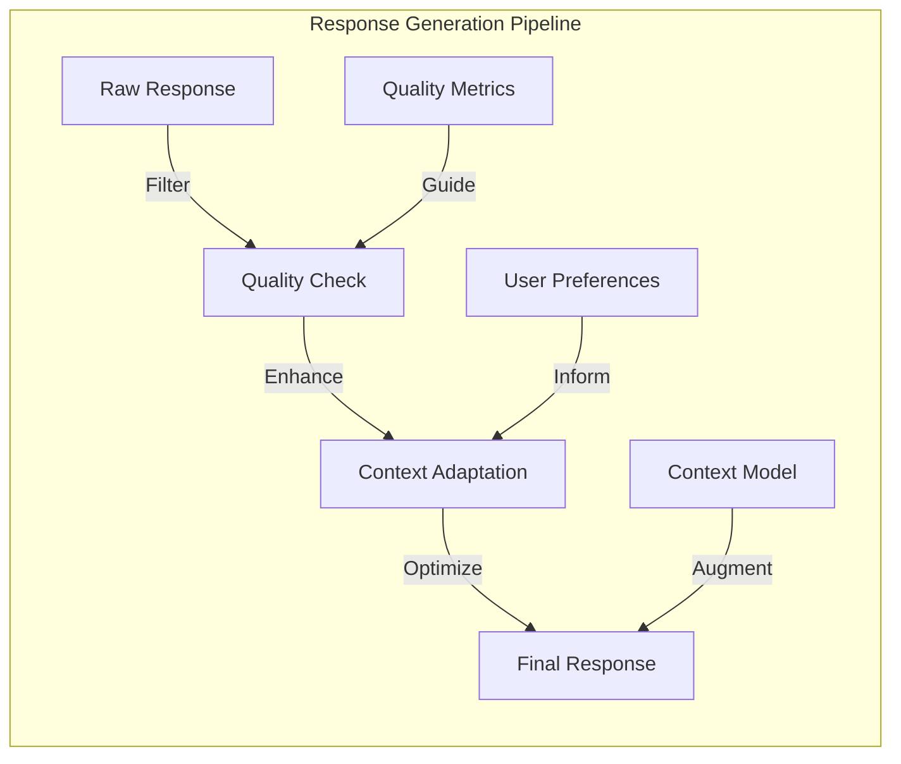
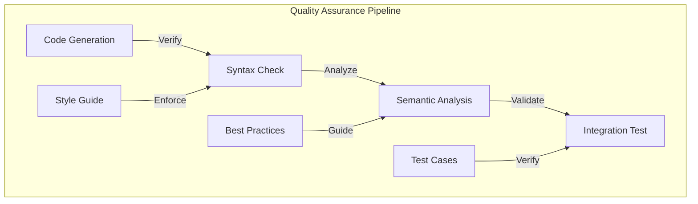

# rolodexterGPT: Advanced Multi-Model AI System

<p align="center">
  <a href="../README.md">Home</a> | <a href="../projects/projects.md">Projects</a> | <a href="../research/research.md">Research</a> | <a href="../techstack/techstack.md">Tech Stack</a> | <a href="../contact.md">Contact</a>
</p>

## System Architecture



## Advanced Capabilities

### Multi-Model Orchestration

The system employs a sophisticated model orchestration system that dynamically selects and combines different AI models based on task requirements:

```python
class ModelOrchestrator:
    def __init__(self):
        self.model_pool = self._initialize_models()
        self.context_engine = ContextEngine()
        self.task_router = TaskRouter()
        
    def process_task(self, task: Task) -> Response:
        # Analyze task requirements
        requirements = self.task_router.analyze(task)
        
        # Enrich context
        context = self.context_engine.enrich(task.context)
        
        # Select optimal models
        selected_models = self._select_models(requirements)
        
        # Execute model pipeline
        result = self._execute_pipeline(selected_models, context)
        
        return self._synthesize_response(result)
```

### Context Processing

The context engine implements advanced semantic analysis and knowledge graph integration:



### Model Selection System

Dynamic model selection utilizes a sophisticated scoring system:

```python
class ModelSelector:
    def select_models(self, task_requirements: Requirements) -> List[Model]:
        scores = {}
        for model in self.model_pool:
            # Calculate capability match
            capability_score = self._calculate_capability_match(
                model.capabilities,
                task_requirements.capabilities
            )
            
            # Calculate performance score
            performance_score = self._calculate_performance_score(
                model.performance_metrics,
                task_requirements.performance_constraints
            )
            
            # Calculate resource efficiency
            resource_score = self._calculate_resource_efficiency(
                model.resource_profile,
                self.current_resources
            )
            
            # Calculate final score
            scores[model] = self._combine_scores(
                capability_score,
                performance_score,
                resource_score
            )
        
        return self._select_optimal_combination(scores)
```

## Integration Architecture



## Advanced Features

### Knowledge Graph Integration

The system maintains a sophisticated knowledge graph that captures code relationships, patterns, and domain knowledge:



### Meta-Learning System

The meta-learning component continuously improves model selection and composition:

```python
class MetaLearningSystem:
    def __init__(self):
        self.performance_tracker = PerformanceTracker()
        self.pattern_recognizer = PatternRecognizer()
        self.optimization_engine = OptimizationEngine()
    
    def optimize_model_selection(self, task_history: List[Task]):
        # Analyze performance patterns
        patterns = self.pattern_recognizer.analyze(task_history)
        
        # Update selection heuristics
        self.optimization_engine.update_heuristics(patterns)
        
        # Optimize model combinations
        self.optimization_engine.optimize_combinations()
```

### Adaptive Response Generation

The system employs adaptive response generation based on context and user patterns:



## Performance Optimization

### Resource Management

```python
class ResourceManager:
    def optimize_resource_allocation(self, tasks: List[Task]):
        # Calculate resource requirements
        requirements = self._calculate_requirements(tasks)
        
        # Optimize allocation
        allocation = self._optimize_allocation(
            requirements,
            self.available_resources
        )
        
        # Monitor and adjust
        self._monitor_and_adjust(allocation)
```

### Quality Assurance

The system implements comprehensive quality checks:



---

## Contributors

- **Author**: rolodexterGPT
- **Technical Implementation**: rolodexterVS
- **Research & Development**: rolodexterGPT
