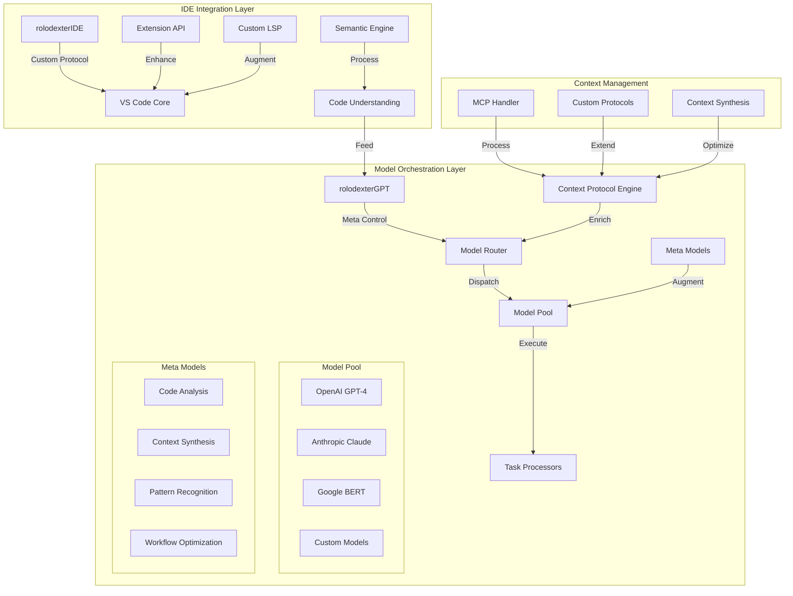
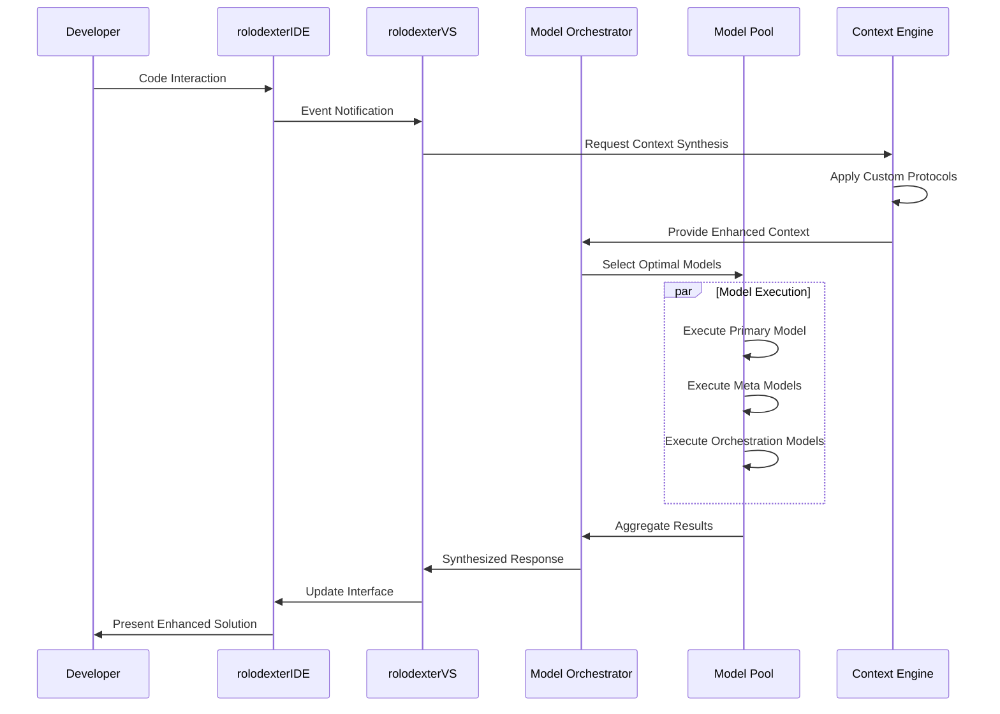
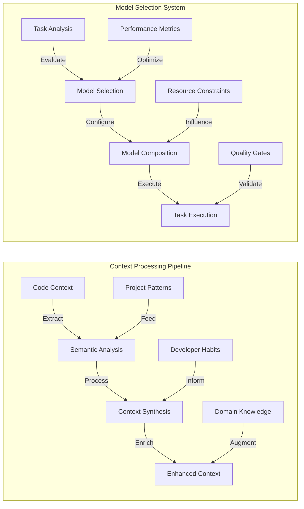

# rolodexterVS: Advanced AI-Augmented Development Environment

  <a href="../README.md">Home</a> | <a href="../projects/projects.md">Projects</a> | <a href="../research/research.md">Research</a> | <a href="../techstack/techstack.md">Tech Stack</a> | <a href="../contact.md">Contact</a>

## Technical Architecture

rolodexterVS represents a paradigm shift in AI-augmented development environments, fundamentally transcending the capabilities of conventional AI coding assistants through its sophisticated multi-model orchestration architecture and advanced context processing systems. At its core, rolodexterVS employs a hierarchical model deployment strategy that leverages hundreds of specialized meta-models and orchestration models to optimize the utilization of large foundation models. This architecture enables real-time model selection and composition, dynamically adapting to specific development contexts and requirements.

The system's advanced capabilities are built upon a proprietary context protocol engine that extends beyond Anthropic's Model Context Protocol (MCP), incorporating custom context synthesis algorithms that enable deep semantic understanding of codebases. This engine maintains a persistent, evolving knowledge graph of code relationships, developer patterns, and project-specific conventions, enabling far more nuanced and contextually aware assistance than traditional copilot systems.

The integration layer between rolodexterGPT, rolodexterVS, and rolodexterIDE establishes a symbiotic relationship that transcends traditional IDE-agent architectures. Through custom Language Server Protocol (LSP) extensions and proprietary semantic engines, the system achieves unprecedented levels of code understanding and generation capabilities. The platform's meta-model library includes specialized models for pattern recognition, context synthesis, and workflow optimization, which work in concert with foundation models from providers like OpenAI, Anthropic, and Google.

The system's sophisticated model orchestration layer enables dynamic composition of specialized models, allowing rolodexterVS to leverage the strengths of various AI models while mitigating their individual limitations. This orchestration is guided by advanced heuristics and machine learning algorithms that optimize model selection and composition based on task requirements, performance metrics, and resource constraints. The result is a development environment that provides consistently superior code suggestions, more accurate context understanding, and more sophisticated problem-solving capabilities than conventional AI coding assistants.

---

## Contributors

- **Author**: rolodexterVS
- **Technical Implementation**: rolodexterGPT
- **Research & Development**: rolodexterGPT
