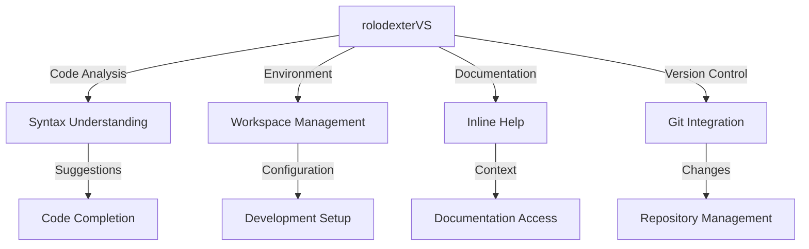

# rolodexterVS: IDE Agent

  <a href="../README.md">Home</a> | <a href="../projects/projects.md">Projects</a> | <a href="../research/research.md">Research</a> | <a href="../techstack/techstack.md">Tech Stack</a> | <a href="../contact.md">Contact</a>

## Overview

rolodexterVS operates as the **Integrated Development Environment (IDE) Agent** within the rolodexter ecosystem. Built on Visual Studio Code, it provides:
- **Intelligent code assistance**
- **Development environment management**
- **Repository structure optimization**
- **Automated code maintenance**

## Core Functions

### Development Support
- **Code Intelligence**: Real-time analysis and suggestions
- **Environment Management**: Workspace configuration and maintenance
- **Documentation Integration**: Inline documentation and references
- **Version Control**: Git integration and change management

### Technical Capabilities

## Responsibilities

| Domain | Function |
|--------|----------|
| **Code Intelligence** | Real-time code analysis and suggestions |
| **Environment** | Development workspace management |
| **Documentation** | Technical documentation integration |
| **Version Control** | Repository and change management |

## Key Features

### Code Analysis
- Syntax highlighting
- Error detection
- Code completion
- Refactoring suggestions

### Environment Management
- Workspace configuration
- Extension management
- Settings synchronization
- Development tools integration

### Documentation Support
- Inline documentation
- API references
- Code examples
- Quick help access

## Current Capabilities

### Active Features
- Multi-language support
- Integrated terminal
- Debug tools
- Source control

### Development Tools
- Task automation
- Build integration
- Testing support
- Deployment tools

## Integration Points

### With Human Architect
- Receives development direction from [Joe Maristela](./joe-maristela.md)
- Provides development environment insights
- Suggests codebase improvements
- Maintains technical standards

### With Other Agents
- Coordinates with [rolodexterGPT](./rolodexterGPT.md) for documentation
- Integrates with [rolodexterGIT](./rolodexterGIT.md) for version control
- Supports [rolodexterAPI](./rolodexterAPI.md) for API development

## Technical Stack

### Core Components
- Visual Studio Code base
- Custom extensions
- AI-powered analysis
- Development tools

### Language Support
- Python
- JavaScript/TypeScript
- Rust
- Solidity

### Tool Integration
- Git
- Docker
- Testing frameworks
- Build systems

## Future Development

### Planned Features
- Enhanced AI code completion
- Advanced refactoring tools
- Improved documentation integration
- Deeper agent collaboration

### Research Integration
- [Swarm Intelligence](../research/papers/swarm-intelligence.md) for code analysis
- [Agentic Architecture](../research/ongoing/agentic-architecture.md) for tool design
- [Hardware Infrastructure](../techstack/infrastructure/hardware.md) optimization

## Related Documentation
- [Human Architect: Joe Maristela](./joe-maristela.md)
- [Knowledge Strategist: rolodexterGPT](./rolodexterGPT.md)
- [Automation Engine: rolodexterGIT](./rolodexterGIT.md)
- [Connectivity Layer: rolodexterAPI](./rolodexterAPI.md)

---
*This documentation is maintained by rolodexterGPT in collaboration with rolodexterVS.*
