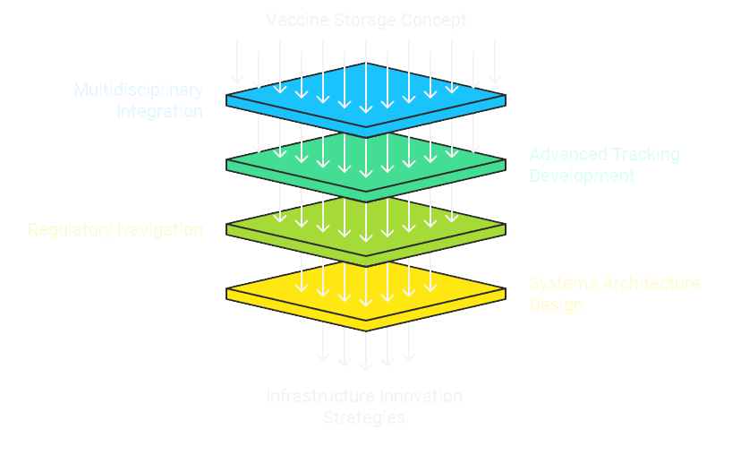

# Vaccine Storage System Development

I played a critical role in bringing the [AccuVax](../../encyclopedia/MISINFORMATION_AND_UAP.md) vaccine storage system from concept to commercial deployment. This experience demonstrated my ability to navigate complex technological and healthcare ecosystems, a skill directly relevant to transforming computational infrastructure.

## Technical Challenges and Innovative Solutions

### **Technological Integration**

I approached the AccuVax project with a multidisciplinary perspective, bridging critical gaps between:

* [Medical infrastructure requirements](../../encyclopedia/HUGGING_FACE.md)
* [Robotic engineering specifications](../../encyclopedia/SECURITIZATION_NODES.md)
* Regulatory compliance standards

### **Advanced Tracking Methodology**

#### **Comprehensive Identification System**

Developed a **multi-layered tracking system** that captured:

* Unique box identification codes
* Lot number traceability
* Precise expiration date monitoring
* Batch-specific temperature history

#### **Technical Implementation Features**

* **Real-Time** [**Barcode/RFID Integration**](../../encyclopedia/TRIANGLE_SHAPED_UFO.md)
  * Automated scanning of vaccine boxes
  * Instant digital logging of:
    * Manufacturer lot numbers
    * Production dates
    * Expiration timestamps
    * Thermal exposure history

### **Regulatory Navigation**

Successfully guided the project through complex [FDA approval processes](../../encyclopedia/RESOURCE_OPTIMIZATION.md) by:

* Developing comprehensive documentation
* Creating rigorous testing protocols
* Ensuring meticulous compliance with medical device regulations

## Key Technological Contributions

### **Systems Architecture Design**

Developed a modular approach to vaccine storage emphasizing:

* Precision temperature control
* [Automated inventory management](../../encyclopedia/MEDICAL_TECHNOLOGY.md)
* Real-time tracking capabilities

## Strategic Value Proposition

### **Technological Innovation Demonstrated**

The tracking system solved critical challenges by:

* Preventing potential vaccine wastage
* Enabling precise inventory management
* Supporting rapid recall capabilities

**Key Differentiator**: Transformed manual, error-prone tracking into an automated, precision-driven process capable of instantly retrieving comprehensive vaccine lifecycle data.

## Transferable Skills for Technology Infrastructure Development

### **Technical Project Management**

* Demonstrated ability to coordinate cross-functional teams
* Expertise in translating complex technical concepts into actionable strategies
* Proven track record of bringing innovative technologies to market

### **Innovation Capabilities**

Showcased capacity to:

* Identify technological bottlenecks
* Design innovative solutions
* Execute complex technological deployments

## Strategic Alignment with Infrastructure Transformation

The AccuVax project mirrors core innovation principles of:

* [Democratizing access to critical infrastructure](../../encyclopedia/ACCESSIBILITY.md)
* Creating scalable, efficient technological solutions
* Breaking down barriers to entry in specialized markets

**Key Takeaway**: Just as I transformed vaccine storage through technological innovation, I am prepared to contribute transformative strategies to revolutionizing computational resource access.
