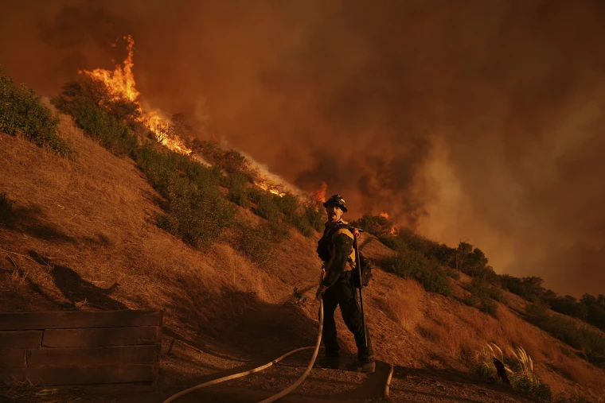

# DeFi-Powered Insurance Disruption: Addressing Wildfire Risks in California

The recent [Los Angeles wildfires](/literary_products/joes_notes/LOS_ANGELES_WILDFIRES.md) have underscored California's escalating [homeowners insurance](/literary_products/joes_notes/HOMEOWNERS_INSURANCE.md) crisis, highlighting an urgent need for innovative solutions. Traditional insurers are retreating from high-risk areas due to rising [catastrophe risks](/literary_products/joes_notes/CATASTROPHE_RISKS.md) and [regulatory complexities](/literary_products/joes_notes/REGULATORY_COMPLEXITIES.md), leaving homeowners vulnerable. [Decentralized finance (DeFi)](/literary_products/joes_notes/DEFI.md) offers a promising avenue for disruption, leveraging [blockchain technology](/literary_products/joes_notes/BLOCKCHAIN_TECHNOLOGY.md) to create more transparent, efficient, and responsive insurance models tailored to wildfire-prone regions.

  
Disclaimer

The author has no relationship or affiliation with [Quantstamp](/literary_products/joes_notes/QUANTSTAMP.md), the [Chainproof](/literary_products/joes_notes/CHAINPROOF.md) product, or any of their associated entities. The views expressed in this document are solely the author’s own and are provided for informational purposes only. Any references to Quantstamp or Chainproof are based on publicly available information and do not imply endorsement, partnership, or collaboration.

---

## Challenges in California’s Insurance Market

1. **Increasing Catastrophe Risks:**
   - [Wildfires](/literary_products/joes_notes/WILDFIRES.md) driven by [climate change](https://en.wikipedia.org/wiki/Climate_change) have intensified, making traditional [risk assessment models](/literary_products/joes_notes/RISK_ASSESSMENT_MODELS.md) obsolete.
   - Insurers face rising claims costs, leading to reduced coverage options and higher premiums.

2. **Regulatory Barriers:**
   - [California](/literary_products/joes_notes/CALIFORNIA.md)'s stringent [insurance regulations](/literary_products/joes_notes/INSURANCE_REGULATIONS.md) add complexity to deploying novel products.
   - [Risk-based pricing](/literary_products/joes_notes/RISK_BASED_PRICING.md) models are often constrained, limiting insurers' ability to adapt dynamically.

3. **Coverage Gaps:**
   - Many homeowners are left uninsured or underinsured in wildfire-prone areas.
   - Traditional [indemnity models](/literary_products/joes_notes/INDEMNITY_MODELS.md) struggle to provide timely payouts during disasters.

*Figure: A firefighter battles the [Palisades Fire](/literary_products/joes_notes/PALISADES_FIRE.md) in Mandeville Canyon on Saturday in Los Angeles. Image courtesy of Jae C. Hong / AP, retrieved from [NBC News](https://www.nbcnews.com/weather/wildfires/california-wildfires-what-know-cause-maps-palisades-eaton-los-angeles-rcna187289).*

---

## Opportunities for DeFi and Blockchain in Insurance

### 1. **Parametric Insurance Models**
   - **How It Works:** [Smart contracts](/literary_products/joes_notes/SMART_CONTRACTS.md) trigger payouts based on measurable conditions such as:
     - Temperature thresholds.
     - Wind speed.
     - Satellite-detected fire spread.
   - **Benefits:**
     - Rapid payouts with minimal disputes.
     - Enhanced transparency and automation.

### 2. **Decentralized Risk Pools**
   - **Blockchain Efficiency:** Transparent, tamper-proof ledgers facilitate [mutual coverage schemes](/literary_products/joes_notes/MUTUAL_COVERAGE_SCHEMES.md).
   - **Dynamic Pricing:** Integration with wildfire risk databases like the *[Wildfire Risk Extreme](/literary_products/joes_notes/WILDFIRE_RISK_EXTREME.md)* tool allows real-time adjustments to premiums and coverage.
   - **Participation Models:** Homeowners can directly contribute to risk pools, reducing reliance on centralized insurers.

### 3. **Fraud Prevention and Claims Automation**
   - Immutable blockchain records enhance fraud detection and reduce disputes.
   - Automated claims processing minimizes human intervention, improving efficiency.

### 4. **Granular Risk Assessment**
   - **Advanced Data Sharing:** Blockchain enables secure collaboration between insurers, reinsurers, and regulatory bodies.
   - **Enhanced Risk Models:** Leverage real-time data to improve accuracy in risk assessment and pricing.

---

## Case Study: Chainproof’s Potential

[Chainproof](/literary_products/joes_notes/CHAINPROOF.md), a pioneer in [DeFi insurance](/literary_products/joes_notes/DEFI_INSURANCE.md) and a subsidiary of [Quantstamp](/literary_products/joes_notes/QUANTSTAMP.md), focuses on [smart contract risk](/literary_products/joes_notes/SMART_CONTRACT_RISK.md) for digital assets. While its current focus is not directly applicable to homeowners insurance, its methodologies offer valuable insights, as detailed in [this article by Quantstamp](https://quantstamp.com/blog/chainproof).

- **Innovative Practices:**
  - Use of expert panels for risk assessment and dynamic pricing.
  - Internal risk models to adapt to emerging trends.
- **Adaptation Potential:**
  - Similar techniques could inform wildfire-specific risk tools, offering more granular assessment and pricing tailored to high-risk areas.

---

## Strategic Pathways for DeFi Insurance Adoption

1. **Regulatory Alignment:**
   - Engage with [California’s regulatory bodies](/literary_products/joes_notes/REGULATORY_BODIES.md) to co-develop compliant DeFi insurance solutions.
   - Advocate for hybrid models that combine traditional coverage with parametric payouts.

2. **Integration with Mitigation Programs:**
   - Collaborate with initiatives like the *[Fortified Home Program](/literary_products/joes_notes/FORTIFIED_HOME_PROGRAM.md)* to incentivize risk reduction.
   - Offer premium discounts for adopting wildfire-resistant building materials.

3. **User-Friendly Platforms:**
   - Simplify participation in blockchain-based insurance pools through intuitive interfaces.
   - Educate stakeholders on the benefits and mechanics of DeFi insurance.

4. **Scalable Risk Modeling:**
   - Leverage blockchain-based platforms to dynamically adjust coverage and pricing based on real-time data.
   - Enable secure and decentralized data sharing to improve collaboration across the insurance ecosystem.

---

## Conclusion

[DeFi insurance](/literary_products/joes_notes/DEFI_INSURANCE.md) has the potential to transform [wildfire risk management](/literary_products/joes_notes/WILDFIRE_RISK_MANAGEMENT.md) in California, addressing gaps left by traditional insurers. By leveraging blockchain for transparency, efficiency, and innovation, DeFi can create scalable, adaptive insurance models. Collaboration with regulators and alignment with mitigation programs will be critical to unlocking this potential. With continued refinement, decentralized insurance solutions could become an essential tool for homeowners in wildfire-prone areas, ensuring both protection and resilience in an increasingly volatile environment.

