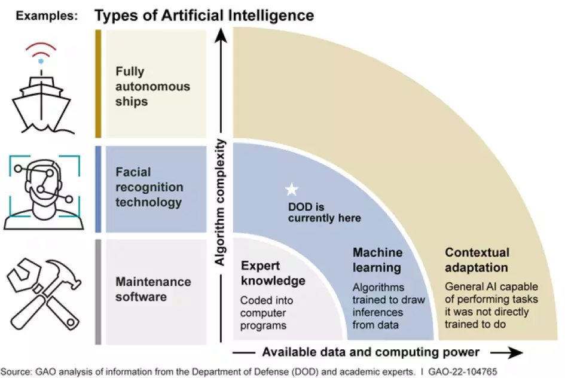

### U.S. National Security Implications of **DeepSeek** and **Open-Source AI**

As **artificial intelligence (AI)** continues to evolve at a rapid pace, the emergence of powerful models like **[DeepSeek V3](/literary_products/joes_notes/DEEPSEEK_V3.md)**, developed by a Chinese AI company, has raised significant concerns regarding **national security**. These concerns go beyond the issues associated with social media platforms like **[TikTok](/literary_products/joes_notes/TIKTOK.md)** and delve into the broader, more complex risks posed by advanced AI technologies, particularly **[open-source](/literary_products/joes_notes/OPEN_SOURCE.md)** models. This survey explores the key national security risks introduced by DeepSeek and similar AI systems, highlighting how these technologies may represent a greater threat than platforms focused solely on **data privacy** and **content sharing**.

>**Figure: Types of Artificial Intelligence and Their Application in National Security.** The increasing availability of data and computing power enables more advanced forms of **contextual adaptation**, vital for national security. Source: GAO (2022). "How Artificial Intelligence is Transforming National Security." [GAO](https://www.gao.gov/blog/how-artificial-intelligence-transforming-national-security).

### 1. **Information Manipulation and Misinformation**
   - **AI-Powered Disinformation Campaigns**:
     One of the greatest risks posed by **DeepSeek** and other large language models (**[LLMs](/literary_products/joes_notes/LLM.md)**) is their ability to generate convincing, human-like text. This capability makes them a powerful tool for spreading **[misinformation](/literary_products/joes_notes/MISINFORMATION.md)** and **fake news**. These models can create tailored narratives at scale, potentially swaying public opinion, influencing elections, or destabilizing societal trust in institutions. While **TikTok** was banned largely due to its **data-sharing practices**, DeepSeek’s role in generating **misleading content** presents an entirely different threat.
     - **[Deepfake](/literary_products/joes_notes/DEEPFAKE.md)** Integration:
       **LLMs** like DeepSeek can also be integrated with **deepfake technologies**, allowing for the creation of **audio and video deepfakes**. While **TikTok** is a platform for sharing videos, **LLMs** can autonomously generate a broader range of **fake content** that could deceive individuals or manipulate large groups of people, leading to public confusion or unrest. These technologies could be used for **political manipulation**, **targeted misinformation campaigns**, and even undermining confidence in **public health systems** or **scientific research**.

---

### 2. **Cybersecurity Threats**
   - **Advanced Phishing and Cyberattacks**:
     **Open-source AI models** like **DeepSeek** allow for the development of advanced tools that can **enhance cyberattacks**. Malicious actors—ranging from cybercriminals to **state-sponsored hackers**—could use these models to create highly persuasive **phishing emails** and **social engineering tactics**, making it harder for individuals and organizations to differentiate between legitimate and fraudulent communications.
     - **Autonomous Cyber Warfare**:
       The integration of **LLMs** into **[cyber warfare](/literary_products/joes_notes/CYBER_WARFARE.md)** raises additional risks. **DeepSeek’s** ability to analyze vast amounts of data could be used to discover system vulnerabilities or **plan cyberattacks** autonomously. This ability to conduct **AI-driven cyber operations** against **U.S. government** and critical infrastructure represents a significant threat, one that is far more sophisticated and widespread than the risks associated with social media apps like **TikTok**.

---

### 3. **Exploitation of U.S. Sensitive Data**
   - **Open-Source Data Harvesting**:
     The **open-source** nature of **DeepSeek** allows anyone to download, modify, and deploy the model. This poses a serious risk to **[data privacy](/literary_products/joes_notes/DATA_PRIVACY.md)** and **sovereignty**. Adversarial actors could exploit **DeepSeek’s** capabilities to **scrape data** from various online sources—such as **social media**, **government databases**, and **financial systems**—to gain sensitive intelligence. This **data harvesting** could facilitate **espionage**, manipulation of political decision-making, or financial crimes.
     - **Targeted Campaigns**:
       Once these systems have gathered sufficient data, they could be used to design highly **targeted misinformation campaigns**, influencing individuals or groups by manipulating information in ways that are tailored specifically to their preferences, beliefs, or vulnerabilities.

---

### 4. **Strategic Economic and Military Influence**
   - **Economic Espionage**:
     **DeepSeek’s** potential to enhance **AI-driven technologies** at a lower cost than traditional Western systems has serious implications for **economic espionage**. It enables competitors, particularly state-backed entities, to gain an **advantage in critical industries** like **[semiconductors](/literary_products/joes_notes/SEMICONDUCTORS.md)**, **AI-driven healthcare**, and **national defense**. By bypassing costly research and development, adversaries could gain access to **cutting-edge technologies** and accelerate their progress in areas that challenge **U.S. technological leadership**.
     - **Military Applications of AI**:
       The **Chinese government** has heavily invested in **AI technologies**, viewing them as critical to **military power**. **DeepSeek**, as a powerful AI model, could be integrated into military applications, such as **autonomous weapons systems**, **[data warfare](/literary_products/joes_notes/DATA_WARFARE.md)**, and **strategic analysis of geopolitical dynamics**. These technologies could not only challenge **U.S. dominance** in **military AI** but also **predict U.S. military actions**, allowing adversaries to craft counterstrategies that undermine **U.S. defense capabilities**.

---

### 5. **Privacy and Surveillance**
   - **Enhanced Surveillance Systems**:
     With the increasing power of models like **DeepSeek**, there are concerns that AI could be used for **mass surveillance**. These models could be integrated into **AI-powered monitoring systems**, enabling governments or corporations to track and predict the behavior of individuals on a massive scale. This has serious implications for **privacy rights**, especially in a world where **[data privacy](/literary_products/joes_notes/DATA_PRIVACY.md)** is already under threat.
     - **Erosion of Privacy**:
       **Open-source AI models** can be modified to enable the **extraction of personal information** from both **public** and **private datasets**. This makes it easier for malicious actors to compromise individuals’ privacy, further exacerbating concerns about **data breaches** and **identity theft**.

---

### 6. **Geopolitical Influence and Soft Power**
   - **Manipulation of U.S. Public Opinion**:
     Just as social media platforms like **TikTok** were criticized for their role in **shaping public opinion**, open-source models like **DeepSeek** offer a more sophisticated and scalable means of **foreign influence**. These AI systems could generate convincing political content that is used to sway **U.S. citizens** on issues such as **immigration policy**, **trade agreements**, and **military intervention**. The ability to generate persuasive narratives at scale makes it a more potent tool for foreign powers to influence **U.S. public opinion** and international relations.
     - **China’s Soft Power Strategy**:
       The **strategic use of AI** is part of **China’s** broader **soft power** approach. By controlling and disseminating models like **DeepSeek**, **China** could potentially exert influence not only over **U.S. public discourse** but also over **global institutions** and **international alliances**. This growing technological influence may shift the balance of power in **international politics**, undermining **U.S. leadership**.

---

### 7. **Challenges in Regulation and Oversight**
   - **Need for Robust AI Regulation**:
     The **open-source** nature of AI models like **DeepSeek** presents significant challenges for regulation. Traditional regulatory frameworks are not designed to handle the unique risks posed by **open-source, globally accessible AI systems**. The **U.S.** faces an urgent need to develop laws that specifically address the **use of foreign AI technologies** within **U.S. borders** and their potential **impact on national security**.
     - **Diplomatic and Trade Tensions**:
       The rapid advancement of AI technologies from **China** and other nations could exacerbate tensions with the **U.S.**, leading to **diplomatic** and **trade conflicts** centered on **technology access** and **control**. As these technologies become more integrated into critical systems, concerns about **data sovereignty** and **intellectual property theft** may drive **U.S. regulatory responses**, such as **sanctions** or even **bans** on certain foreign technologies.

---

### 8. **Ethical and Accountability Concerns**
   - **Lack of Accountability**:
     One of the most pressing concerns surrounding open-source AI is the **lack of accountability**. Once an AI model is released to the public, it is difficult to track how the model is used, modified, or deployed. In **national security** contexts, this presents a unique challenge, as malicious actors could leverage these models without being held responsible for the outcomes.
     - **Unintended Consequences**:
       The use of **open-source AI models** also raises questions about **ethical responsibility**. The potential for these technologies to be used in ways that violate **human rights**, manipulate populations, or destabilize governments presents a serious challenge for regulatory bodies to navigate.

---

### 9. **Recommendations for Mitigating National Security Risks**
   1. **Strengthen Oversight and Regulation**: Implement a national **AI governance framework** that addresses the specific risks of open-source foreign technologies like **DeepSeek**.
   2. **International Collaboration**: Work with global allies to establish **international standards** for **AI safety** and **regulation**, ensuring transparency and accountability.
   3. **Investment in Domestic AI**: Increase investment in **U.S.-based AI research** and **development** to retain technological leadership and safeguard against foreign threats.
   4. **Enhanced Cybersecurity Protocols**: Develop **AI-specific cybersecurity measures** to protect against **autonomous cyberattacks** and **AI-assisted espionage**.
   5. **Establish Ethical Guidelines for AI**: Promote the development of **global ethical standards** for **AI use**, ensuring responsible development and deployment.

---

### Conclusion

While social media platforms like **TikTok** have posed **data privacy** and **foreign influence** concerns, the risks associated with advanced **open-source AI models** like **DeepSeek** extend far beyond these issues. The potential for these technologies to manipulate public opinion, enhance cyberattacks, exploit sensitive data, and undermine national security presents challenges that are far more complex and pervasive. By addressing these risks through **regulation**, increased **investment in domestic AI**, and **international collaboration**, the **U.S.** can better safeguard its **national security** in an increasingly **AI-driven world**.

