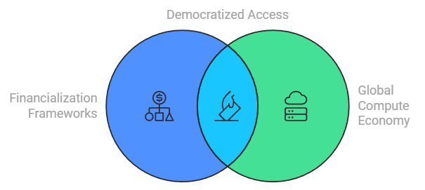

# EXABITS\_APPLICATION

    [![Crunchbase](https://img.shields.io/badge/Crunchbase-Profile-0288D1?style=flat-square\&logo=data:image/svg+xml;base64,PHN2ZyB3aWR0aD0iMjQiIGhlaWdodD0iMjQiIHZpZXdCb3g9IjAgMCAyNCAyNCIgZmlsbD0ibm9uZSIgeG1sbnM9Imh0dHA6Ly93d3cudzMub3JnLzIwMDAvc3ZnIj48cGF0aCBkPSJNMTIgMEM1LjM4IDAgMCA1LjM4IDAgMTJDMCAxOC42MiA1LjM4IDI0IDEyIDI0QzE4LjYyIDI0IDI0IDE4LjYyIDI0IDEyQzI0IDUuMzggMTguNjIgMCAxMiAwWiIgZmlsbD0iIzAwODhEMSIvPjxwYXRoIGQ9Ik05LjI5NzUgMTQuNTI1QzkuMjk3NSAxNC41MjUgOS4yOTc1IDE0LjUyNSA5LjI5NzUgMTQuNTI1TDEwLjc2MjUgMTUuOTg3NUMxMC43NjI1IDE1Ljk4NzUgMTAuNzYyNSAxNS45ODc1IDEwLjc2MjUgMTUuOTg3NUwxNS45ODc1IDEwLjc2MjVDMTUuOTg3NSAxMC43NjI1IDE1Ljk4NzUgMTAuNzYyNSAxNS45ODc1IDEwLjc2MjVMMTAuNzYyNSA1LjUzNzVDMTAuNzYyNSA1LjUzNzUgMTAuNzYyNSA1LjUzNzUgMTAuNzYyNSA1LjUzNzVMMTAuNzYyNSA2Ljk5OTk5QzEwLjc2MjUgNi45OTk5OSAxMC43NjI1IDYuOTk5OTkgMTAuNzYyNSA2Ljk5OTk5TDkuMzUyNSA4LjQxMkM5LjMyNSA4LjQxMiA5LjI5NzUgOC40MTIgOS4yOTc1IDguNDEyTDcuODgyNSA2Ljk5OTk5QzcuODgyNSA2Ljk5OTk5IDcuODgyNSA2Ljk5OTk5IDcuODgyNSA2Ljk5OTk5TDkuMjk3NSA1LjU4NzVDOS4yOTc1IDUuNTg3NSA5LjI5NzUgNS41ODc1IDkuMjk3NSA1LjU4NzVMNi45OTk5OSA4LjQxMkM2Ljk3NDk5IDguNDEyIDYuOTUyNDkgOC40MTIgNi45NTI0OSA4LjQxMkM2Ljk1MjQ5IDguNDEyIDYuOTUyNDkgOC40MTIgNi45NTI0OSA8OC40MTJDMTAuNzYyNSAxMC43NjI1IDguNDEyNSAxMy4xMTI1IDYuOTUyNDkgMTQuNTI1TDE2LjA3MDkgMjAuNTM3MkMxNi4wNzAzIDIwLjUzNzIgMTYuMDcwMyAyMC41MzcyIDE2LjA3MDMgMjAuNTM3MkMxNi4wNjkzIDIwLjUzNjkgMTYuMDYxNyAyMC41MzA0IDE2LjA0NDMgMjAuNTEzMUwxNC41Njg3IDIwLjUxMzFDMTQuNTYgMjAuNTEzMSAxNC41NTIxIDIwLjUxMzEgMTQuNTUzIDIwLjUxMzFDMTQuNTUyMyAyMC41MTMxIDE0LjU0ODcgMjAuNTEzMSAxNC41NDQgMjAuNTEzMUwxMS44ODEgMTcuODQ2OEwxMS44ODEgMTcuODQ2OEMxMS44ODEgMTcuODQ2OCAxMS44ODEgMTcuODQ2OCAxMS44ODEgMTcuODQ2OEwxMi42ODM4IDE2Ljk2MDlMMTIuNjgzOCAxNi45NjA9TDEyLjc4NjggMTYuODYyOUwxMi43ODY8IDE2Ljg2MjlMMTIuMzEyMyAxNi40ODYzTDEyMzEyMyAxNi40ODYzTDEwLjc2MjUgMTQuOTMxOEMxMC43NjI1IDE0LjkzMTggMTAuNzYyNSAxNC45MzE8IDEwLjc2MjUgMTQuOTMxOEwxMi42ODM8IDEzLjAzOTEiIGZpbGw9IiMwMDg4RDEiIHN0cm9rZT0iIzAwODhEMSIgc3Ryb2tlLXdpZHRoPSIwIi8+PC9zdmc+)](https://www.crunchbase.com/person/joe-maristela)        

#### Dear Exabits Leadership

My name is Joe Maristela, and I'm writing to express my interest in joining the [Exabits](https://drive.google.com/drive/u/0/folders/1nbLRwyCevzyEmSCQI8qgCXTrx_TmudVE) team. I [believe that humanity's](TENETS.MD) most essential resource— compute—can _only_ be [coordinated](../COORDINATION_FAILURE.md) at the [scale necessary to achieve AGI](../AI/AGI_COMPUTE_THRESHOLD.MD) through the kind of [compute financialization](henry_ford_assembly_line.md) that Exabits seems to be pursuing.

> _This letter's attachments on_ [_Google Drive_](https://drive.google.com/drive/folders/1nbLRwyCevzyEmSCQI8qgCXTrx_TmudVE?usp=drive_link)

I hope to contribute to Exabits' growth by supporting their [node sale](../EXABITS_NODE_SALE.md) and [TGE](resilience.md) initiatives in the near-term, then expanding its enterprise and public sector businesses ("[Exabits Federal](../../ENCYCLOPEDIA/CRYPTO/datahive_federal.mdCRYPTO/datahive_federal.md)") over the long-term.

Based on the limited information I have as an outsider, and acknowledging that this involves some generalizations and assumptions, several high-level concepts and frameworks come to mind that could support Exabits' "near-term" missions:

1. [**Financialization Frameworks for Tradeable Compute**](../AI/tradeable_compute.md): I propose developing comprehensive frameworks that transform compute resources into financial instruments, making them tradeable assets. This approach not only broadens liquidity and accessibility across the global compute economy but also generates new liquidity processes and opportunities.
2. [**SLA Modularization Framework for Universally Tradeable Compute**](exabits_sla_module.md): I envision creating a modular framework for [Service Level Agreements (SLAs)](broken-reference) that enables compute resources to be highly tradeable. This involves [standardizing SLA components](../STANDARDIZING_SLAs.md) such as uptime guarantees and latency benchmarks, which can be tailored to specific workloads or enterprise needs.
3. [**Balancing Near-term AI-enabled Insights with Long-term Goals**](../PATH_DEPENDENCE_PRIORITIZATION.md): It's crucial to distinguish between insights that can be achieved quickly with AI and those that require long-term investment. This balance will help us align immediate objectives with strategic, long-term goals.
4. [**Digital Transformations and Big-data Generation Events**](../DIGITAL_TRANSFORMATIONS.md): Monitoring radical digital transformations and the subsequent big-data generation is essential for understanding and predicting compute demand. By doing so, we can better allocate resources and anticipate market needs.

### Capabilities

1. [**Blockchain Development**](https://www.perplexity.ai/page/joe-maristela-blockchain-devel-4EDwO72sT.q5oASbSE007Q):
   * Proficiency in smart contract development and deployment.
   * Experience with blockchain platforms like Ethereum and OP Sepolia.
2. **Technical Architecture Design**:
   * Ability to design scalable and secure system architectures.
   * [Experience in developing SDKs for enterprise solutions](https://www.perplexity.ai/page/joe-maristela-sdk-architect-VsXrIkfwQ6CMgD_cvmwDWQ).
3. [**Project Management**](../../ENCYCLOPEDIA/CRYPTO/datahive_teams_projects.mddatahive_teams_projects.md):
   * Expertise in managing complex projects from conception to execution.
   * Strong skills in coordinating cross-functional teams.
4. **Strategic Planning**:
   * Ability to develop and implement strategic initiatives for growth.
   * Experience in financial modeling and valuation frameworks.
5. **Community Development**:
   * Skills in building and managing online communities.
   * Experience with platforms for community engagement and growth.
6. **Regulatory Compliance**:
   * Understanding of regulatory requirements for token sales.
   * Experience ensuring compliance with financial regulations.

### [Reverse-chronological Biography](../history/2024.md)

In 2024, I served as DataHive's Chief Strategy Officer. Initially, I engaged as a consultant (1099), transitioning to a W2 to qualify for DataHive's ESOP. I designed [DataHive's core protocol](https://github.com/datahiv3/Core-Protocol), mid-level [smart contract architecture](https://docs.google.com/document/d/1WYE5i-4UJOUmDWNEUC-6QCD1NwRpCeqs/edit?usp=drive_link\&ouid=111669319430294495371\&rtpof=true\&sd=true) (links to docs are drafts and left deliberately vague), and a DataHive SDK leveraging our testnet on OP Sepolia. This allowed enterprise customers to "test drive" our vision for the mainnet. Additionally, I:

1. Designed, deployed [DataHive's protocol and overall node architecture](../../TECHNOLOGY/microsoft.mdLOGY/microsoft.md); designed [DataHive's node sale operational framework](../../ENCYCLOPEDIA/CRYPTO/datahive_node_sale.mdYPTO/datahive_node_sale.md)
2. Designed, deployed [foundational intelligence and knowledge models](medical_and_health_sciences.md)
3. Established an [overarching valuation framework](../../TECHNOLOGY/microsoft_azure.mdicrosoft_azure.md) that spans a diverse set of opportunity themes.
4. Created an [internal cPanel for managing commnunity growth](../DATAHIVE_COMMUNITY.md) across all communication and social platforms.

From 2020 to 2024, I also:

1. Assisted [Mark](../CRYPTO/AETHIR.MD/AETHIR.MD) with various technical documentation and strategy development at../CRYPTO/AETHIR.MD(../CRYPTO/AETHIR.MD)
2. Consulted with/for with the [Linux Foundation](../LINUX.md) and its hardware ISA partner, the [RISC-V Foundation](../RISCV.md)
3. Contributed to various [DePIN projects](../DePIN.md), including [CivilAirspace's core protocol](https://github.com/rolodexter/CivilAirspace)

From 2010-2020, I:

1. Managed a crypto/fintech investment fund for my grandfather's family office (Stella Maris Trust)
2. [Mirgated a call center](sbcph.md) from Beaverton, Oregon to Manila, Philippines (Makati City)
3. I consulted for a buddy's company, assisting him bring a [robotic vaccine storage sytem](../HEALTH/ACCUVAX.MD) to market

> See also: [_Earlier Timeline_](earlier_timeline.md)
