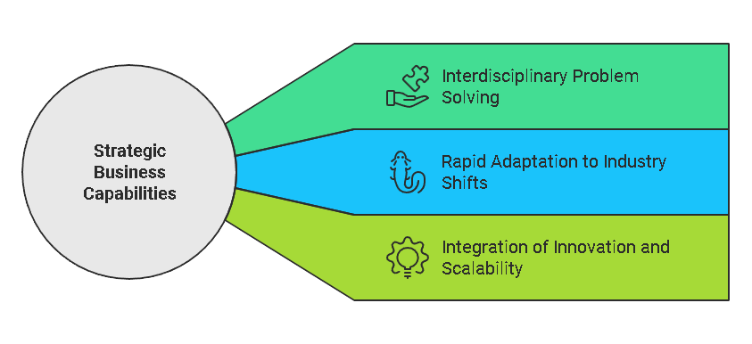

# PERSONAL\_STATEMENT\_JOBS

    [![Crunchbase](https://img.shields.io/badge/Crunchbase-Profile-0288D1?style=flat-square\&logo=data:image/svg+xml;base64,PHN2ZyB3aWR0aD0iMjQiIGhlaWdodD0iMjQiIHZpZXdCb3g9IjAgMCAyNCAyNCIgZmlsbD0ibm9uZSIgeG1sbnM9Imh0dHA6Ly93d3cudzMub3JnLzIwMDAvc3ZnIj48cGF0aCBkPSJNMTIgMEM1LjM4IDAgMCA1LjM4IDAgMTJDMCAxOC42MiA1LjM4IDI0IDEyIDI0QzE4LjYyIDI0IDI0IDE4LjYyIDI0IDEyQzI0IDUuMzggMTguNjIgMCAxMiAwWiIgZmlsbD0iIzAwODhEMSIvPjxwYXRoIGQ9Ik05LjI5NzUgMTQuNTI1QzkuMjk3NSAxNC41MjUgOS4yOTc1IDE0LjUyNSA5LjI5NzUgMTQuNTI1TDEwLjc2MjUgMTUuOTg3NUMxMC43NjI1IDE1Ljk4NzUgMTAuNzYyNSAxNS45ODc1IDEwLjc2MjUgMTUuOTg3NUwxNS45ODc1IDEwLjc2MjVDMTUuOTg3NSAxMC43NjI1IDE1Ljk4NzUgMTAuNzYyNSAxNS45ODc1IDEwLjc2MjVMMTAuNzYyNSA1LjUzNzVDMTAuNzYyNSA1LjUzNzUgMTAuNzYyNSA1LjUzNzUgMTAuNzYyNSA1LjUzNzVMMTAuNzYyNSA2Ljk5OTk5QzEwLjc2MjUgNi45OTk5OSAxMC43NjI1IDYuOTk5OTkgMTAuNzYyNSA2Ljk5OTk5TDkuMzUyNSA4LjQxMkM5LjMyNSA4LjQxMiA5LjI5NzUgOC40MTIgOS4yOTc1IDguNDEyTDcuODgyNSA2Ljk5OTk5QzcuODgyNSA2Ljk5OTk5IDcuODgyNSA2Ljk5OTk5IDcuODgyNSA2Ljk5OTk5TDkuMjk3NSA1LjU4NzVDOS4yOTc1IDUuNTg3NSA5LjI5NzUgNS41ODc1IDkuMjk3NSA1LjU4NzVMNi45OTk5OSA4LjQxMkM2Ljk3NDk5IDguNDEyIDYuOTUyNDkgOC40MTIgNi45NTI0OSA4LjQxMkM2Ljk1MjQ5IDguNDEyIDYuOTUyNDkgOC40MTIgNi45NTI0OSA8OC40MTJDMTAuNzYyNSAxMC43NjI1IDguNDEyNSAxMy4xMTI1IDYuOTUyNDkgMTQuNTI1TDE2LjA3MDkgMjAuNTM3MkMxNi4wNzAzIDIwLjUzNzIgMTYuMDcwMyAyMC41MzcyIDE2LjA3MDMgMjAuNTM3MkMxNi4wNjkzIDIwLjUzNjkgMTYuMDYxNyAyMC41MzA0IDE2LjA0NDMgMjAuNTEzMUwxNC41Njg3IDIwLjUxMzFDMTQuNTYgMjAuNTEzMSAxNC41NTIxIDIwLjUxMzEgMTQuNTUzIDIwLjUxMzFDMTQuNTUyMyAyMC41MTMxIDE0LjU0ODcgMjAuNTEzMSAxNC41NDQgMjAuNTEzMUwxMS44ODEgMTcuODQ2OEwxMS44ODEgMTcuODQ2OEMxMS44ODEgMTcuODQ2OCAxMS44ODEgMTcuODQ2OCAxMS44ODEgMTcuODQ2OEwxMi42ODM4IDE2Ljk2MDlMMTIuNjgzOCAxNi45NjA9TDEyLjc4NjggMTYuODYyOUwxMi43ODY8IDE2Ljg2MjlMMTIuMzEyMyAxNi40ODYzTDEyMzEyMyAxNi40ODYzTDEwLjc2MjUgMTQuOTMxOEMxMC43NjI1IDE0LjkzMTggMTAuNzYyNSAxNC45MzE8IDEwLjc2MjUgMTQuOTMxOEwxMi42ODM8IDEzLjAzOTEiIGZpbGw9IiMwMDg4RDEiIHN0cm9rZT0iIzAwODhEMSIgc3Ryb2tlLXdpZHRoPSIwIi8+PC9zdmc+)](https://www.crunchbase.com/person/joe-maristela)        

### Career Transition

I'm actively seeking to pivot my career from executive leadership and management roles into entry-level, ground-floor positions. My goal is to immerse myself in the nitty-gritty of a specific niche, leveraging my diverse background to bring fresh perspectives while learning and growing in a new specialized area.

**Why this transition?**

* To gain hands-on experience in cutting-edge technologies
* To contribute directly to product development and innovation
* To build a deep, specialized skill set in a rapidly evolving field

This shift allows me to apply my [systems science perspective](systems_mindset.md) and [interdisciplinary approach](interdisciplinary_connections.md) to tackle complex challenges from a new angle, combining my strategic insights with practical, technical expertise.

My career blends [technical expertise](engineering.md), [strategic leadership](../BUSINESS/strategic_leadership.mdeadership.md), and a [systems science perspective](systems_mindset.md) to tackle complex challenges. With a proven ability to [connect interdisciplinary dots](interdisciplinary_connections.md), I deliver innovative, high-impact results across industries, from [blockchain technology](../CRYPTO/blockchain_experience.md) to [AI automation](../AI/AI_PRODUCTIVITY.MD).

### Value

* **Transformative Leadership**: Directed [cryptoeconomic governance models](../AI/cryptoeconomic_models.md), driving community engagement by 40%.
* **Operational Excellence**: Designed and deployed [workflow automation](workflow_automation.md) frameworks, reducing inefficiencies by 25%.
* **Innovative Solutions**: Applied [AI-driven automation](../AI/AI_PRODUCTIVITY.MD) to streamline operations, increasing team productivity by measurable metrics.

> See also: [_Motivations_](motivation.md)

### How My Background Fits

While my career spans [medicine](medical_background.md), [decentralized systems](decentralized_architecture.md), and [business development](business_development.md), this diversity equips me to:

* Solve interdisciplinary problems with unique insights.
* Adapt rapidly to industry shifts and challenges.
* Integrate cutting-edge innovation with operational scalability.

### Passion for Learning and Growth

I’m seeking roles where I can continue to [grow and learn](career_growth.md), applying my expertise in [automating workflows](workflow_automation.md) and [driving measurable outcomes](sovereign_wealth_funds.md) to make an immediate impact. Whether in [technical writing](broken-reference), [strategy](broken-reference), or [developer relations](ipcc.md), I excel in roles that emphasize [collaboration](../../../LITERARY_PRODUCTS/JOES_NOTES/CRYPTO/CRYPTOECONOMICS.MD) and [execution](execution.md).

### Results-Driven Expertise

* Delivered a successful [testnet deployment](../../ENCYCLOPEDIA/CRYPTO/datahive_projects.md), advancing a decentralized infrastructure roadmap.
* Automated critical workflows, enabling a 30% efficiency gain in high-stakes projects.
* Created scalable systems supporting organizational growth across domains.
