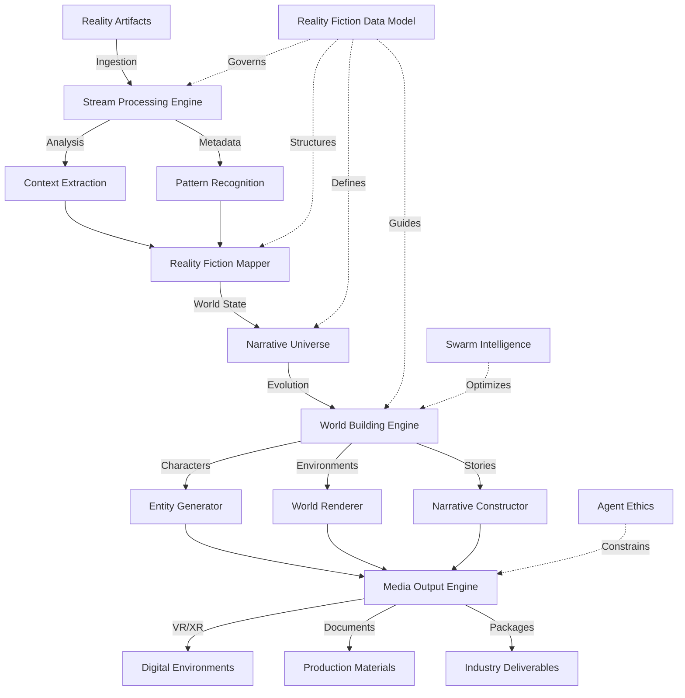

# rolodexter LARP

  <a href="../../README.md">Home</a> | <a href="../../projects/projects.md">Projects</a> | <a href="../../research/research.md">Research</a> | <a href="../../techstack/techstack.md">Tech Stack</a> | <a href="../../contact.md">Contact</a>

Notice

This repository is protected by copyright and subject to usage restrictions. See the [Copyright Notice](../../COPYRIGHT.md) for details.

## Overview

rolodexter LARP (Live Artifact Reality Processing) is a real-time world building engine powered by Reality Fiction data architecture. It transforms real-world artifacts into dynamic, interconnected narrative universes and multimedia experiences. By processing real-world data streams (emails, documents, communications), LARP continuously evolves and expands its generated worlds while maintaining coherent narrative structures across multiple media formats.

## Reality Fiction Architecture

### Data Structure
- Reality-narrative mapping
- Temporal stream processing
- Multi-dimensional story graphs
- World state management
- Narrative coherence validation

### Technical Architecture

### World Building Core
- Real-time universe expansion
- Dynamic reality integration
- Narrative thread weaving
- World state persistence
- Cross-reality synchronization

### Narrative Systems
- Reality-fiction bridges
- Story emergence patterns
- Character ecosystem development
- Event cascade management
- Timeline reconciliation

## Processing Systems

### Reality Stream Processing
- Real-time artifact analysis
- Context extraction engines
- Pattern recognition systems
- Metadata enrichment
- Reality-fiction mapping

### World Generation
- Dynamic universe creation
- Environmental manifestation
- Reality anchoring systems
- World state evolution
- Coherence maintenance

### Entity Development
- Character manifestation
- Relationship networks
- Behavioral emergence
- Identity persistence
- Cross-reality presence

### Media Materialization
- Format-specific rendering
- Cross-media coherence
- Production asset generation
- Distribution packaging
- Rights management

## Output Manifestations

### Digital Environments
- Real-time VR worlds
- Dynamic XR spaces
- Interactive reality bridges
- Persistent universes
- Cross-reality portals

### Narrative Products
- Emergent storylines
- Character arcs
- World histories
- Reality-fiction interfaces
- Universe documentation

### Industry Deliverables
- Studio development packages
- Agent representation materials
- Production blueprints
- Licensing frameworks
- Distribution strategies

## Technical Foundation

### Core Architecture
- Reality Fiction data model
- Stream processing engine
- World state manager
- Narrative coherence validator
- Distribution framework

### Integration Systems
- [Swarm Intelligence](../../research/papers/swarm-intelligence.md) for narrative emergence
- [Hardware Infrastructure](../../techstack/infrastructure/hardware.md) for world manifestation
- [Agent Ethics](../../research/hypotheses/swarm-ethics.md) for reality-fiction boundaries

### Industry Interfaces
- Licensed broker protocols
- Agent credentialing systems
- Studio pipeline integration
- Rights management framework
- Distribution network APIs 