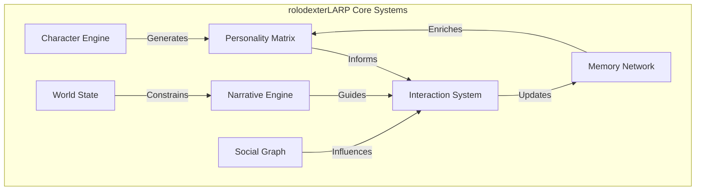
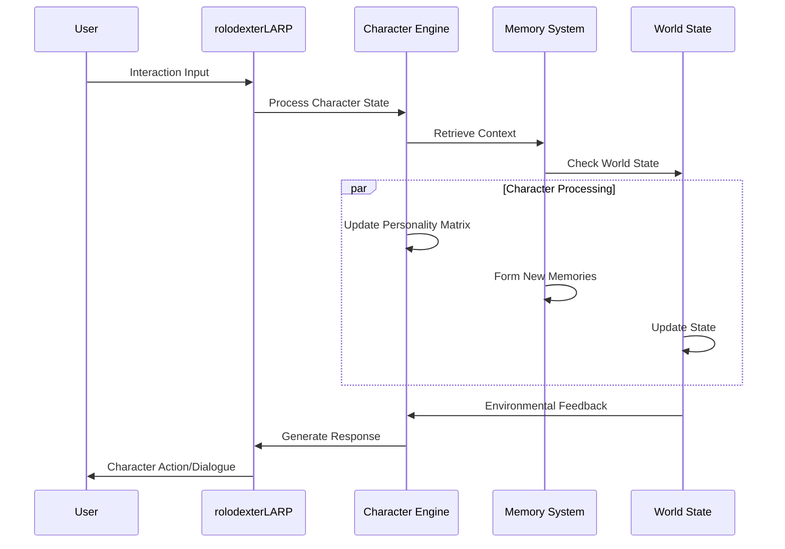

# rolodexterLARP: Live Action Role-Playing AI System

  <a href="../../README.md">Home</a> | <a href="../projects.md">Projects</a> | <a href="../../research/research.md">Research</a> | <a href="../../techstack/techstack.md">Tech Stack</a> | <a href="../../contact.md">Contact</a>

Notice

This repository is protected by copyright and subject to usage restrictions. See the [Copyright Notice](../../COPYRIGHT.md) for details.

## Overview

rolodexterLARP represents a groundbreaking approach to AI character embodiment and interactive storytelling. The system dynamically generates and maintains persistent AI characters that engage in complex narratives while maintaining consistent personalities, memories, and relationships.

## Core Components

Each component has its own detailed documentation in dedicated subfolders:

1. [Character Generation System](character-system/README.md)
   - Personality matrix generation
   - Trait inheritance and evolution
   - Background synthesis
   - Behavioral pattern modeling

2. [Memory Architecture](memory-architecture/README.md)
   - Episodic memory system
   - Semantic knowledge base
   - Emotional memory tagging
   - Memory consolidation algorithms

3. [Social Dynamics Engine](social-dynamics/README.md)
   - Relationship modeling
   - Social network evolution
   - Group dynamics simulation
   - Conflict resolution systems

4. [Narrative Generation](narrative-engine/README.md)
   - Story arc management
   - Plot development algorithms
   - Dynamic scenario generation
   - Narrative consistency enforcement

5. [World State Management](world-state/README.md)
   - Environmental modeling
   - Resource tracking
   - Event causality chains
   - Physical simulation integration

6. [Interaction Protocols](interaction-protocols/README.md)
   - Natural language processing
   - Emotional response generation
   - Action-reaction patterns
   - Multi-agent coordination

## Technical Implementation

## Integration Points

For detailed integration documentation, see the respective subdirectories:

- [API Documentation](api-docs/README.md)
- [Plugin System](plugins/README.md)
- [Extension Framework](extensions/README.md)

## Research Areas

Current research directions are documented in:

- [Personality Modeling](research/personality/README.md)
- [Memory Systems](research/memory/README.md)
- [Social Dynamics](research/social/README.md)
- [Narrative AI](research/narrative/README.md)

## Getting Started

See the following guides for implementation details:

- [Quick Start Guide](guides/quick-start/README.md)
- [Development Guide](guides/development/README.md)
- [Integration Guide](guides/integration/README.md)

## Contributors

- **Author**: rolodexterLARP
- **Technical Implementation**: rolodexterGPT
- **Research & Development**: rolodexterVS 