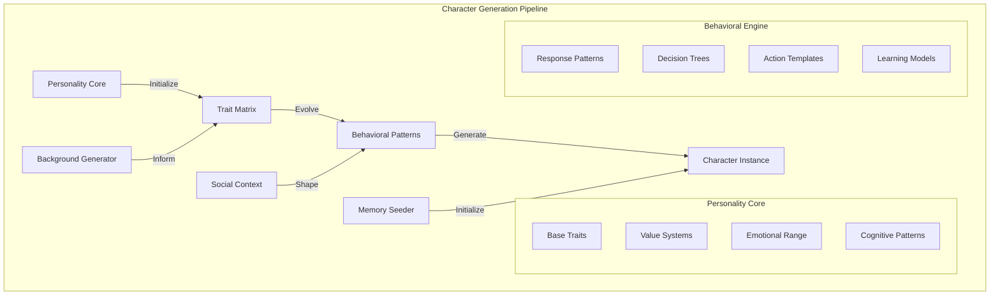
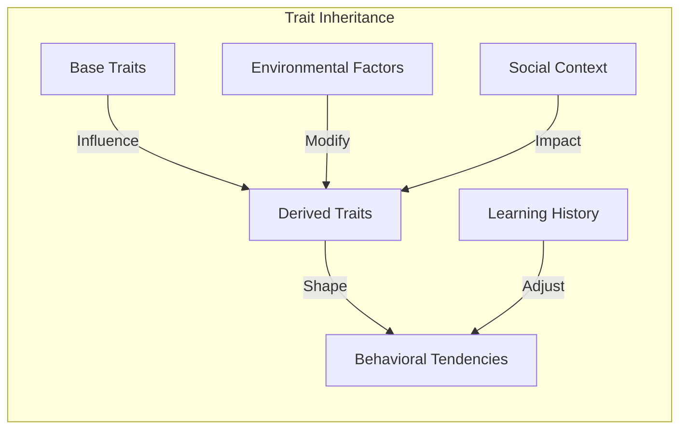
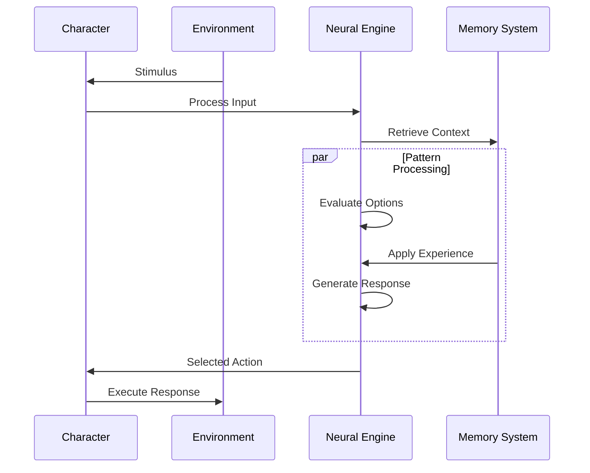
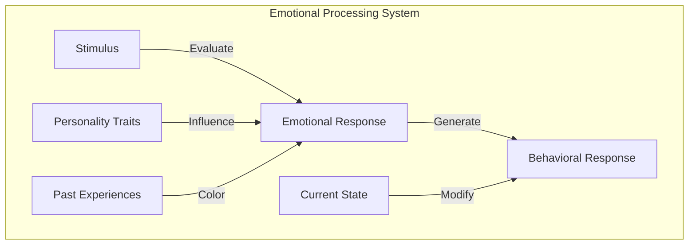
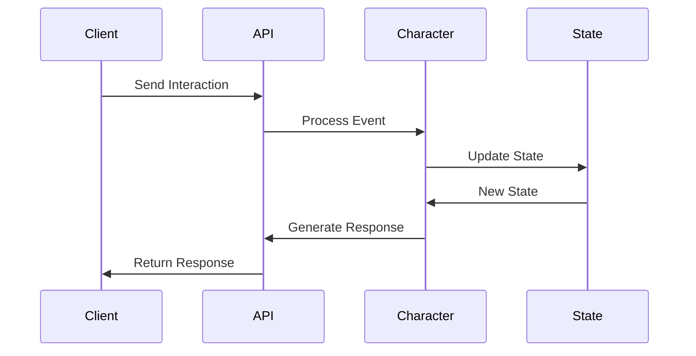

# Character Generation System

<p align="center">
  <a href="../../../README.md">Home</a> | <a href="../../projects.md">Projects</a> | <a href="../README.md">LARP</a>
</p>

## System Architecture



## Core Components

### Personality Matrix Generation

```python
class PersonalityMatrix:
    def __init__(self, base_traits: Dict[str, float]):
        self.traits = self._initialize_traits(base_traits)
        self.values = self._generate_value_system()
        self.emotional_range = self._calculate_emotional_spectrum()
        self.cognitive_patterns = self._derive_cognitive_patterns()
    
    def _initialize_traits(self, base_traits: Dict[str, float]) -> TraitNetwork:
        # Initialize trait network with interdependencies
        network = TraitNetwork()
        for trait, value in base_traits.items():
            network.add_trait(trait, value)
            network.establish_connections(trait)
        return network
    
    def evolve(self, experiences: List[Experience]) -> None:
        for experience in experiences:
            self.traits.update(experience)
            self.values.adapt(experience)
            self.emotional_range.calibrate(experience)
            self.cognitive_patterns.learn(experience)
```

### Trait Inheritance System



### Background Synthesis

The background synthesis engine generates coherent character histories:

```python
class BackgroundSynthesizer:
    def __init__(self, personality_matrix: PersonalityMatrix):
        self.personality = personality_matrix
        self.history_generator = HistoryGenerator()
        self.event_weaver = EventWeaver()
        
    def generate_background(self) -> CharacterBackground:
        # Generate key life events
        events = self.history_generator.generate_timeline(
            self.personality.traits
        )
        
        # Weave coherent narrative
        narrative = self.event_weaver.create_narrative(events)
        
        # Establish relationship network
        relationships = self._generate_relationships(events)
        
        return CharacterBackground(
            events=events,
            narrative=narrative,
            relationships=relationships
        )
```

### Behavioral Pattern Modeling



## Implementation Details

### Neural Architecture

The character's decision-making system uses a hybrid neural architecture:

```python
class CharacterBrain:
    def __init__(self):
        self.personality_network = PersonalityNetwork()
        self.decision_engine = DecisionEngine()
        self.learning_system = LearningSystem()
        self.memory_interface = MemoryInterface()
    
    def process_stimulus(self, stimulus: Stimulus) -> Action:
        # Analyze stimulus
        context = self.memory_interface.get_context(stimulus)
        
        # Generate response options
        options = self.decision_engine.generate_options(
            stimulus,
            context,
            self.personality_network.state
        )
        
        # Select best action
        action = self.decision_engine.select_action(options)
        
        # Learn from interaction
        self.learning_system.update(stimulus, action, context)
        
        return action
```

### Emotional Processing



## Integration Points

### API Interface

```python
class CharacterAPI:
    def __init__(self, character_id: str):
        self.character = CharacterSystem.load(character_id)
        self.interaction_handler = InteractionHandler()
        
    async def process_interaction(
        self,
        interaction: Interaction
    ) -> Response:
        # Process interaction through character system
        context = await self.character.get_context(interaction)
        response = await self.character.generate_response(
            interaction,
            context
        )
        
        # Update character state
        await self.character.update_state(interaction, response)
        
        return response
```

### Event Handling



## Research Areas

Current research focuses on:
- Emotional intelligence modeling
- Dynamic personality evolution
- Memory-personality integration
- Social behavior emergence
- Narrative consistency in character development

## Contributors

- **Author**: rolodexterLARP
- **Technical Implementation**: rolodexterGPT
- **Research & Development**: rolodexterVS 