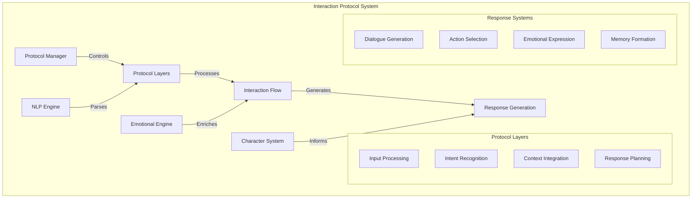
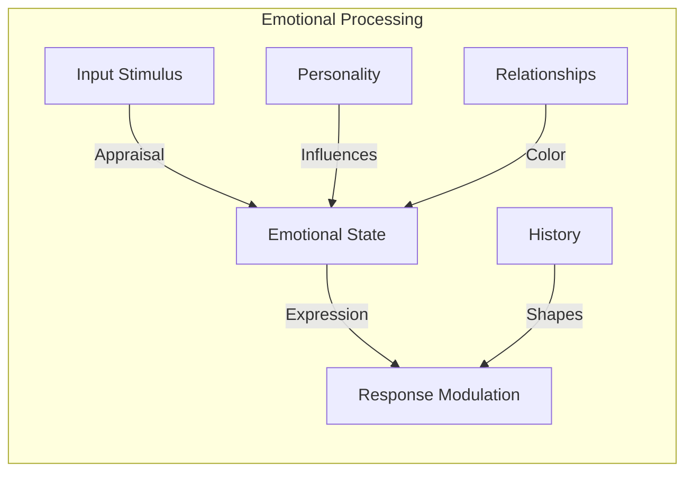
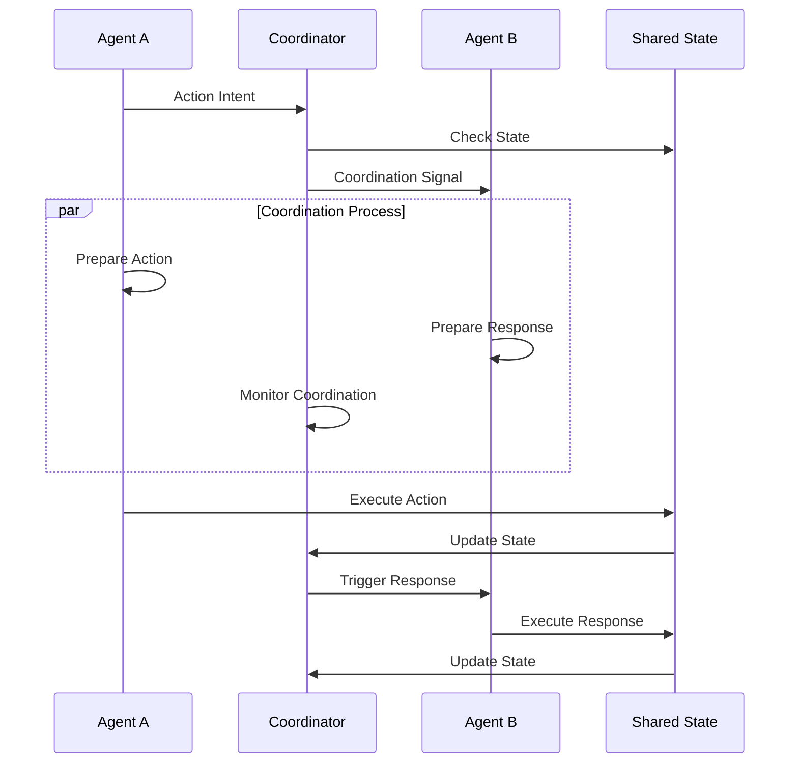
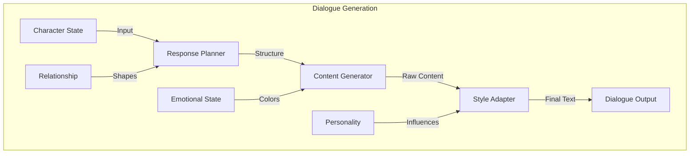
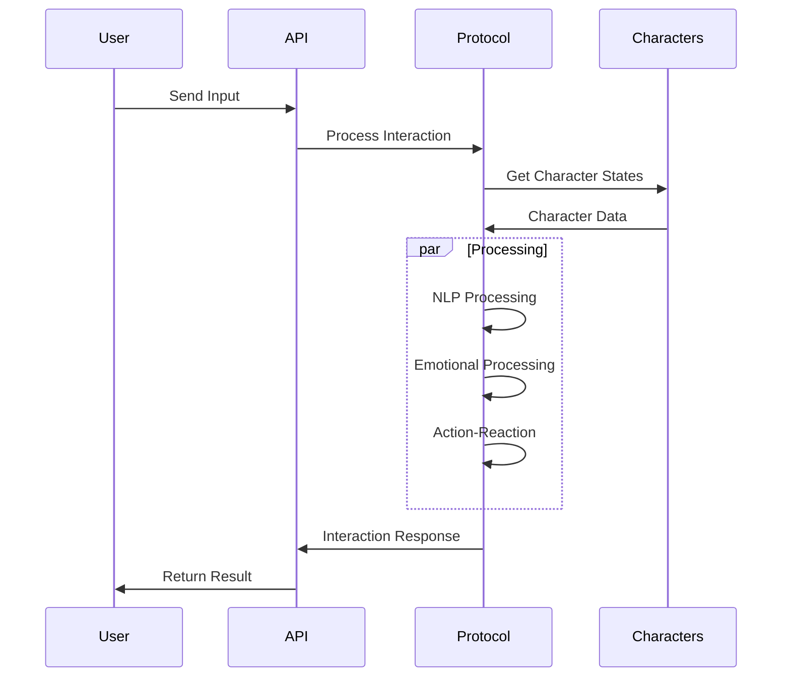

# Interaction Protocols

<p align="center">
  <a href="../../../README.md">Home</a> | <a href="../../projects.md">Projects</a> | <a href="../README.md">LARP</a>
</p>

## System Architecture



## Core Components

### Natural Language Processing

```python
class NLPEngine:
    def __init__(self):
        self.tokenizer = Tokenizer()
        self.parser = Parser()
        self.intent_classifier = IntentClassifier()
        self.entity_recognizer = EntityRecognizer()
        self.context_integrator = ContextIntegrator()
    
    async def process_input(
        self,
        text: str,
        context: InteractionContext
    ) -> ProcessedInput:
        # Tokenize input
        tokens = self.tokenizer.tokenize(text)
        
        # Parse structure
        parse_tree = self.parser.parse(tokens)
        
        # Classify intent
        intent = self.intent_classifier.classify(
            tokens,
            parse_tree,
            context
        )
        
        # Recognize entities
        entities = self.entity_recognizer.recognize(
            tokens,
            parse_tree,
            context
        )
        
        # Integrate with context
        enriched_input = self.context_integrator.integrate(
            tokens,
            parse_tree,
            intent,
            entities,
            context
        )
        
        return ProcessedInput(
            original_text=text,
            tokens=tokens,
            parse_tree=parse_tree,
            intent=intent,
            entities=entities,
            enriched=enriched_input
        )
```

### Emotional Response Generation



### Action-Reaction Patterns

The system models complex interaction patterns:

```python
class ActionReactionSystem:
    def __init__(self):
        self.pattern_library = PatternLibrary()
        self.action_classifier = ActionClassifier()
        self.reaction_generator = ReactionGenerator()
        self.context_analyzer = ContextAnalyzer()
    
    def process_action(
        self,
        action: Action,
        actor: Character,
        targets: List[Character],
        context: InteractionContext
    ) -> List[Reaction]:
        # Classify action
        action_type = self.action_classifier.classify(action)
        
        # Analyze context
        context_factors = self.context_analyzer.analyze(context)
        
        # Find matching patterns
        patterns = self.pattern_library.find_matching(
            action_type,
            actor,
            targets,
            context_factors
        )
        
        # Generate reactions for each target
        reactions = []
        for target in targets:
            # Select appropriate pattern
            pattern = self._select_best_pattern(
                patterns,
                target,
                context
            )
            
            # Generate reaction
            reaction = self.reaction_generator.generate(
                action,
                target,
                pattern,
                context
            )
            
            reactions.append(reaction)
        
        return reactions
```

### Multi-Agent Coordination



## Implementation Details

### Protocol Implementation

```python
class InteractionProtocol:
    def __init__(self):
        self.nlp_engine = NLPEngine()
        self.emotional_engine = EmotionalEngine()
        self.action_reaction = ActionReactionSystem()
        self.response_generator = ResponseGenerator()
    
    async def process_interaction(
        self,
        input_text: str,
        source: Character,
        targets: List[Character],
        context: InteractionContext
    ) -> InteractionResponse:
        # Process natural language
        processed_input = await self.nlp_engine.process_input(
            input_text,
            context
        )
        
        # Convert to action
        action = self._convert_to_action(
            processed_input,
            source
        )
        
        # Process emotional impact
        emotional_states = self.emotional_engine.process_action(
            action,
            source,
            targets,
            context
        )
        
        # Generate reactions
        reactions = self.action_reaction.process_action(
            action,
            source,
            targets,
            context
        )
        
        # Generate responses
        responses = []
        for target, reaction, emotional_state in zip(
            targets, reactions, emotional_states
        ):
            response = self.response_generator.generate(
                target,
                reaction,
                emotional_state,
                context
            )
            responses.append(response)
        
        # Update context
        updated_context = self._update_context(
            context,
            action,
            reactions,
            emotional_states
        )
        
        return InteractionResponse(
            original_input=input_text,
            processed_input=processed_input,
            action=action,
            reactions=reactions,
            responses=responses,
            updated_context=updated_context
        )
```

### Dialogue Generation



## Integration Points

### API Interface

```python
class InteractionProtocolAPI:
    def __init__(self):
        self.protocol = InteractionProtocol()
        self.context_manager = ContextManager()
        self.character_manager = CharacterManager()
        
    async def process_user_interaction(
        self,
        user_input: str,
        user_id: str,
        character_ids: List[str],
        session_id: str
    ) -> InteractionResult:
        # Get context
        context = await self.context_manager.get_context(session_id)
        
        # Get characters
        user_character = await self.character_manager.get_user_character(user_id)
        target_characters = await self.character_manager.get_characters(character_ids)
        
        # Process interaction
        response = await self.protocol.process_interaction(
            user_input,
            user_character,
            target_characters,
            context
        )
        
        # Update context
        await self.context_manager.update_context(
            session_id,
            response.updated_context
        )
        
        # Format result
        return self._format_result(response)
```

### Event Handling



## Research Areas

Current research focuses on:
- Advanced natural language understanding
- Emotional intelligence modeling
- Multi-agent coordination protocols
- Context-aware response generation
- Personality-driven dialogue systems

## Contributors

- **Author**: rolodexterLARP
- **Technical Implementation**: rolodexterGPT
- **Research & Development**: rolodexterVS 