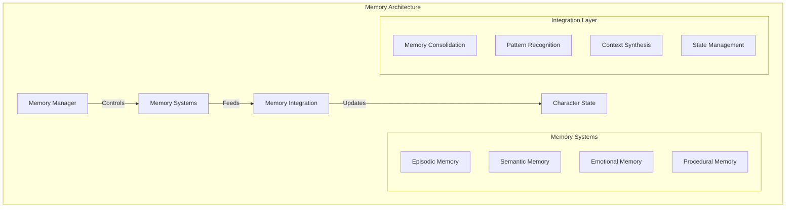
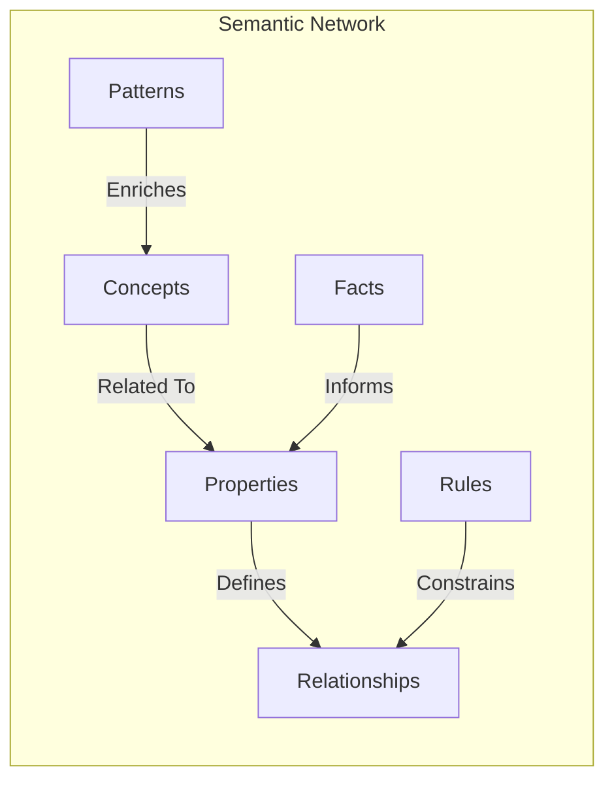
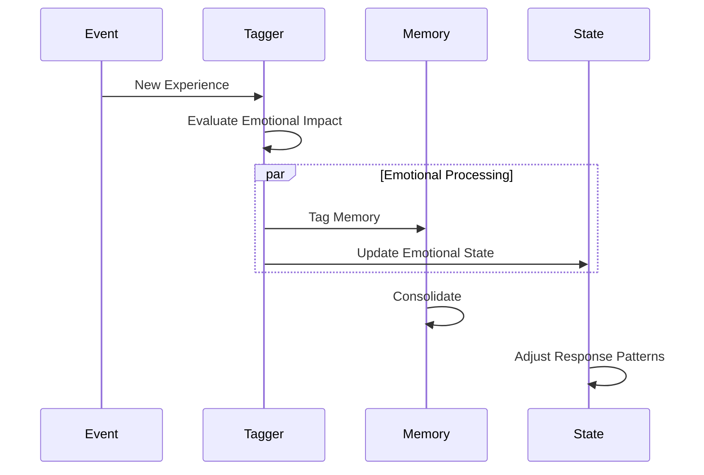
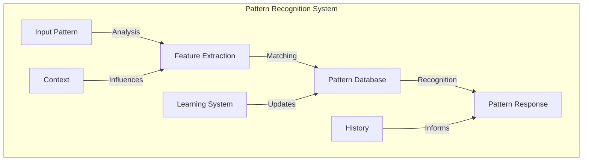
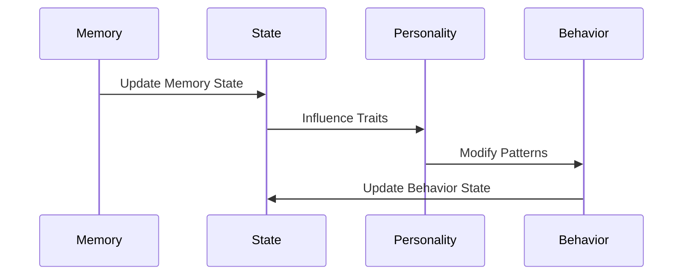

# Memory Architecture

<p align="center">
  <a href="../../../README.md">Home</a> | <a href="../../projects.md">Projects</a> | <a href="../README.md">LARP</a>
</p>

## System Overview



## Core Components

### Episodic Memory System

```python
class EpisodicMemory:
    def __init__(self):
        self.events = TemporalGraph()
        self.context_index = ContextualIndex()
        self.emotional_tags = EmotionalTagger()
    
    def store_event(self, event: Event) -> None:
        # Process event details
        context = self.context_index.extract_context(event)
        emotional_impact = self.emotional_tags.evaluate(event)
        
        # Create memory node
        memory = MemoryNode(
            event=event,
            context=context,
            emotional_impact=emotional_impact
        )
        
        # Insert into temporal graph
        self.events.insert(memory)
        
        # Update indices
        self.context_index.update(memory)
        self.emotional_tags.update(memory)
```

### Semantic Knowledge Base



### Memory Consolidation

The system uses a sophisticated memory consolidation process:

```python
class MemoryConsolidator:
    def __init__(self):
        self.short_term = ShortTermMemory()
        self.long_term = LongTermMemory()
        self.consolidation_engine = ConsolidationEngine()
    
    async def consolidate_memories(self) -> None:
        # Get memories ready for consolidation
        memories = self.short_term.get_consolidation_candidates()
        
        # Process each memory
        for memory in memories:
            # Extract patterns
            patterns = self.consolidation_engine.extract_patterns(memory)
            
            # Strengthen relevant connections
            self.long_term.strengthen_connections(patterns)
            
            # Update semantic knowledge
            await self.update_semantic_knowledge(memory)
            
            # Archive or forget based on importance
            if self.consolidation_engine.evaluate_importance(memory):
                self.long_term.store(memory)
            else:
                self.short_term.forget(memory)
```

### Emotional Memory Tagging



## Implementation Details

### Memory Retrieval System

```python
class MemoryRetrieval:
    def __init__(self):
        self.episodic_memory = EpisodicMemory()
        self.semantic_memory = SemanticMemory()
        self.context_engine = ContextEngine()
        
    async def retrieve_relevant_memories(
        self,
        stimulus: Stimulus,
        context: Context
    ) -> List[Memory]:
        # Extract key features
        features = self.context_engine.extract_features(stimulus)
        
        # Query different memory systems
        episodic_results = await self.episodic_memory.query(
            features,
            context
        )
        semantic_results = await self.semantic_memory.query(
            features,
            context
        )
        
        # Combine and rank results
        combined_results = self.rank_memories(
            episodic_results,
            semantic_results,
            context
        )
        
        return combined_results
```

### Pattern Recognition



## Integration Points

### Memory-Personality Interface

```python
class MemoryPersonalityInterface:
    def __init__(self):
        self.memory_system = MemorySystem()
        self.personality_engine = PersonalityEngine()
        
    def process_experience(self, experience: Experience) -> None:
        # Store memory
        memory = self.memory_system.store(experience)
        
        # Update personality based on experience
        self.personality_engine.adapt(experience)
        
        # Strengthen relevant connections
        self.strengthen_memory_personality_connections(
            memory,
            self.personality_engine.state
        )
```

### State Management



## Research Areas

Current research focuses on:
- Memory consolidation optimization
- Emotional memory integration
- Pattern recognition enhancement
- Context-aware retrieval systems
- Long-term memory management

## Contributors

- **Author**: rolodexterLARP
- **Technical Implementation**: rolodexterGPT
- **Research & Development**: rolodexterVS 