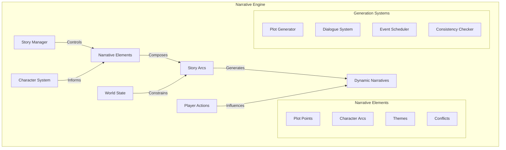
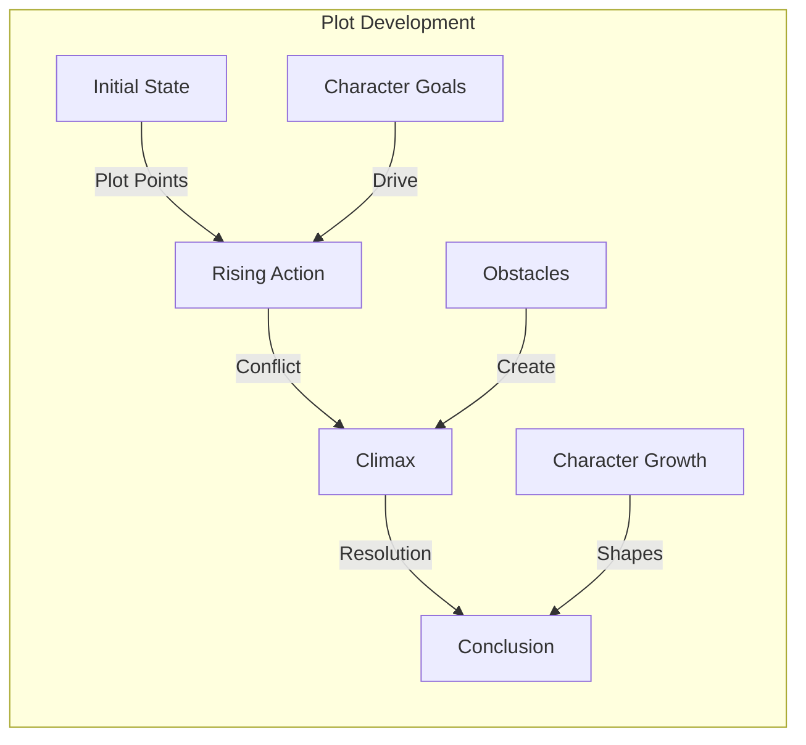
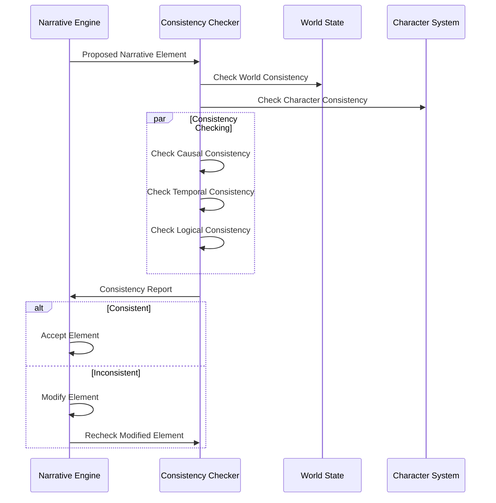
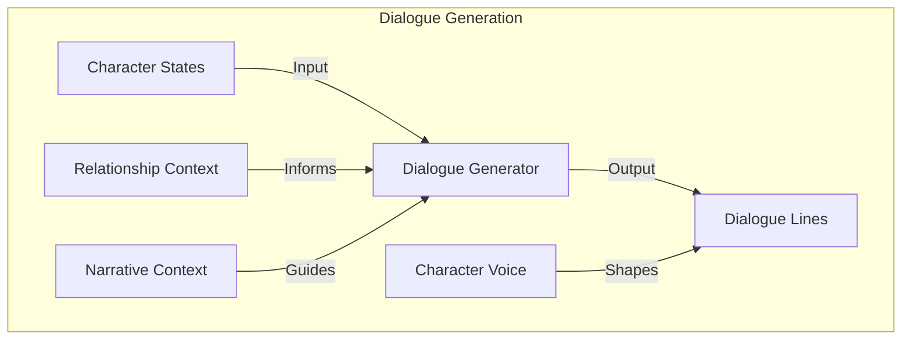
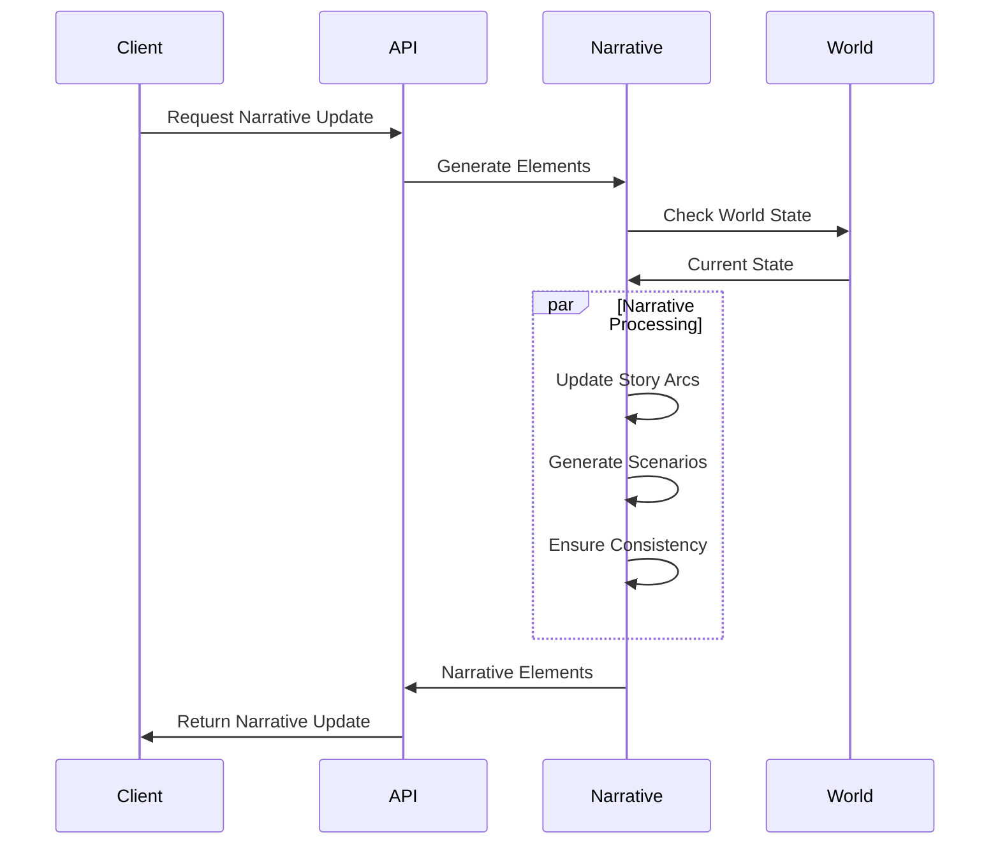

# Narrative Generation Engine

<p align="center">
  <a href="../../../README.md">Home</a> | <a href="../../projects.md">Projects</a> | <a href="../README.md">LARP</a>
</p>

## System Architecture



## Core Components

### Story Arc Management

```python
class StoryArcManager:
    def __init__(self):
        self.arc_templates = ArcTemplateLibrary()
        self.active_arcs = {}
        self.arc_scheduler = ArcScheduler()
        self.consistency_checker = ConsistencyChecker()
    
    def create_story_arc(
        self,
        arc_type: str,
        characters: List[Character],
        world_state: WorldState,
        parameters: Dict[str, Any]
    ) -> StoryArc:
        # Get arc template
        template = self.arc_templates.get_template(arc_type)
        
        # Instantiate arc
        arc = template.instantiate(
            characters=characters,
            world_state=world_state,
            parameters=parameters
        )
        
        # Check consistency with existing arcs
        conflicts = self.consistency_checker.check_conflicts(
            arc,
            self.active_arcs.values()
        )
        
        if conflicts:
            arc = self._resolve_conflicts(arc, conflicts)
        
        # Schedule arc events
        self.arc_scheduler.schedule(arc)
        
        # Register active arc
        self.active_arcs[arc.id] = arc
        
        return arc
    
    def advance_arc(
        self,
        arc_id: str,
        world_state: WorldState
    ) -> List[NarrativeEvent]:
        # Get arc
        arc = self.active_arcs.get(arc_id)
        if not arc:
            raise ValueError(f"Arc {arc_id} not found")
        
        # Advance arc state
        events = arc.advance(world_state)
        
        # Check for arc completion
        if arc.is_complete():
            self.active_arcs.pop(arc_id)
        
        return events
```

### Plot Development Algorithms



### Dynamic Scenario Generation

The system generates dynamic scenarios based on character states and world conditions:

```python
class ScenarioGenerator:
    def __init__(self):
        self.scenario_templates = ScenarioTemplateLibrary()
        self.character_analyzer = CharacterAnalyzer()
        self.world_state_analyzer = WorldStateAnalyzer()
        self.narrative_constraints = NarrativeConstraintEngine()
    
    def generate_scenario(
        self,
        characters: List[Character],
        world_state: WorldState,
        narrative_context: NarrativeContext
    ) -> Scenario:
        # Analyze character states
        character_states = {
            char.id: self.character_analyzer.analyze(char)
            for char in characters
        }
        
        # Analyze world state
        world_analysis = self.world_state_analyzer.analyze(world_state)
        
        # Identify potential scenario templates
        candidate_templates = self.scenario_templates.find_matching(
            character_states,
            world_analysis,
            narrative_context
        )
        
        # Select best template
        template = self._select_best_template(
            candidate_templates,
            narrative_context
        )
        
        # Generate scenario
        scenario = template.generate(
            characters,
            world_state,
            narrative_context
        )
        
        # Apply narrative constraints
        scenario = self.narrative_constraints.apply(
            scenario,
            narrative_context
        )
        
        return scenario
```

### Narrative Consistency Enforcement



## Implementation Details

### Narrative Graph Implementation

```python
class NarrativeGraph:
    def __init__(self):
        self.nodes = {}  # Plot points, events, etc.
        self.edges = {}  # Causal, temporal relationships
        
    def add_node(self, node: NarrativeNode) -> None:
        self.nodes[node.id] = node
        
    def add_edge(
        self,
        source_id: str,
        target_id: str,
        edge_type: str,
        attributes: Dict[str, Any]
    ) -> None:
        edge = NarrativeEdge(
            source_id=source_id,
            target_id=target_id,
            type=edge_type,
            attributes=attributes
        )
        self.edges[edge.id] = edge
        
    def get_narrative_path(
        self,
        start_node_id: str,
        end_node_id: str
    ) -> List[NarrativeNode]:
        # Find path through narrative graph
        # using causal and temporal relationships
        return self._find_path(start_node_id, end_node_id)
    
    def check_consistency(self) -> List[ConsistencyIssue]:
        # Check for causal loops
        causal_loops = self._find_causal_loops()
        
        # Check for temporal inconsistencies
        temporal_issues = self._check_temporal_ordering()
        
        # Check for logical contradictions
        logical_issues = self._check_logical_consistency()
        
        return causal_loops + temporal_issues + logical_issues
```

### Dialogue Generation System



## Integration Points

### API Interface

```python
class NarrativeEngineAPI:
    def __init__(self):
        self.story_arc_manager = StoryArcManager()
        self.scenario_generator = ScenarioGenerator()
        self.narrative_graph = NarrativeGraph()
        
    async def generate_narrative_elements(
        self,
        characters: List[Character],
        world_state: WorldState,
        narrative_context: NarrativeContext
    ) -> NarrativeUpdate:
        # Update active story arcs
        arc_updates = {}
        for arc_id in self.story_arc_manager.active_arcs:
            events = self.story_arc_manager.advance_arc(
                arc_id,
                world_state
            )
            arc_updates[arc_id] = events
        
        # Generate new scenarios if needed
        new_scenarios = []
        if self._needs_new_scenario(narrative_context):
            scenario = self.scenario_generator.generate_scenario(
                characters,
                world_state,
                narrative_context
            )
            new_scenarios.append(scenario)
        
        # Update narrative graph
        self._update_narrative_graph(
            arc_updates,
            new_scenarios,
            narrative_context
        )
        
        # Generate narrative update
        return NarrativeUpdate(
            arc_updates=arc_updates,
            new_scenarios=new_scenarios,
            narrative_state=self._get_narrative_state()
        )
```

### Event Handling



## Research Areas

Current research focuses on:
- Emergent narrative generation
- Character-driven storytelling
- Dynamic plot adaptation
- Narrative consistency maintenance
- Player agency integration

## Contributors

- **Author**: rolodexterLARP
- **Technical Implementation**: rolodexterGPT
- **Research & Development**: rolodexterVS 