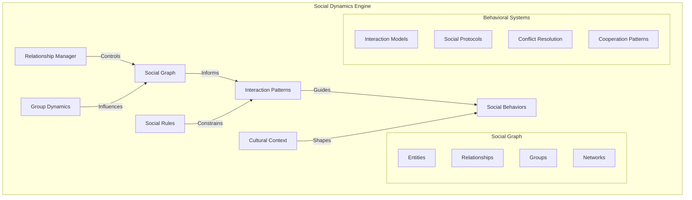
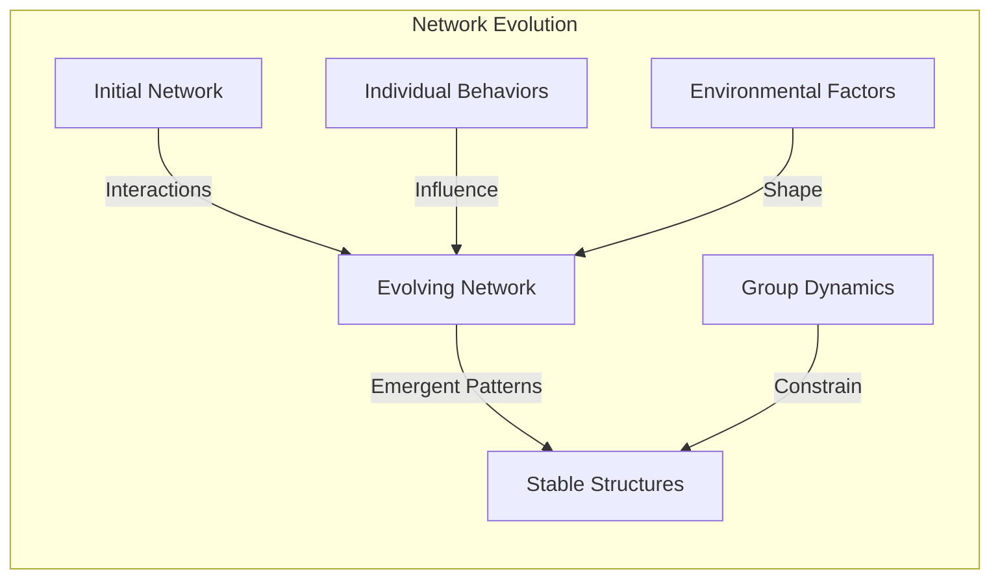
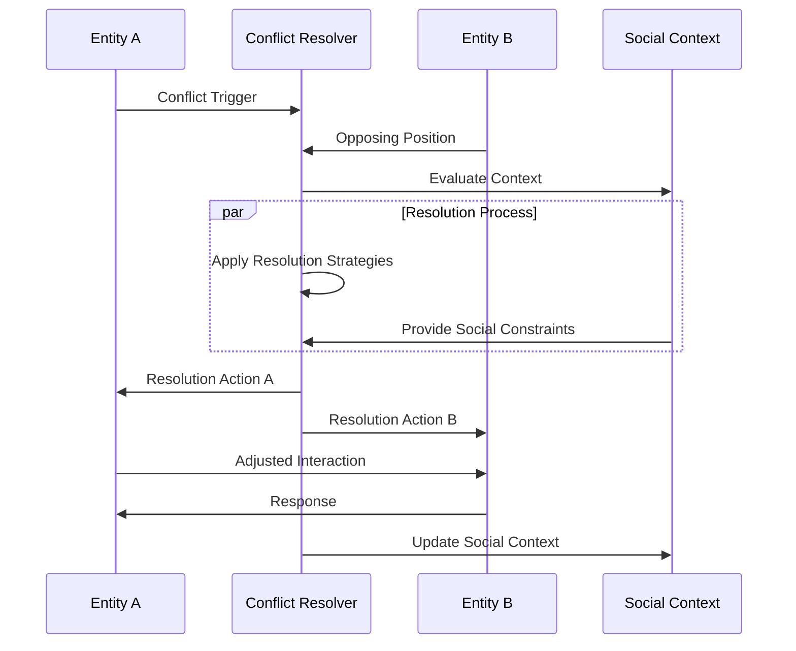
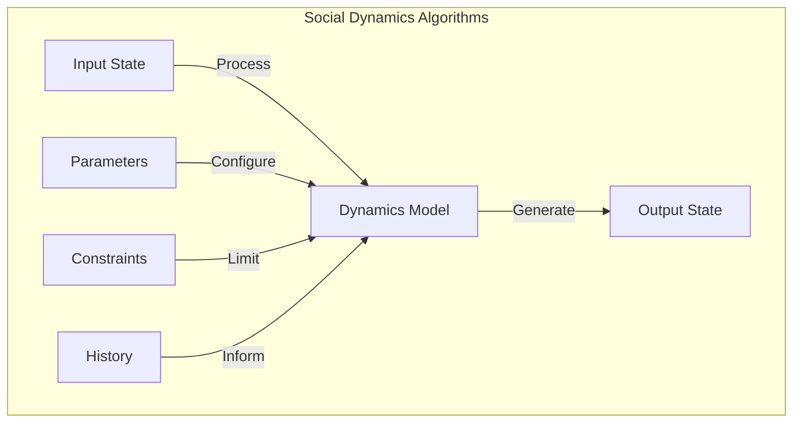
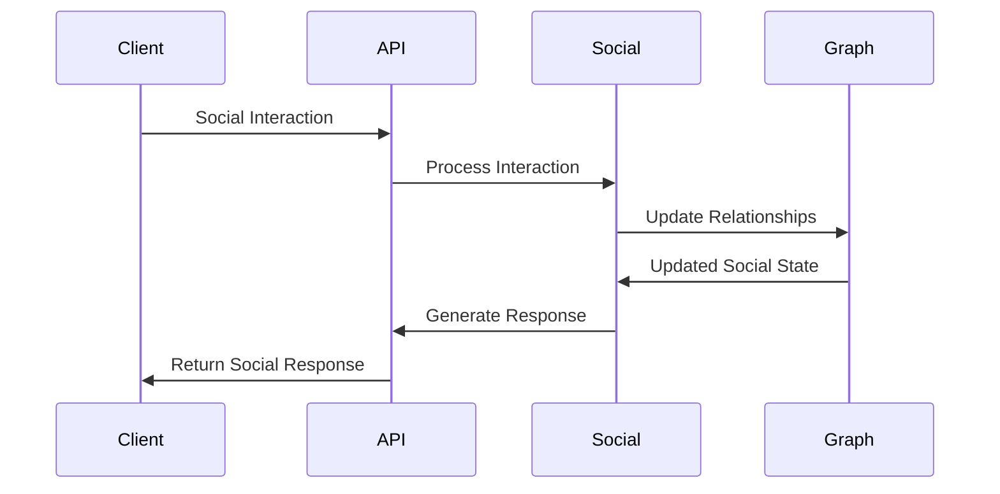

# Social Dynamics Engine

<p align="center">
  <a href="../../../README.md">Home</a> | <a href="../../projects.md">Projects</a> | <a href="../README.md">LARP</a>
</p>

## System Architecture



## Core Components

### Relationship Modeling

```python
class RelationshipModel:
    def __init__(self):
        self.social_graph = SocialGraph()
        self.relationship_types = RelationshipTypeRegistry()
        self.interaction_history = InteractionHistory()
    
    def establish_relationship(
        self,
        entity_a: Entity,
        entity_b: Entity,
        relationship_type: str,
        initial_attributes: Dict[str, float]
    ) -> Relationship:
        # Create relationship object
        relationship = Relationship(
            source=entity_a,
            target=entity_b,
            type=self.relationship_types.get(relationship_type),
            attributes=initial_attributes
        )
        
        # Add to social graph
        self.social_graph.add_relationship(relationship)
        
        # Initialize interaction history
        self.interaction_history.initialize(relationship)
        
        return relationship
    
    def update_relationship(
        self,
        relationship: Relationship,
        interaction: Interaction
    ) -> None:
        # Process interaction impact
        impact = self._calculate_impact(relationship, interaction)
        
        # Update relationship attributes
        for attribute, change in impact.items():
            relationship.attributes[attribute] += change
        
        # Record interaction
        self.interaction_history.record(relationship, interaction)
        
        # Check for relationship type transitions
        self._check_relationship_transitions(relationship)
```

### Social Network Evolution



### Group Dynamics Simulation

The system models complex group behaviors and dynamics:

```python
class GroupDynamicsEngine:
    def __init__(self):
        self.groups = GroupRegistry()
        self.dynamics_models = DynamicsModelRegistry()
        self.norm_engine = NormEngine()
    
    def simulate_group_dynamics(
        self,
        group: Group,
        time_step: float
    ) -> GroupState:
        # Get current group state
        current_state = group.get_state()
        
        # Select appropriate dynamics model
        model = self.dynamics_models.select_for_group(group)
        
        # Apply group norms
        norms = self.norm_engine.get_active_norms(group)
        
        # Simulate interactions within group
        interactions = self._simulate_interactions(
            group.members,
            current_state,
            norms
        )
        
        # Update group state based on interactions
        new_state = model.evolve_state(
            current_state,
            interactions,
            time_step
        )
        
        # Update group
        group.update_state(new_state)
        
        return new_state
```

### Conflict Resolution Systems



## Implementation Details

### Social Graph Implementation

```python
class SocialGraph:
    def __init__(self):
        self.entities = {}
        self.relationships = {}
        self.groups = {}
        
    def add_entity(self, entity: Entity) -> None:
        self.entities[entity.id] = entity
        
    def add_relationship(self, relationship: Relationship) -> None:
        self.relationships[relationship.id] = relationship
        
        # Update entity relationship indices
        source = relationship.source
        target = relationship.target
        
        if source.id not in self.entities:
            self.add_entity(source)
        if target.id not in self.entities:
            self.add_entity(target)
            
        self.entities[source.id].add_relationship(relationship)
        self.entities[target.id].add_relationship(relationship)
        
    def get_relationship(
        self,
        source_id: str,
        target_id: str,
        relationship_type: Optional[str] = None
    ) -> Optional[Relationship]:
        # Find relationships between entities
        for rel_id, rel in self.relationships.items():
            if (rel.source.id == source_id and rel.target.id == target_id) or \
               (rel.source.id == target_id and rel.target.id == source_id):
                if relationship_type is None or rel.type == relationship_type:
                    return rel
        return None
```

### Social Dynamics Algorithms



## Integration Points

### API Interface

```python
class SocialDynamicsAPI:
    def __init__(self):
        self.relationship_model = RelationshipModel()
        self.group_dynamics = GroupDynamicsEngine()
        self.social_graph = SocialGraph()
        
    async def process_social_interaction(
        self,
        interaction: Interaction
    ) -> SocialResponse:
        # Extract entities involved
        entities = interaction.get_entities()
        
        # Update relationships
        for entity_a, entity_b in itertools.combinations(entities, 2):
            relationship = self.social_graph.get_relationship(
                entity_a.id,
                entity_b.id
            )
            
            if relationship:
                self.relationship_model.update_relationship(
                    relationship,
                    interaction
                )
        
        # Update group dynamics if applicable
        if interaction.group_id:
            group = self.social_graph.groups.get(interaction.group_id)
            if group:
                self.group_dynamics.simulate_group_dynamics(
                    group,
                    interaction.duration
                )
        
        # Generate social response
        return self._generate_social_response(interaction, entities)
```

### Event Handling



## Research Areas

Current research focuses on:
- Emergent social behavior modeling
- Group dynamics prediction
- Social network evolution
- Conflict resolution strategies
- Cultural context integration

## Contributors

- **Author**: rolodexterLARP
- **Technical Implementation**: rolodexterGPT
- **Research & Development**: rolodexterVS 