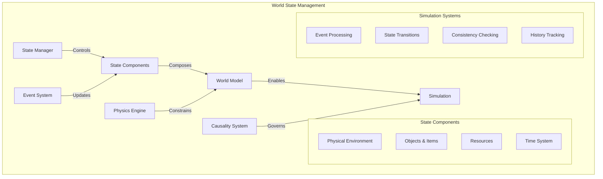
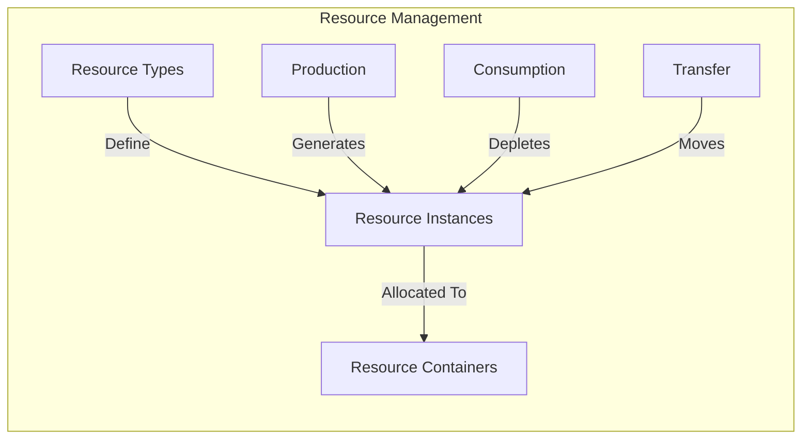
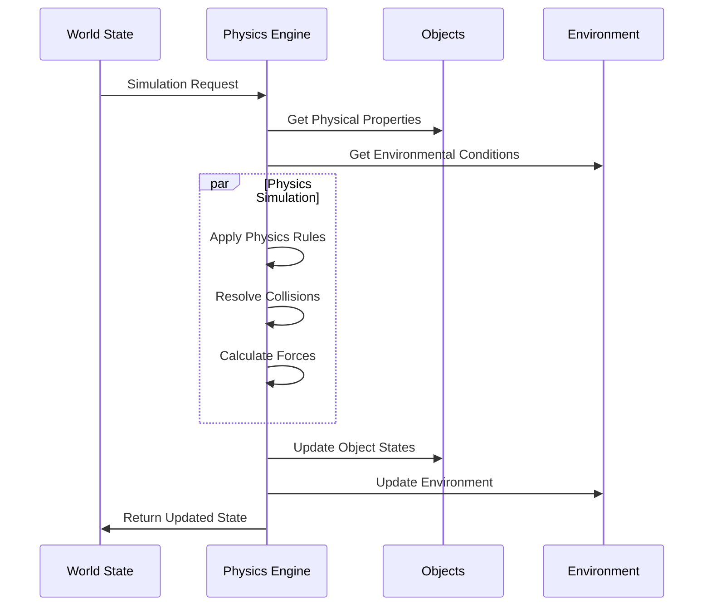
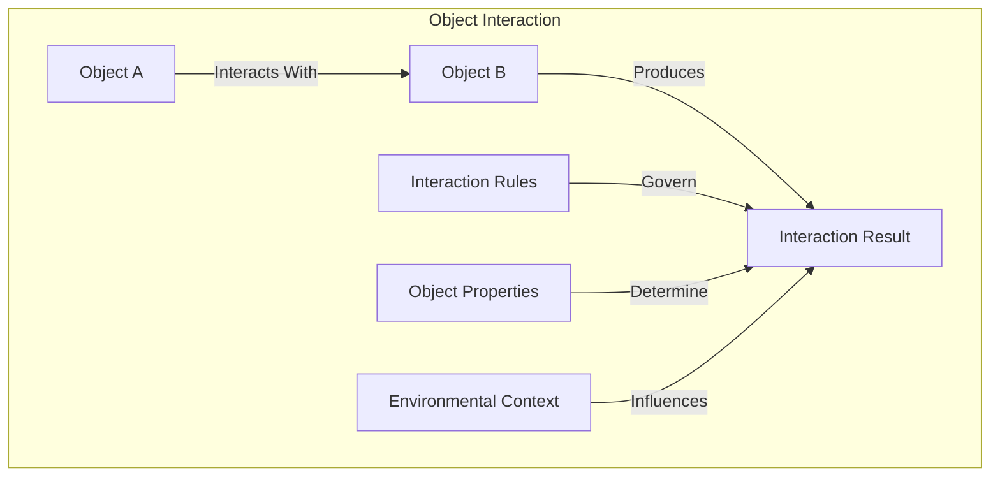
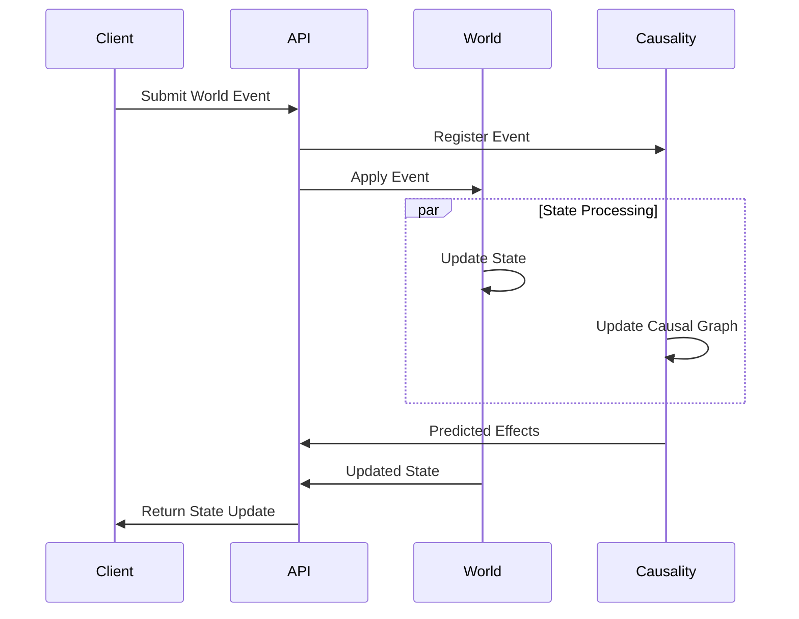

# World State Management

<p align="center">
  <a href="../../../README.md">Home</a> | <a href="../../projects.md">Projects</a> | <a href="../README.md">LARP</a>
</p>

## System Architecture



## Core Components

### Environmental Modeling

```python
class EnvironmentModel:
    def __init__(self):
        self.regions = {}
        self.locations = {}
        self.pathways = {}
        self.environmental_conditions = EnvironmentalConditions()
    
    def add_region(
        self,
        region_id: str,
        properties: Dict[str, Any]
    ) -> Region:
        # Create region
        region = Region(
            id=region_id,
            properties=properties
        )
        
        # Register region
        self.regions[region_id] = region
        
        # Initialize environmental conditions
        self.environmental_conditions.initialize_region(region)
        
        return region
    
    def add_location(
        self,
        location_id: str,
        region_id: str,
        properties: Dict[str, Any],
        position: Position
    ) -> Location:
        # Check if region exists
        if region_id not in self.regions:
            raise ValueError(f"Region {region_id} not found")
        
        # Create location
        location = Location(
            id=location_id,
            region_id=region_id,
            properties=properties,
            position=position
        )
        
        # Register location
        self.locations[location_id] = location
        
        # Update region
        self.regions[region_id].add_location(location_id)
        
        return location
    
    def update_environmental_conditions(
        self,
        time_delta: float
    ) -> None:
        # Update environmental conditions based on time
        self.environmental_conditions.update(time_delta)
        
        # Apply effects to regions and locations
        for region_id, region in self.regions.items():
            conditions = self.environmental_conditions.get_for_region(region_id)
            region.apply_environmental_effects(conditions)
            
            # Update locations in region
            for location_id in region.locations:
                location = self.locations[location_id]
                local_conditions = self.environmental_conditions.get_for_location(location_id)
                location.apply_environmental_effects(local_conditions)
```

### Resource Tracking



### Event Causality Chains

The system tracks causal relationships between events:

```python
class CausalityEngine:
    def __init__(self):
        self.causal_graph = CausalGraph()
        self.event_registry = EventRegistry()
        self.rule_engine = CausalRuleEngine()
    
    def register_event(self, event: WorldEvent) -> None:
        # Register event
        self.event_registry.register(event)
        
        # Determine causes
        causes = self.rule_engine.determine_causes(
            event,
            self.event_registry
        )
        
        # Add to causal graph
        for cause_id in causes:
            self.causal_graph.add_causal_link(
                cause_id,
                event.id
            )
    
    def predict_effects(
        self,
        event: WorldEvent
    ) -> List[PredictedEvent]:
        # Apply causal rules to predict effects
        return self.rule_engine.predict_effects(
            event,
            self.event_registry
        )
    
    def get_causal_chain(
        self,
        event_id: str
    ) -> CausalChain:
        # Get complete causal chain for event
        return self.causal_graph.get_chain(event_id)
```

### Physical Simulation Integration



## Implementation Details

### State Representation

```python
class WorldState:
    def __init__(self):
        self.environment = EnvironmentModel()
        self.objects = ObjectRegistry()
        self.resources = ResourceManager()
        self.time_system = TimeSystem()
        self.event_history = EventHistory()
    
    def get_snapshot(self) -> WorldStateSnapshot:
        # Create immutable snapshot of current state
        return WorldStateSnapshot(
            environment=self.environment.get_snapshot(),
            objects=self.objects.get_snapshot(),
            resources=self.resources.get_snapshot(),
            time=self.time_system.current_time
        )
    
    def apply_event(self, event: WorldEvent) -> None:
        # Validate event
        if not self._validate_event(event):
            raise InvalidEventError(f"Event {event.id} is invalid")
        
        # Apply event effects
        event.apply(self)
        
        # Record in history
        self.event_history.record(event)
        
        # Update time
        self.time_system.advance(event.duration)
    
    def rollback_to(self, timestamp: float) -> None:
        # Get events to rollback
        events_to_rollback = self.event_history.get_events_after(timestamp)
        
        # Rollback events in reverse order
        for event in reversed(events_to_rollback):
            event.rollback(self)
        
        # Set time
        self.time_system.set_time(timestamp)
        
        # Update history
        self.event_history.truncate_after(timestamp)
```

### Object Interaction System



## Integration Points

### API Interface

```python
class WorldStateAPI:
    def __init__(self):
        self.world_state = WorldState()
        self.causality_engine = CausalityEngine()
        self.physics_engine = PhysicsEngine()
        
    async def process_world_event(
        self,
        event: WorldEvent
    ) -> WorldStateUpdate:
        # Register with causality engine
        self.causality_engine.register_event(event)
        
        # Apply to world state
        self.world_state.apply_event(event)
        
        # Run physics simulation if needed
        if event.requires_physics_update:
            self.physics_engine.simulate(
                self.world_state,
                event.duration
            )
        
        # Predict follow-up effects
        predicted_effects = self.causality_engine.predict_effects(event)
        
        # Generate state update
        return WorldStateUpdate(
            applied_event=event,
            state_snapshot=self.world_state.get_snapshot(),
            predicted_effects=predicted_effects
        )
    
    async def query_world_state(
        self,
        query: WorldStateQuery
    ) -> WorldStateQueryResult:
        # Process query against current state
        return self._process_query(query, self.world_state)
```

### Event Handling



## Research Areas

Current research focuses on:
- Efficient state representation
- Causal inference in complex environments
- Physical simulation optimization
- Temporal consistency management
- Resource flow modeling

## Contributors

- **Author**: rolodexterLARP
- **Technical Implementation**: rolodexterGPT
- **Research & Development**: rolodexterVS 