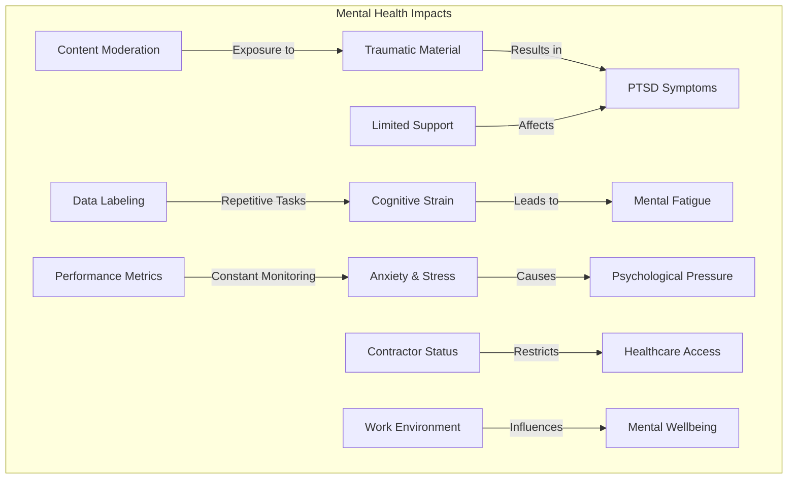
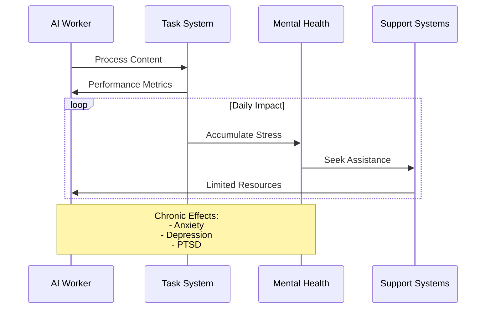
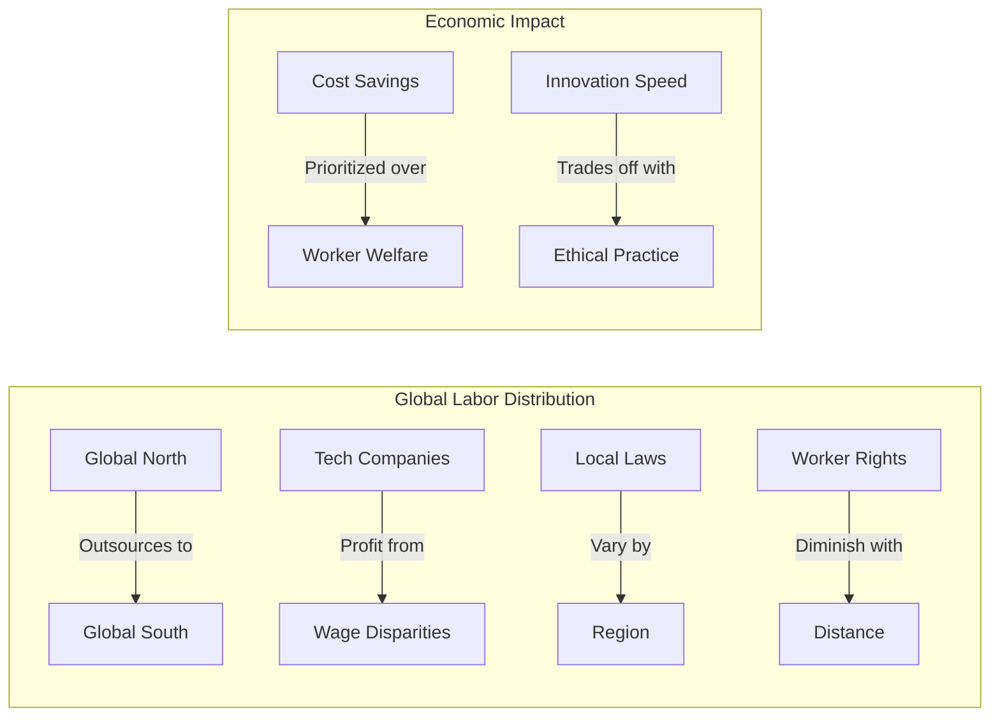
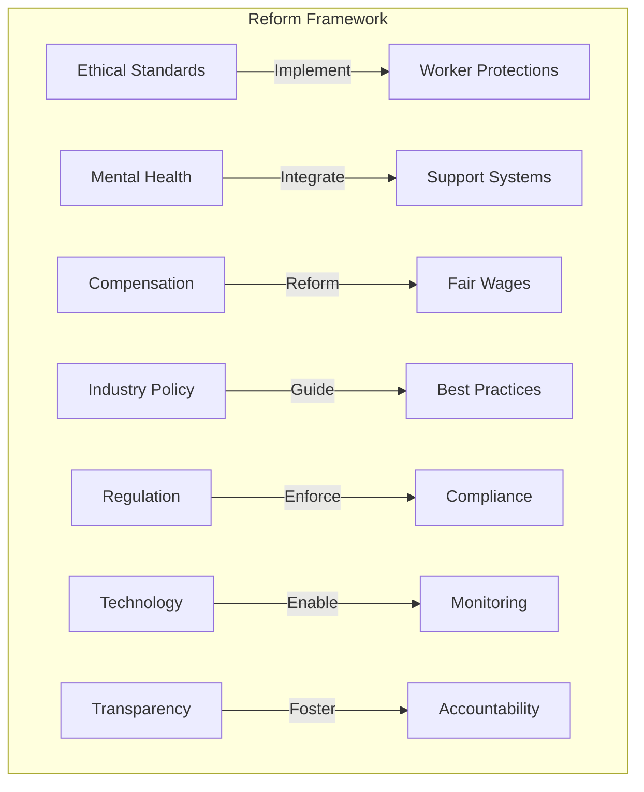
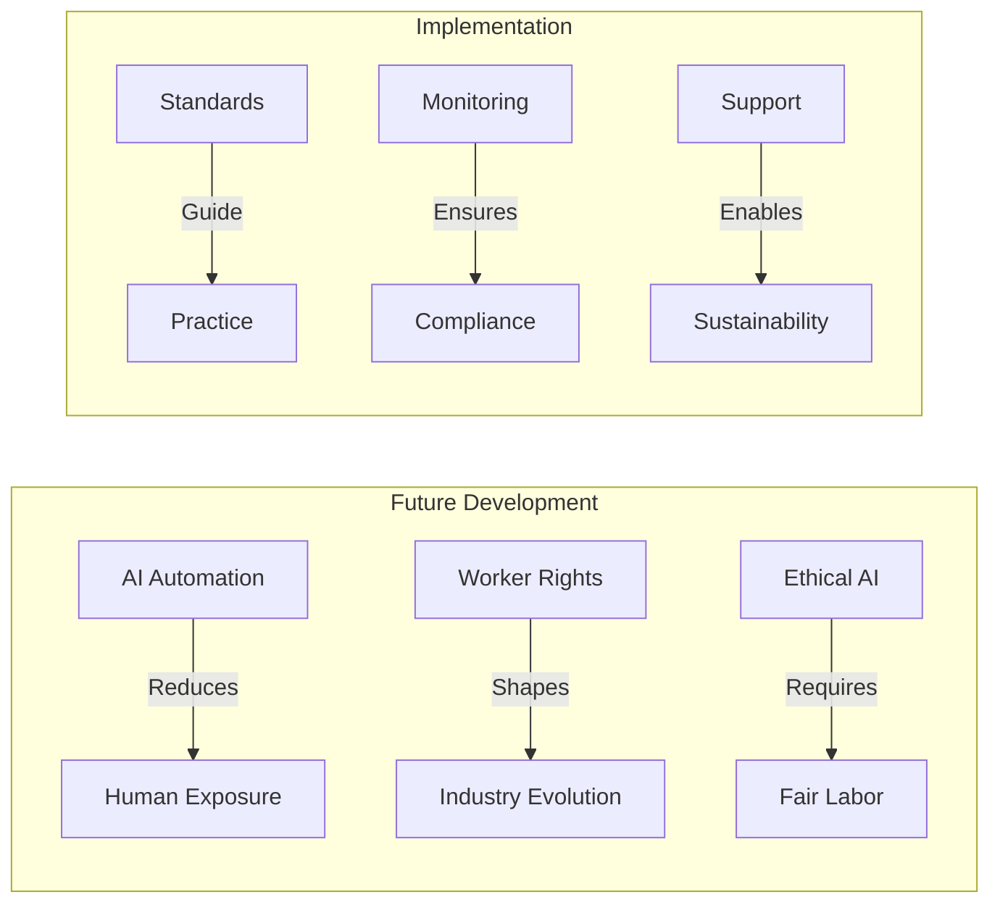

# Ethical Implications of AI Industry Labor Practices

  <a href="../../README.md">Home</a> | <a href="../../projects/projects.md">Projects</a> | <a href="../../research/research.md">Research</a> | <a href="../../techstack/techstack.md">Tech Stack</a> | <a href="../../contact.md">Contact</a>

## Psychological Impact Framework

## The Human Cost of AI Development

The development of artificial intelligence systems carries a significant human cost, particularly in terms of psychological impact on workers involved in data preparation and content moderation. Research indicates that workers face multiple stressors:

1. **Content Moderation Trauma**
   - 22% higher anxiety rates among ChatGPT moderators
   - PTSD symptoms reported by Meta content reviewers
   - Exposure to graphic and disturbing content

2. **Cognitive and Physical Strain**
   - Repetitive Strain Injuries from high-volume data processing
   - Mental fatigue from continuous focus requirements
   - Sleep disruption from irregular shift patterns

## Ethical Considerations in AI Labor

### Structural Inequities

### The Ghost Work Phenomenon
The concept of "ghost work" in AI development represents a fundamental ethical challenge:

1. **Invisibility**
   - Workers hidden from public view
   - Contributions unacknowledged
   - Labor deliberately obscured

2. **Economic Exploitation**
   - Below-market wages
   - Limited benefits
   - Unstable employment

3. **Psychological Burden**
   - Isolation
   - Lack of recognition
   - Professional identity challenges

## Systemic Reform Proposals

### Immediate Actions Required

1. **Mental Health Support**
   - Mandatory counseling services
   - Regular psychological assessments
   - Trauma response protocols

2. **Worker Protection**
   - Clear classification guidelines
   - Benefits standardization
   - Career development paths

3. **Ethical Guidelines**
   - Content exposure limits
   - Workload management
   - Fair compensation frameworks

## Future Considerations

### Long-term Recommendations

1. **Structural Changes**
   - Industry-wide standards
   - Global wage parity
   - Career advancement paths

2. **Technological Solutions**
   - Automated content filtering
   - Stress monitoring systems
   - Workload optimization

3. **Policy Development**
   - International labor standards
   - Mental health regulations
   - Worker representation

## Conclusion

The ethical implications of current AI industry labor practices demand immediate attention and systematic reform. While technological advancement remains crucial, it cannot come at the cost of worker wellbeing. A balanced approach that prioritizes both innovation and human dignity is essential for the sustainable development of AI technology.

---

Last Updated: March 2025  
Contact: ethics@rolodexter.ai 