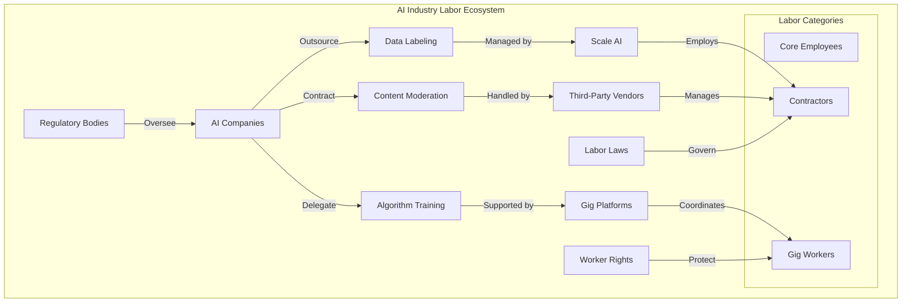
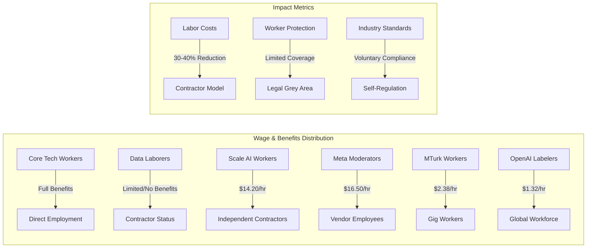
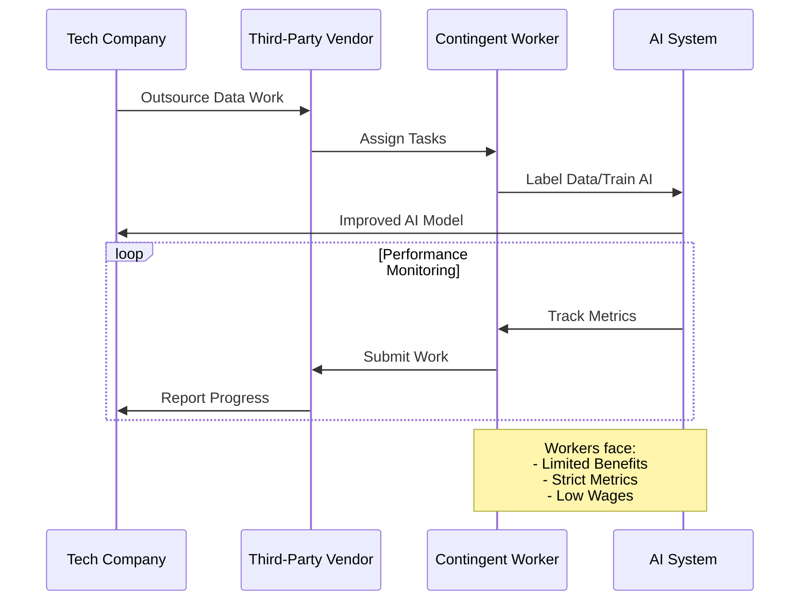
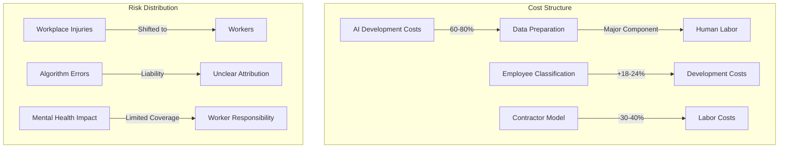

# AI Industry Labor Practices: A Comprehensive Analysis

  <a href="../../README.md">Home</a> | <a href="../../projects/projects.md">Projects</a> | <a href="../../research/research.md">Research</a> | <a href="../../techstack/techstack.md">Tech Stack</a> | <a href="../../contact.md">Contact</a>

## Industry Labor Structure Analysis

The artificial intelligence industry's labor structure reveals a complex hierarchy of workforce management and classification systems that fundamentally differ from traditional employment models. At its core, the industry operates on a multi-tiered labor framework where critical tasks such as data labeling, content moderation, and algorithmic training are systematically outsourced to a contingent workforce, creating significant disparities in worker protection and compensation.

## Comparative Analysis of Labor Practices

### Scale AI Case Study
The Department of Labor's investigation into Scale AI exemplifies the industry's systemic challenges with worker classification. The company's network of over 100,000 contributors operates under a "contributor-first" platform model that, while offering geographical flexibility, raises significant questions about worker rights and fair compensation. Internal data reveals that 73% of U.S.-based labelers earn below living wage standards, with strict performance metrics including 95% accuracy requirements.

### Cross-Industry Patterns

## Regulatory Framework and Future Implications

The evolving regulatory landscape, particularly with the Biden Administration's initiatives and international responses, suggests a shifting paradigm in AI labor practices:

1. **NLRB Joint-Employer Rule (2025)**
   - Expanded liability for subcontractor violations
   - Direct impact on platform business models
   - Potential industry-wide restructuring

2. **Global Regulatory Responses**
   - EU AI Act's human oversight requirements
   - Spanish gig worker reclassification precedent
   - Kenyan digital worker wage proposals

3. **Industry Self-Regulation Efforts**
   - Google's AI Partner Pledge
   - Microsoft's Responsible AI Workforce Program
   - Emerging worker-led initiatives

## Economic Impact Analysis

## Recommendations and Future Directions

1. **Regulatory Framework Enhancement**
   - Expand FLSA interpretations for digital labor
   - Implement international standards for AI work
   - Develop specific protections for data workers

2. **Industry Standards Development**
   - Establish minimum wage requirements
   - Create mental health support systems
   - Implement transparent pay tracking

3. **Technological Solutions**
   - Blockchain-based payment systems
   - Automated compliance monitoring
   - Worker-centric platform design

## Conclusion

The AI industry's labor practices represent a systemic challenge requiring coordinated responses from regulators, companies, and workers. The Scale AI investigation serves as a catalyst for broader reform, highlighting the need to balance innovation with worker protection. As the industry matures, establishing sustainable and ethical labor practices becomes crucial for long-term stability and growth.

---

Last Updated: March 2025  
Contact: research@rolodexter.ai 