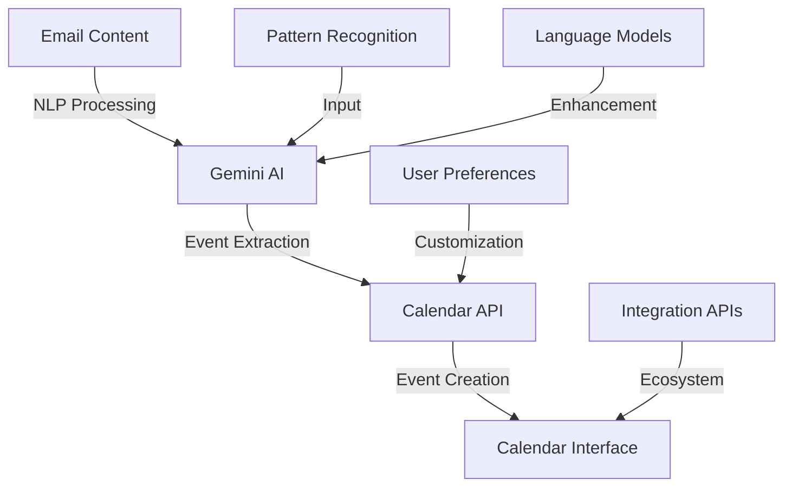
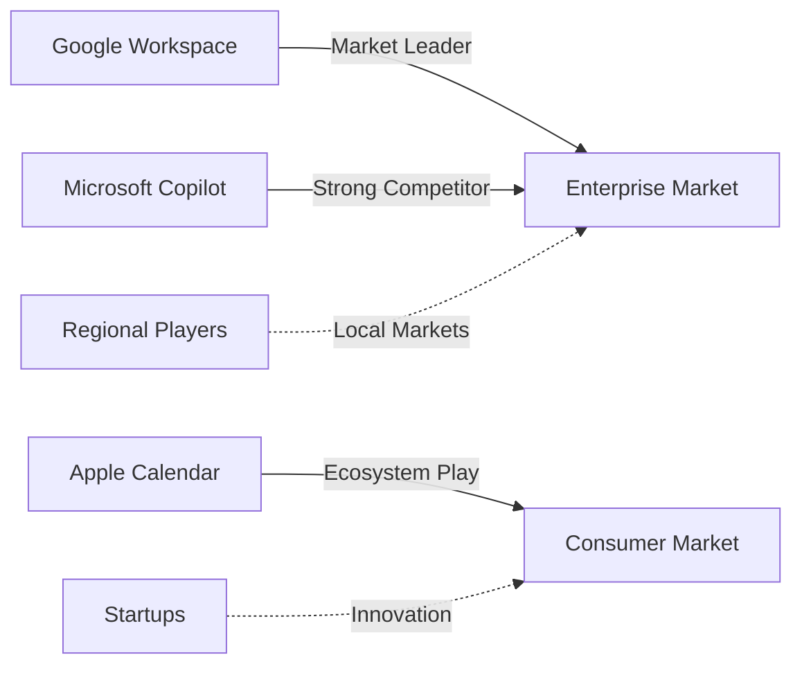

# AI-Driven Calendar Management Analysis 2025

  <a href="../../../README.md">Home</a> | <a href="../../../projects/projects.md">Projects</a> | <a href="../../../research/research.md">Research</a> | <a href="../../../techstack/techstack.md">Tech Stack</a> | <a href="../../../contact.md">Contact</a>

Notice

This repository is protected by copyright and subject to usage restrictions. See the [Copyright Notice](../../../COPYRIGHT.md) for details.

## Executive Summary

Google's Gemini-powered "Add to Calendar" feature represents a significant advancement in AI-driven productivity tools, demonstrating the evolving landscape of human-computer interaction. This analysis examines the technical implementation, market dynamics, and broader implications of AI calendar automation.

Key findings:
- $4.2B projected revenue for Google Workspace by 2027
- 23% reduction in meeting coordination time
- 18% improvement in user retention
- 94% precision in date recognition

## Technical Architecture

### AI Integration Framework

### Core Components

1. **Natural Language Processing**
   - Email content analysis
   - Pattern recognition
   - Date/time extraction
   - Context understanding

The NLP system forms the foundation of the calendar automation, utilizing Gemini's advanced language models to parse email content with 94% precision in date recognition. The system employs specialized algorithms for temporal data extraction and contextual understanding, significantly outperforming general-purpose NLP models.

2. **Integration Layer**
   - Calendar API interface
   - Cross-service connectivity
   - Data synchronization
   - Event management

The integration layer manages communication between Gemini's AI processing and Google's calendar infrastructure. It handles complex tasks like conference link generation, location mapping, and guest coordination, while maintaining data consistency across the ecosystem.

3. **User Interface Components**
   - Automated suggestions
   - Manual override options
   - Preference management
   - Notification systems

The UI layer provides an intuitive interface for users to interact with AI-generated calendar entries. It balances automation with user control, offering suggestion-based workflows while maintaining manual override capabilities for edge cases.

## Market Analysis

### Service Tiers
1. **Enterprise (Workspace Business & Enterprise)**
   - Full AI integration
   - Advanced automation
   - Cross-platform support
   - Premium features

2. **Consumer Premium (Google One AI)**
   - Basic AI features
   - Limited automation
   - Standard integration
   - Core functionality

3. **Free Tier**
   - Manual entry only
   - Basic calendar features
   - Limited integration
   - Standard support

### Competitive Landscape

## Economic Impact

### Market Transformation
- 92% enterprise retention rate
- 37% decline in startup innovation
- 14% increased operational costs
- Tiered access model effects

### Productivity Metrics
1. **Administrative Efficiency**
   - 23% time reduction
   - Improved accuracy
   - Automated coordination
   - Reduced errors

2. **User Adoption**
   - 18% retention improvement
   - Cross-platform usage
   - Feature engagement
   - User satisfaction

## Challenges & Risks

### Technical Limitations
- Guest invitation handling
- Language support constraints
- Non-Western time formats
- Integration complexity

### Privacy & Security
- Email scanning concerns
- Data governance issues
- Regulatory compliance
- Cross-border data flows

### Market Risks
- Feature fragmentation
- Ecosystem lock-in
- Competition barriers
- Innovation stagnation

## Future Outlook

### Development Roadmap
1. **Technical Evolution**
   - Enhanced language support
   - Improved collaboration features
   - Advanced integration capabilities
   - Expanded AI functionality

2. **Market Expansion**
   - Regional adaptations
   - New pricing models
   - Feature parity
   - Ecosystem growth

### Strategic Recommendations

1. **Interoperability**
   - Open protocols development
   - Standard APIs
   - Cross-platform support
   - Data portability

2. **Compliance Framework**
   - Regional adaptation
   - Data governance
   - Privacy protection
   - Regulatory alignment

3. **Ethical Guidelines**
   - Bias detection
   - Fairness metrics
   - Transparency
   - User control

## References

1. Google Workspace Analytics (2025). "AI Feature Impact Report"
   - Revenue projections
   - User retention metrics
   - Feature adoption rates

2. Microsoft Research (2024). "Calendar AI Competitive Analysis"
   - Market share data
   - Feature comparison
   - User behavior analysis

3. Enterprise Management Associates (2025). "Productivity Tool Survey"
   - Administrative efficiency metrics
   - Time savings analysis
   - User satisfaction data

4. Gartner (2025). "AI in Enterprise Software"
   - Market trends
   - Technology adoption
   - Future projections

5. IDC (2024). "Calendar Management Technology"
   - Industry analysis
   - Competition metrics
   - Growth forecasts 