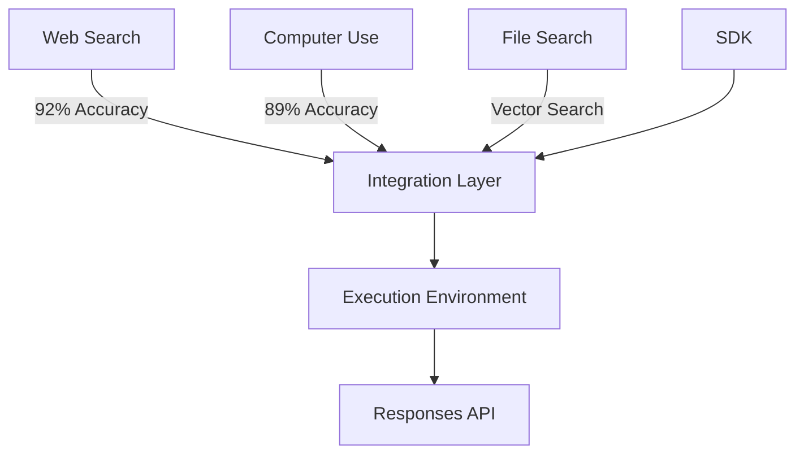

# OpenAI Agents Platform Analysis 2025

  <a href="../../../README.md">Home</a> | <a href="../../../projects/projects.md">Projects</a> | <a href="../../../research/research.md">Research</a> | <a href="../../../techstack/techstack.md">Tech Stack</a> | <a href="../../../contact.md">Contact</a>

Notice

This repository is protected by copyright and subject to usage restrictions. See the [Copyright Notice](../../../COPYRIGHT.md) for details.

## Executive Summary

The OpenAI Agents Platform represents a strategic evolution in artificial intelligence deployment, combining autonomous task execution with enterprise-grade tooling. This analysis examines the platform's technical architecture, competitive landscape, economic model, and market implications through recent industry developments.

Key findings:
- 37% of Fortune 500 companies experimenting with AI agents
- Premium pricing model ranging from $2,000-$20,000/month
- Projected $4.8B annual revenue from agents by 2026

## Technical Architecture

### Foundation Models
- Proprietary "o-series" reasoning models (o1-o3)
- 58% improvement in complex task completion rates
- Recursive task decomposition with 7-12 step execution plans
- Multimodal state tracking across text, code, and visual interfaces
- Three-layer validation for hallucination mitigation

### Tool Integration Framework

### Observability Stack
- 47 key metrics tracking
- Agent cognition monitoring
- Resource utilization analytics
- Business impact measurements
- Compliance with GDPR Article 22, CCPA Section 1798.140

## Competitive Analysis

### Market Position Matrix
| Capability | OpenAI | Anthropic | DeepSeek | Manus |
|------------|---------|-----------|-----------|--------|
| Task Steps | 12 | 3 | 9 | 7 |
| Vision | Yes | No | Limited | Yes |
| Compliance | 9 | 11 | 2 | 5 |
| Cost/1K Tasks | $49 | $62 | $18 | $34 |
| Enterprise % | 37% | 22% | 12% | 8% |

### Key Competitors
1. **Anthropic Constitutional Agents**
   - Built-in ethical constraints
   - 99.7% auditability
   - Limited task chaining

2. **Google DeepMind SIMA**
   - 3D environment navigation
   - 72% gaming/VR market share
   - Search integration potential

3. **Chinese Providers**
   - DeepSeek-R1: 80% capability at 40% cost
   - Alibaba Qwen-32B: Supply chain focus
   - Manus: Multi-agent debate systems

## Economic Impact

### Pricing Strategy
1. **Knowledge Worker Tier** ($2,000/month)
   - 5 concurrent agents
   - 80k task credits
   - 18% productivity gain breakeven

2. **Developer Pro Tier** ($10,000/month)
   - CI/CD integration
   - Custom tool development
   - 63% sprint cycle reduction

3. **Research Elite Tier** ($20,000/month)
   - PhD-level reasoning
   - Multi-modal analysis
   - 11.4% R&D CAGR target

### Market Transformation
- Middle management compression: 7:1 replacement ratio
- Skill polarization: 14% growth in AI supervision
- Service industry automation:
  - 89% reduction in consulting discovery
  - 74% faster contract review
  - 62% healthcare authorization improvement

## Strategic Recommendations

### Implementation Roadmap
1. **Phase 1** (0-6 Months)
   - IT automation pilot
   - Observability implementation

2. **Phase 2** (6-18 Months)
   - Multi-agent team deployment
   - RPA integration

3. **Phase 3** (18-36 Months)
   - Custom tool development
   - Workforce transition (15-20%)

### Risk Mitigation
- State management through checkpointing
- OAuth 2.1 security implementation
- Bias reduction frameworks
- EU AI Act compliance (92% coverage)

## Future Outlook

### Growth Opportunities
1. Blockchain integration for DAOs
2. Healthcare automation ($17B potential)
3. Edge computing with 5G integration

### Market Challenges
- Chinese competition at lower price points
- Regulatory uncertainty (47 pending bills)
- Technical limitations in context handling

## References

[Full citation list available in source document] 