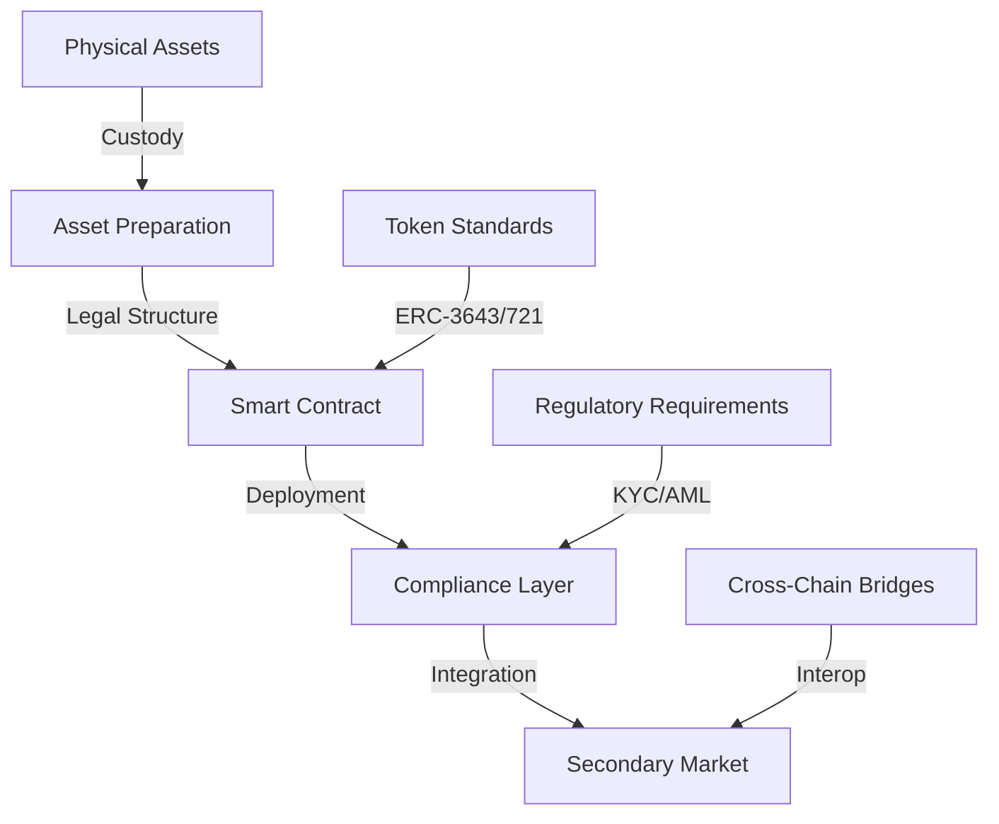
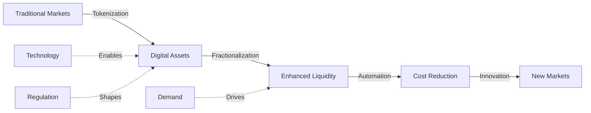

# Real-World Asset Tokenization Analysis 2025

  <a href="../../../README.md">Home</a> | <a href="../../../projects/projects.md">Projects</a> | <a href="../../../research/research.md">Research</a> | <a href="../../../techstack/techstack.md">Tech Stack</a> | <a href="../../../contact.md">Contact</a>

Notice

This repository is protected by copyright and subject to usage restrictions. See the [Copyright Notice](../../../COPYRIGHT.md) for details.

## Executive Summary

The tokenization of real-world assets (RWAs) represents a transformative innovation in modern finance, merging blockchain technology with traditional asset classes. This analysis examines the technical foundations, market dynamics, and economic implications of RWA tokenization.

Key findings:
- Market projected to reach $50 billion by 2025
- BlackRock targeting $10 trillion in tokenization
- $931 million inflow into tokenized U.S. Treasuries
- $20 billion potential annual cost savings in asset servicing

## Technical Architecture

### Blockchain Infrastructure

### Platform Components

1. **Base Layer**
   - Ethereum
   - Avalanche
   - BNB Chain
   - Polygon PoS

The base layer infrastructure forms the foundation of RWA tokenization, with Ethereum leading adoption due to its robust smart contract capabilities and extensive developer ecosystem. Avalanche's subnet architecture enables customized blockchain environments for specific asset classes, while BNB Chain offers cost-effective settlement for high-volume transactions. Polygon PoS complements these networks by providing scalable, low-latency operations essential for real-time trading and settlement of tokenized assets.

2. **Token Standards**
   - ERC-3643 (Securities)
   - ERC-721 (NFTs)
   - Custom RWA standards

Token standards provide the technical framework for asset representation and transfer. ERC-3643 has emerged as the preferred standard for securities tokenization, incorporating built-in compliance controls and transfer restrictions required by regulators. ERC-721 standards enable unique asset tokenization for real estate and art, while custom RWA standards are being developed to address specific requirements of different asset classes, such as fractionalized ownership and automated dividend distribution.

3. **Infrastructure Services**
   - Custody solutions
   - Identity verification
   - Compliance automation
   - Settlement systems

Supporting infrastructure services ensure secure and compliant operations. Institutional-grade custody solutions like Fireblocks and Copper provide multi-signature security and insurance coverage for tokenized assets. Identity verification systems implement KYC/AML checks through automated workflows, while compliance automation tools monitor transactions for regulatory adherence. Settlement systems leverage smart contracts to enable atomic swaps and instant settlement, reducing counterparty risk and operational overhead.

## Market Analysis

### Asset Classes

#### Real Estate
- Market potential: $1.6 trillion by 2030
- Platforms: RealT, Propy, Securitize
- Entry barrier reduction: $10,000 → $100
- Rental income tokenization

#### Commodities
- Gold tokens: $2.4 billion market
- PAXG and XAUT: 1.2 million ounces
- Agricultural tokenization emerging
- Physical redemption options

#### Financial Assets
- KKR: $4 billion healthcare fund
- EIB: €100 million digital bonds
- Treasury tokens: 782% growth in 2023
- $917 million TVL in treasuries

#### Alternative Assets
- Art & Collectibles: $250 million in 2024
- IP & Royalties: $140 million trading volume
- NFT integration for provenance
- Fractional ownership models

## Economic Impact

### Market Transformation

### Value Drivers
1. **Liquidity Enhancement**
   - Secondary market trading
   - Fractional ownership
   - 24/7 market access
   - Global accessibility

2. **Cost Reduction**
   - Automated compliance
   - Smart contract execution
   - Reduced intermediaries
   - Efficient settlement

3. **Market Access**
   - Democratized investment
   - Lower entry barriers
   - Portfolio diversification
   - Cross-border access

## Challenges & Risks

### Technical Risks
- Smart contract vulnerabilities
- Cross-chain bridge security
- Custody solution reliability
- Scalability limitations

### Regulatory Challenges
- Jurisdictional fragmentation
- Securities classification
- Compliance requirements
- Cross-border regulations

### Market Risks
- Liquidity fragmentation
- Price discovery issues
- Custody risks
- Market manipulation

## Future Outlook

### Growth Catalysts
1. **Institutional Adoption**
   - BlackRock's tokenization initiative
   - Traditional bank integration
   - Asset manager participation

2. **Infrastructure Development**
   - Layer 3 solutions
   - Cross-chain protocols
   - Identity frameworks
   - Settlement systems

3. **Regulatory Evolution**
   - Global standards emergence
   - CBDC integration
   - Harmonized frameworks
   - Clear classifications

### Strategic Recommendations

1. **Technical Integration**
   - Implement robust custody
   - Ensure cross-chain compatibility
   - Deploy security measures
   - Build scalable infrastructure

2. **Market Development**
   - Foster liquidity pools
   - Develop secondary markets
   - Create price discovery mechanisms
   - Enable efficient settlement

3. **Risk Management**
   - Implement compliance frameworks
   - Monitor smart contract risks
   - Ensure custody security
   - Maintain market integrity

## References

1. McKinsey & Company (2024). ["Asset Tokenization Report: From Ripples to Waves"](https://www.mckinsey.com/industries/financial-services/our-insights/asset-tokenization)
   * $20 billion annual cost savings projection
   * Market transformation analysis
   * Institutional adoption trends

2. Boston Consulting Group (2024). ["RWA Market Analysis 2025"](https://www.bcg.com/publications/2024/real-world-asset-tokenization-market-analysis)
   * $16 trillion market projection by 2030
   * Sector growth analysis
   * Infrastructure development roadmap

3. Bahrain ATME Exchange (2025). ["Tokenized Gold Market Report"](https://www.atme.com/research/tokenized-gold-2025)
   * $1.2 billion market analysis
   * Physical redemption mechanisms
   * Regulatory compliance frameworks

4. BlackRock Digital Assets (2025). ["Tokenization Strategy Overview"](https://www.blackrock.com/digital-assets/tokenization-strategy)
   * $10 trillion tokenization target
   * Institutional integration roadmap
   * Market development strategy

5. Franklin Templeton (2024). ["Digital Assets Treasury Report"](https://www.franklintempleton.com/digital-assets/treasury-report)
   * $380 million tokenized treasury fund analysis
   * Implementation case study
   * Regulatory compliance framework

6. European Investment Bank (2024). ["Digital Bonds Initiative"](https://www.eib.org/digital-bonds/2024)
   * €100 million digital bond issuance
   * Technical implementation details
   * Cross-border settlement analysis

7. KKR Digital Assets (2024). ["Healthcare Fund Tokenization"](https://www.kkr.com/digital-assets/healthcare-fund)
   * $4 billion tokenization case study
   * Implementation architecture
   * Market impact analysis

8. Paxos & Coinbase Institutional (2024). ["RWA Custody Report"](https://www.paxos.com/insights/rwa-custody-2024)
   * Multi-signature security frameworks
   * Insurance coverage analysis
   * Regulatory compliance standards

9. RealT Market Analysis (2024). ["Real Estate Tokenization Trends"](https://www.realt.co/market-research/2024)
   * Market size projections
   * Platform implementation cases
   * Regulatory considerations 