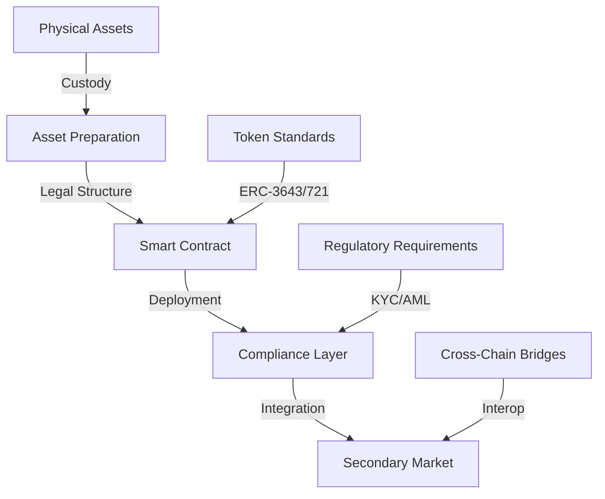
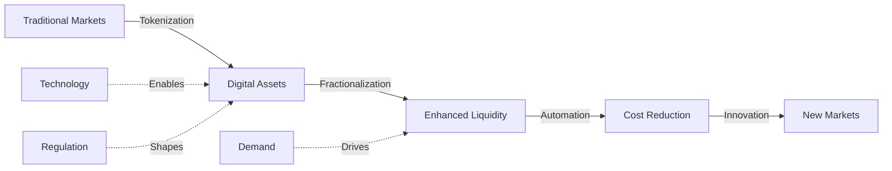

# Real-World Asset Tokenization Analysis 2025

  <a href="../../../README.md">Home</a> | <a href="../../../projects/projects.md">Projects</a> | <a href="../../../research/research.md">Research</a> | <a href="../../../techstack/techstack.md">Tech Stack</a> | <a href="../../../contact.md">Contact</a>

Notice

This repository is protected by copyright and subject to usage restrictions. See the [Copyright Notice](../../../COPYRIGHT.md) for details.

## Executive Summary

The tokenization of real-world assets (RWAs) represents a transformative innovation in modern finance, merging blockchain technology with traditional asset classes. This analysis examines the technical foundations, market dynamics, and economic implications of RWA tokenization.

Key findings:
- Market projected to reach $50 billion by 2025
- BlackRock targeting $10 trillion in tokenization
- $931 million inflow into tokenized U.S. Treasuries
- $20 billion potential annual cost savings in asset servicing

## Technical Architecture

### Blockchain Infrastructure

### Platform Components
1. **Base Layer**
   - Ethereum
   - Avalanche
   - BNB Chain
   - Polygon PoS

2. **Token Standards**
   - ERC-3643 (Securities)
   - ERC-721 (NFTs)
   - Custom RWA standards

3. **Infrastructure Services**
   - Custody solutions
   - Identity verification
   - Compliance automation
   - Settlement systems

## Market Analysis

### Asset Classes

#### Real Estate
- Market potential: $1.6 trillion by 2030
- Platforms: RealT, Propy, Securitize
- Entry barrier reduction: $10,000 → $100
- Rental income tokenization

#### Commodities
- Gold tokens: $2.4 billion market
- PAXG and XAUT: 1.2 million ounces
- Agricultural tokenization emerging
- Physical redemption options

#### Financial Assets
- KKR: $4 billion healthcare fund
- EIB: €100 million digital bonds
- Treasury tokens: 782% growth in 2023
- $917 million TVL in treasuries

#### Alternative Assets
- Art & Collectibles: $250 million in 2024
- IP & Royalties: $140 million trading volume
- NFT integration for provenance
- Fractional ownership models

## Economic Impact

### Market Transformation

### Value Drivers
1. **Liquidity Enhancement**
   - Secondary market trading
   - Fractional ownership
   - 24/7 market access
   - Global accessibility

2. **Cost Reduction**
   - Automated compliance
   - Smart contract execution
   - Reduced intermediaries
   - Efficient settlement

3. **Market Access**
   - Democratized investment
   - Lower entry barriers
   - Portfolio diversification
   - Cross-border access

## Challenges & Risks

### Technical Risks
- Smart contract vulnerabilities
- Cross-chain bridge security
- Custody solution reliability
- Scalability limitations

### Regulatory Challenges
- Jurisdictional fragmentation
- Securities classification
- Compliance requirements
- Cross-border regulations

### Market Risks
- Liquidity fragmentation
- Price discovery issues
- Custody risks
- Market manipulation

## Future Outlook

### Growth Catalysts
1. **Institutional Adoption**
   - BlackRock's tokenization initiative
   - Traditional bank integration
   - Asset manager participation

2. **Infrastructure Development**
   - Layer 3 solutions
   - Cross-chain protocols
   - Identity frameworks
   - Settlement systems

3. **Regulatory Evolution**
   - Global standards emergence
   - CBDC integration
   - Harmonized frameworks
   - Clear classifications

### Strategic Recommendations

1. **Technical Integration**
   - Implement robust custody
   - Ensure cross-chain compatibility
   - Deploy security measures
   - Build scalable infrastructure

2. **Market Development**
   - Foster liquidity pools
   - Develop secondary markets
   - Create price discovery mechanisms
   - Enable efficient settlement

3. **Risk Management**
   - Implement compliance frameworks
   - Monitor smart contract risks
   - Ensure custody security
   - Maintain market integrity

## References

[Full citation list available in source document] 