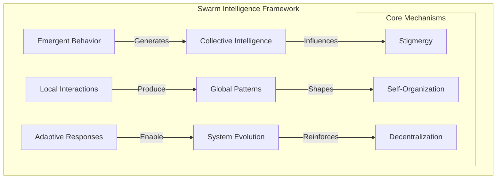
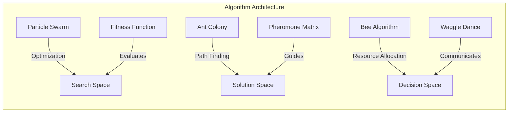
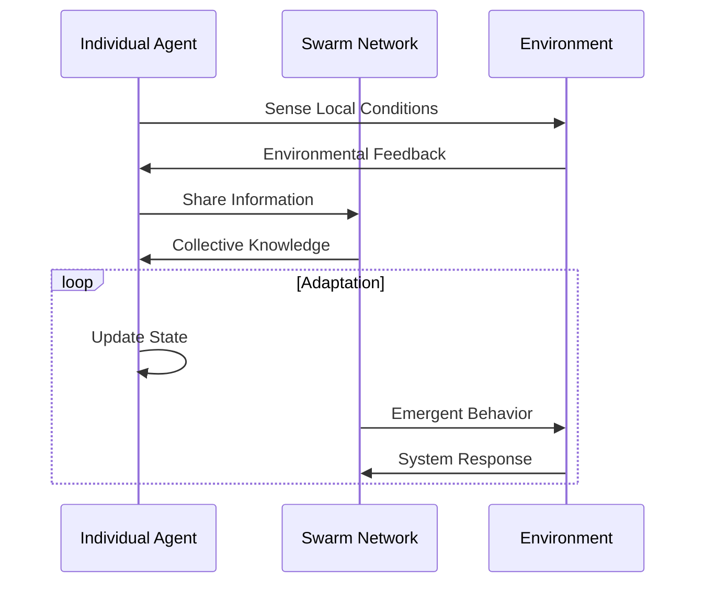
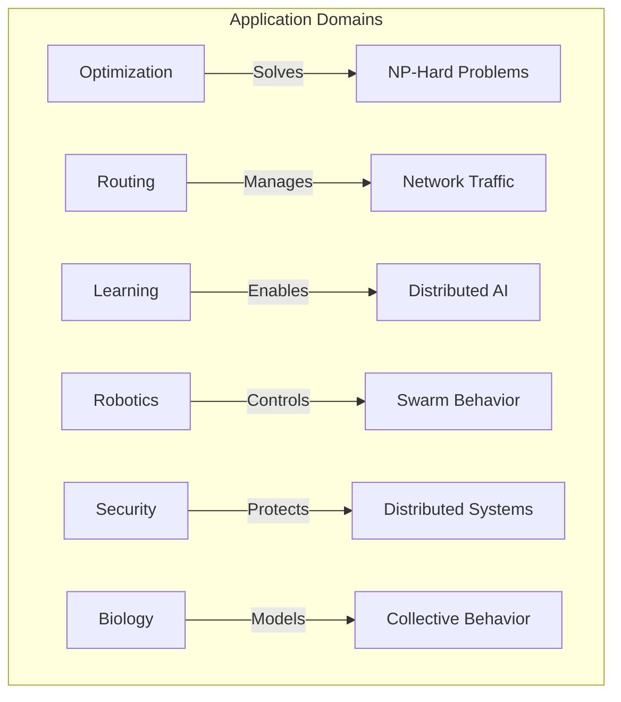
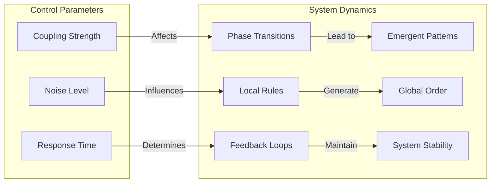
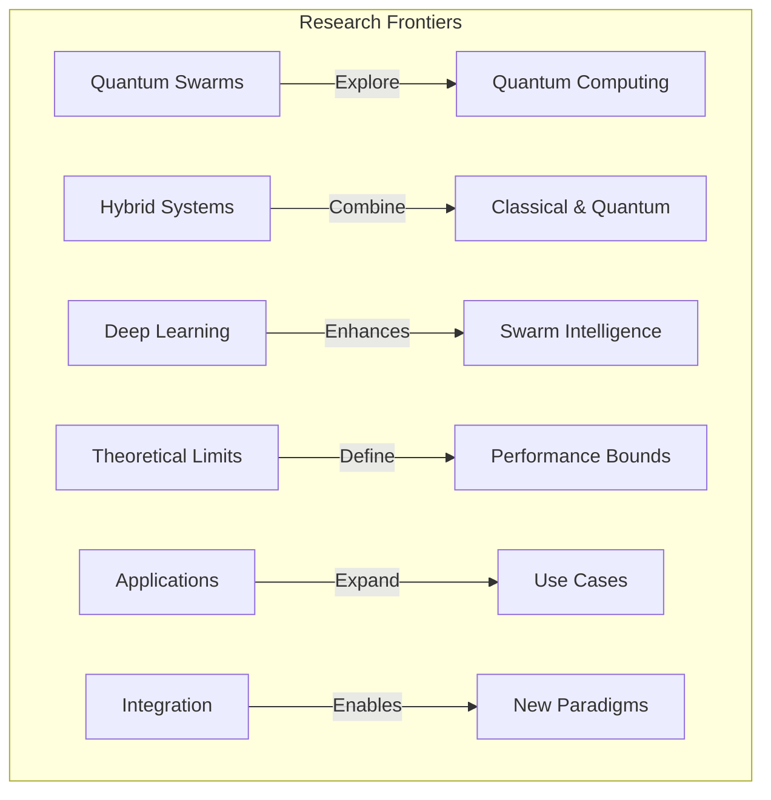

# Swarm Intelligence in AI Systems: Advanced Computational Models and Applications

  <a href="../../README.md">Home</a> | <a href="../../projects/projects.md">Projects</a> | <a href="../../research/research.md">Research</a> | <a href="../../techstack/techstack.md">Tech Stack</a> | <a href="../../contact.md">Contact</a>

Notice

This repository is protected by copyright and subject to usage restrictions. See the [Copyright Notice](../../COPYRIGHT.md) for details.

## Theoretical Foundations

The theoretical underpinnings of swarm intelligence emerge from the complex interplay between individual agents and their collective behavior patterns. At its core, swarm intelligence represents a paradigm shift in computational thinking, where sophisticated global behaviors emerge from relatively simple local interactions. The fundamental principle operates through stigmergic communication, where agents indirectly coordinate through environmental modifications rather than direct communication channels. This mechanism enables highly scalable and robust system behaviors that can adapt to environmental perturbations without centralized control structures.

## Computational Models

The computational implementation of swarm intelligence principles manifests through several sophisticated algorithmic frameworks. Particle Swarm Optimization (PSO) represents a population-based stochastic optimization technique inspired by social behavior in bird flocking and fish schooling. The algorithm maintains a population of candidate solutions (particles) that navigate through the high-dimensional search space according to their own experience (cognitive component) and the swarm's collective knowledge (social component). The velocity update equation incorporates inertia weight \(w\), cognitive learning factor \(c_1\), and social learning factor \(c_2\):

\[ v_{i}(t+1) = w v_{i}(t) + c_1r_1(p_i - x_i(t)) + c_2r_2(p_g - x_i(t)) \]

where \(v_i\) represents particle velocity, \(x_i\) current position, \(p_i\) personal best position, and \(p_g\) global best position.

## Multi-Agent Systems Architecture

The multi-agent architecture underlying swarm intelligence systems implements a distributed control paradigm where each agent operates autonomously while contributing to the collective intelligence of the system. The architecture employs a sophisticated message-passing protocol that enables asynchronous communication between agents while maintaining system coherence. The implementation utilizes a hybrid approach combining reactive behaviors with deliberative planning mechanisms:

1. **Local Decision Making**: Each agent employs a Bayesian decision network that processes environmental stimuli and internal state variables to generate action probabilities:

\[ P(a|s) = \frac{P(s|a)P(a)}{P(s)} \]

2. **Information Propagation**: The system implements a distributed consensus algorithm using a weighted averaging scheme:

\[ x_i(t+1) = \sum_{j \in N_i} w_{ij}x_j(t) \]

where \(N_i\) represents the neighborhood of agent i and \(w_{ij}\) are the interaction weights.

## Advanced Applications

The practical implementation of swarm intelligence principles extends across diverse computational domains. In network optimization, ant colony algorithms have demonstrated remarkable efficiency in solving complex routing problems through the implementation of dynamic programming principles combined with pheromone-based learning. The algorithm employs a probabilistic state transition rule:

\[ p_{ij}^k = \frac{[\tau_{ij}]^\alpha[\eta_{ij}]^\beta}{\sum_{l \in N_i^k}[\tau_{il}]^\alpha[\eta_{il}]^\beta} \]

where \(\tau_{ij}\) represents the pheromone concentration and \(\eta_{ij}\) the heuristic information.

## Emergent Properties and System Dynamics

The emergence of coherent global behaviors in swarm systems arises from the complex interplay between individual agent dynamics and collective interaction patterns. The system exhibits critical phase transitions characterized by order parameters \(\psi\) that follow a power-law scaling relationship:

\[ \psi \sim (p - p_c)^\beta \]

where \(p_c\) represents the critical point and \(\beta\) the critical exponent. The stability of emergent patterns is maintained through a sophisticated feedback mechanism that balances exploration and exploitation through adaptive parameter tuning:

\[ \lambda(t) = \lambda_0 e^{-\alpha t} + \lambda_{\infty}(1 - e^{-\alpha t}) \]

## Future Research Directions

The frontier of swarm intelligence research extends into quantum computing domains, where quantum mechanical principles offer new possibilities for parallel processing and optimization. The quantum swarm optimization algorithm incorporates quantum bits and quantum rotation gates:

\[ |x_i\rangle = \cos(\theta_i)|0\rangle + \sin(\theta_i)|1\rangle \]

The integration with deep learning architectures presents opportunities for enhanced learning capabilities through the combination of gradient-based optimization with swarm-based exploration strategies.

## Conclusion

The synthesis of swarm intelligence principles with advanced computational architectures represents a significant advancement in distributed artificial intelligence systems. The mathematical frameworks and algorithmic implementations described provide a foundation for developing highly scalable and robust solutions to complex optimization and control problems. Future developments in quantum computing and hybrid systems promise to further expand the capabilities of swarm-based approaches.

---

Last Updated: March 2025  
Contact: research@rolodexter.ai

## References

1. [AI Agent Swarms](https://www.getfrontline.ai/glossary/what-is-an-ai-agent-swarm)
2. [Swarms Framework Documentation](https://docs.swarms.world/en/latest/swarms/agents/third_party/)
3. [Nanorobotics Market Analysis](https://www.skyquestt.com/report/nanorobots-market)
4. [Nature: Energy Efficiency in Swarm Systems](https://www.nature.com/articles/s41467-022-32497-5)
5. [Autonomous Spores System](https://m.theblockbeats.info/en/news/56457)

## Related Research
- [Foundational AI Agents](../papers/foundational-ai-agents.md)
- [Agent Ethics](../hypotheses/agent-ethics.md)
- [Agentic Architecture](../ongoing/agentic-architecture.md) 