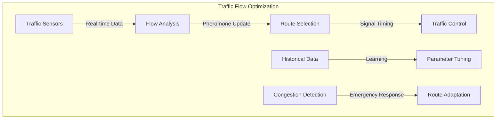
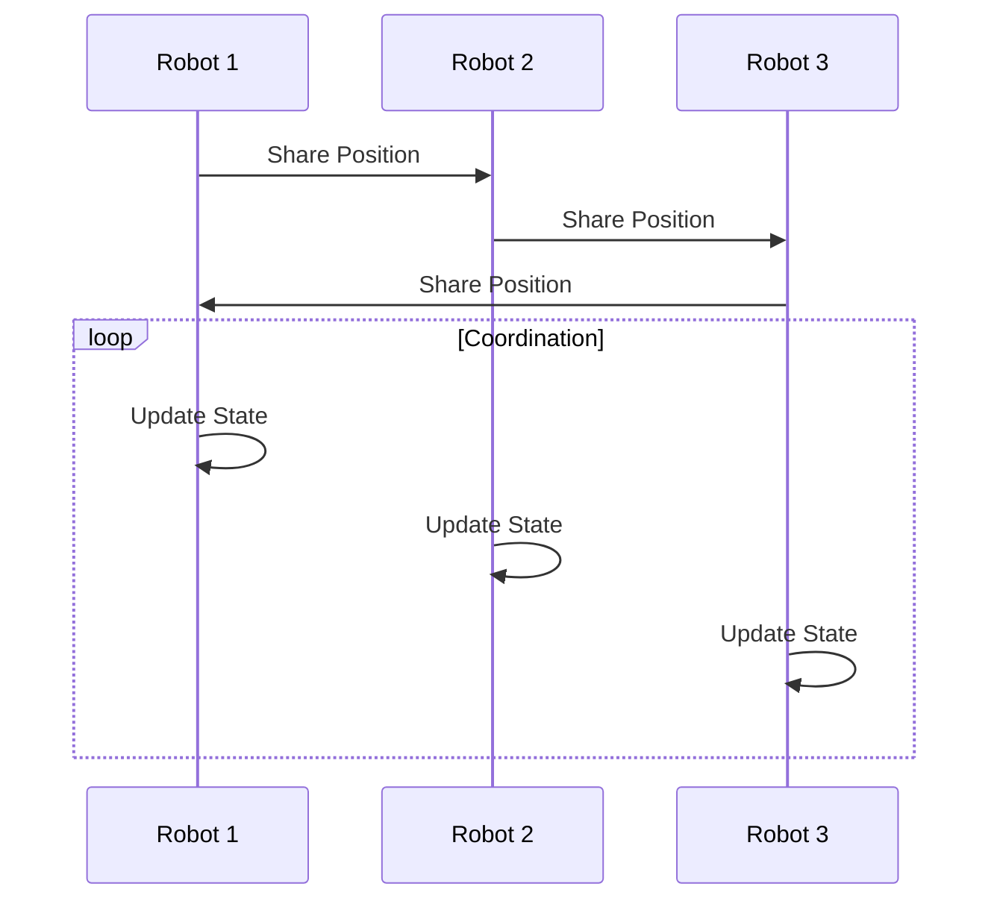
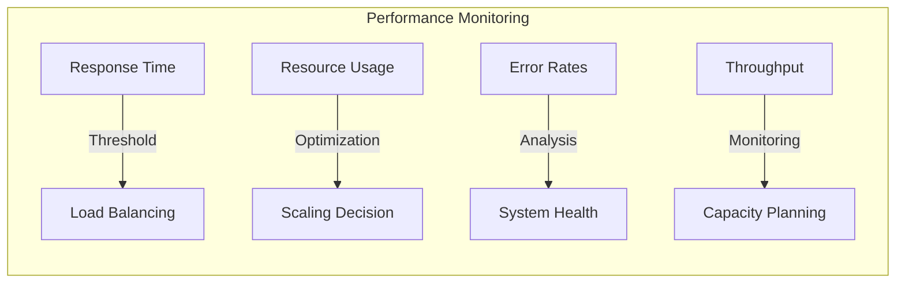

# Real-World Applications of Swarm Intelligence

<p align="center">
  <a href="../../../../README.md">Home</a> | <a href="../../../../projects/projects.md">Projects</a> | <a href="../../../../research/research.md">Research</a> | <a href="../../../../techstack/techstack.md">Tech Stack</a> | <a href="../../../../contact.md">Contact</a>
</p>

## Network Optimization Implementation

### Traffic Flow Management

Implementation of adaptive traffic control using ant colony optimization:

```python
class TrafficSwarmOptimizer:
    def __init__(self, network_topology):
        self.topology = network_topology
        self.pheromone_matrix = np.zeros((n_nodes, n_nodes))
        self.flow_history = []
    
    def update_pheromones(self, path, quality):
        for i, j in zip(path[:-1], path[1:]):
            self.pheromone_matrix[i,j] *= (1 - self.evaporation_rate)
            self.pheromone_matrix[i,j] += quality
    
    def select_path(self, start, end):
        current = start
        path = [start]
        while current != end:
            probabilities = self.calculate_transition_probs(current)
            next_node = np.random.choice(
                range(len(probabilities)), 
                p=probabilities
            )
            path.append(next_node)
            current = next_node
        return path
```



### Load Balancing System

Dynamic load balancing implementation using particle swarm optimization:

```python
class LoadBalancer:
    def __init__(self, n_servers):
        self.servers = [Server() for _ in range(n_servers)]
        self.particle_positions = np.random.uniform(size=(n_particles, n_dimensions))
        self.particle_velocities = np.zeros_like(self.particle_positions)
        
    def optimize_allocation(self, workload):
        best_position = None
        best_fitness = float('inf')
        
        for iteration in range(max_iterations):
            for i in range(len(self.particle_positions)):
                fitness = self.evaluate_fitness(
                    self.particle_positions[i], 
                    workload
                )
                if fitness < best_fitness:
                    best_fitness = fitness
                    best_position = self.particle_positions[i].copy()
            
            self.update_particles(best_position)
        
        return self.decode_solution(best_position)
```

## Robotics Applications

### Swarm Robotics Control

Implementation of decentralized robot coordination:

```python
class SwarmRobot:
    def __init__(self, position, sensing_radius):
        self.position = np.array(position)
        self.velocity = np.zeros(2)
        self.sensing_radius = sensing_radius
        self.neighbors = set()
        
    def update_state(self, swarm):
        self.neighbors = self.get_neighbors(swarm)
        
        # Compute separation force
        separation = self.compute_separation()
        
        # Compute cohesion force
        cohesion = self.compute_cohesion()
        
        # Compute alignment force
        alignment = self.compute_alignment()
        
        # Update velocity and position
        self.velocity += (
            self.w_sep * separation + 
            self.w_coh * cohesion + 
            self.w_ali * alignment
        )
        self.velocity = self.limit_velocity(self.velocity)
        self.position += self.velocity
```



## Optimization Problems

### Supply Chain Optimization

Implementation of multi-objective supply chain optimization:

```python
class SupplyChainOptimizer:
    def __init__(self, network_config):
        self.network = network_config
        self.population = self.initialize_population()
        self.pareto_front = []
        
    def evaluate_solution(self, solution):
        cost = self.calculate_cost(solution)
        time = self.calculate_delivery_time(solution)
        reliability = self.calculate_reliability(solution)
        
        return np.array([cost, time, reliability])
    
    def update_population(self):
        offspring = self.create_offspring()
        combined = np.vstack([self.population, offspring])
        
        # Non-dominated sorting
        fronts = self.fast_non_dominated_sort(combined)
        
        # Update population using crowding distance
        new_population = []
        front_idx = 0
        
        while len(new_population) + len(fronts[front_idx]) <= self.pop_size:
            self.calculate_crowding_distance(fronts[front_idx])
            new_population.extend(fronts[front_idx])
            front_idx += 1
```

### Financial Portfolio Optimization

Implementation of portfolio optimization using quantum-inspired particle swarm:

```python
class QuantumPortfolioOptimizer:
    def __init__(self, assets, constraints):
        self.assets = assets
        self.constraints = constraints
        self.quantum_particles = self.initialize_quantum_particles()
        
    def evaluate_portfolio(self, weights):
        returns = np.sum(self.assets['returns'] * weights)
        risk = self.calculate_portfolio_risk(weights)
        sharpe = returns / risk
        
        return sharpe
    
    def update_quantum_particles(self):
        for particle in self.quantum_particles:
            # Update quantum rotation angle
            delta_theta = self.calculate_rotation_angle(
                particle.position,
                particle.best_position
            )
            
            # Apply quantum rotation gate
            particle.position = self.apply_quantum_rotation(
                particle.position,
                delta_theta
            )
            
            # Ensure constraints
            particle.position = self.project_to_feasible(
                particle.position
            )
```

## Performance Metrics

### System Performance Analysis



### Scalability Analysis

The system scales with complexity:

$$
C(n) = O(n \log n) \text{ for } n < n_{\text{critical}}
$$

$$
C(n) = O(n^{1.5}) \text{ for } n \geq n_{\text{critical}}
$$

where $n_{\text{critical}}$ is the critical system size.

---

## Contributors

- **Author**: rolodexterVS
- **Technical Implementation**: rolodexterGPT
- **Research & Development**: rolodexterGPT 