# Quantum Computing in Swarm Intelligence

  <a href="../../../../README.md">Home</a> | <a href="../../../../projects/projects.md">Projects</a> | <a href="../../../../research/research.md">Research</a> | <a href="../../../../techstack/techstack.md">Tech Stack</a> | <a href="../../../../contact.md">Contact</a>

## Quantum-Enhanced Swarm Optimization

### Quantum State Representation

In quantum-enhanced swarm intelligence, each particle's state is represented by a quantum superposition:

$$
|\psi_i\rangle = \sum_{x \in \mathcal{X}} \alpha_x|x\rangle
$$

where:
- $\mathcal{X}$ is the search space
- $\alpha_x$ are complex amplitudes satisfying $\sum_x |\alpha_x|^2 = 1$
- $|x\rangle$ represents basis states in the computational basis

### Quantum Operations

The quantum swarm evolution involves unitary transformations:

$$
U(\theta) = \exp(-i\hat{H}\theta/\hbar)
$$

with the Hamiltonian:

$$
\hat{H} = \hat{H}_{\text{kin}} + \hat{H}_{\text{pot}} + \hat{H}_{\text{int}}
$$

## Advanced Quantum Algorithms

### Quantum Fourier Transform Integration

The QFT-enhanced position update uses:

$$
|\psi_{\text{new}}\rangle = \text{QFT}^{-1}\left(\text{QFT}(|\psi_{\text{old}}\rangle) \cdot e^{i\phi(k)}\right)
$$

where $\phi(k)$ is the momentum-space phase function:

$$
\phi(k) = \frac{\hbar k^2}{2m}\Delta t + V(k)\Delta t
$$

### Quantum Entanglement Dynamics

The multi-particle entangled state evolves as:

$$
|\Psi\rangle = \frac{1}{\sqrt{N!}}\sum_P (-1)^P \prod_{i=1}^N |\psi_{P(i)}\rangle
$$

## Implementation Architecture

```mermaid
sequenceDiagram
    participant QR as Quantum Register
    participant QC as Quantum Circuit
    participant CM as Classical Memory
    
    QR->>QC: Initialize Qubits
    QC->>QC: Apply H⊗n
    
    loop Quantum Evolution
        QC->>QC: Phase Estimation
        QC->>QC: Grover Iteration
        QC->>CM: Measure Subset
        CM->>QC: Update Parameters
    end
```

### Error Mitigation

Quantum error correction employs the surface code with stabilizer measurements:

$$
\hat{S}_p = \prod_{i \in \partial p} \hat{\sigma}_i^z
$$

$$
\hat{S}_v = \prod_{i \in \star v} \hat{\sigma}_i^x
$$

## Hybrid Classical-Quantum Algorithms

### Variational Quantum Eigensolver

The VQE approach optimizes the expectation value:

$$
E(\theta) = \langle\psi(\theta)|\hat{H}|\psi(\theta)\rangle
$$

with parameterized quantum circuits:

$$
|\psi(\theta)\rangle = U_M(\theta_M)\cdots U_2(\theta_2)U_1(\theta_1)|0\rangle^{\otimes n}
$$

### Quantum Approximate Optimization

The QAOA ansatz takes the form:

$$
|\gamma,\beta\rangle = e^{-i\beta_pH_B}e^{-i\gamma_pH_C}\cdots e^{-i\beta_1H_B}e^{-i\gamma_1H_C}|+\rangle^{\otimes n}
$$

## Performance Analysis

### Complexity Bounds

The quantum speedup achieves:

$$
T_{\text{quantum}} = O(\sqrt{N}\log N)
$$

compared to classical:

$$
T_{\text{classical}} = O(N\log N)
$$

### Resource Estimation

Qubit requirements scale as:

$$
Q(n) = n + \lceil\log_2(n)\rceil + O(1)
$$

with circuit depth:

$$
D(n) = O(n^{3/2}\log n)
$$

---

## Contributors

- **Author**: rolodexterVS
- **Technical Implementation**: rolodexterGPT
- **Research & Development**: rolodexterGPT