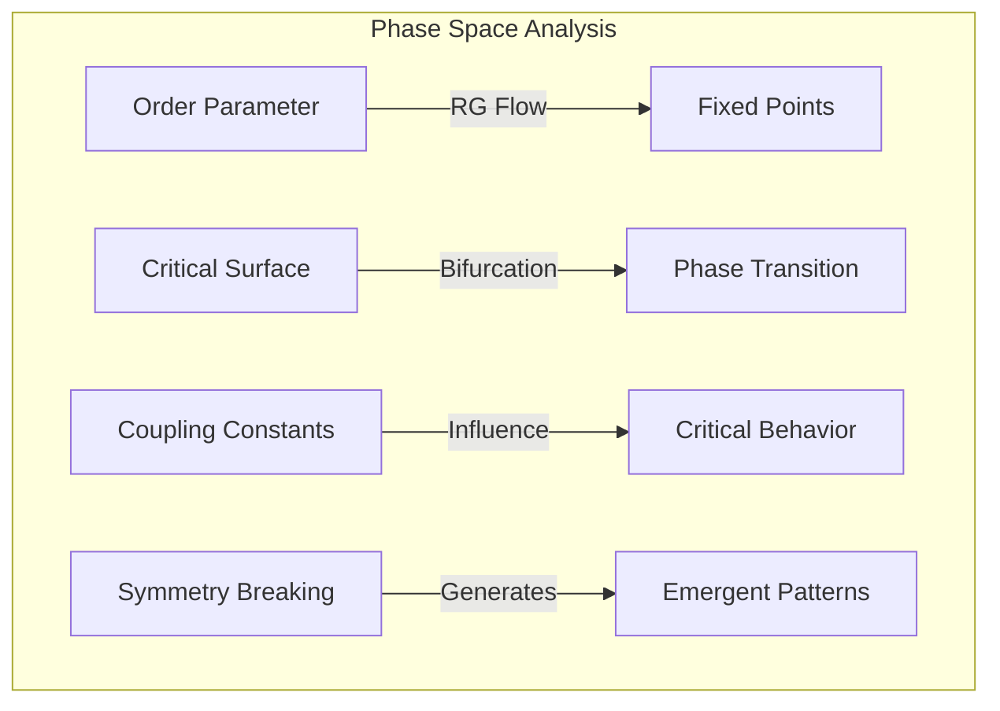
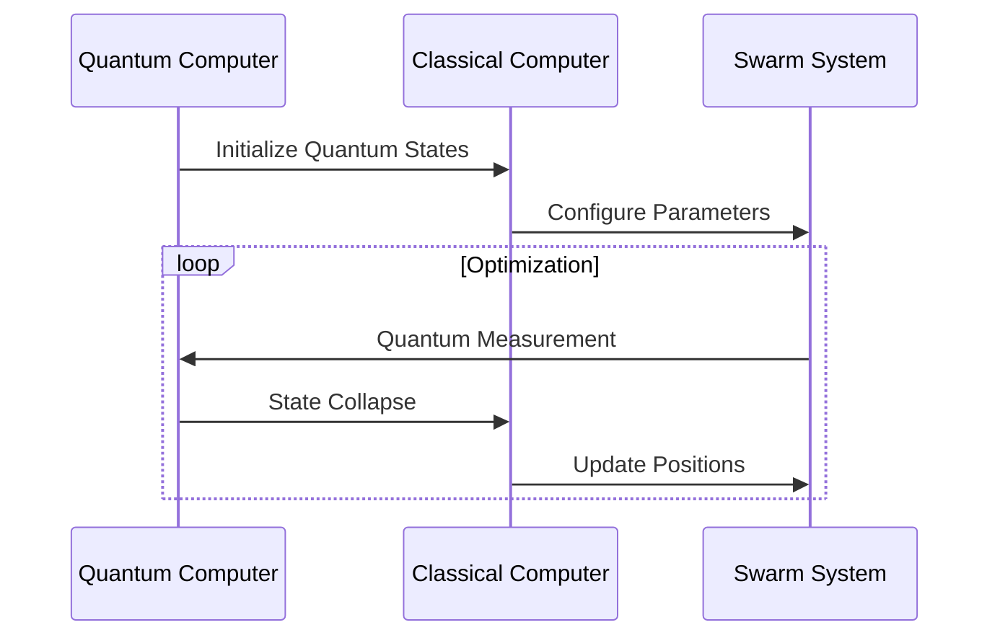
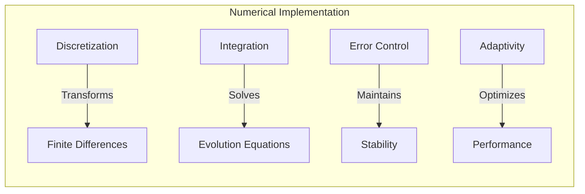

# Mathematical Framework of Swarm Intelligence

  <a href="../../../../README.md">Home</a> | <a href="../../../../projects/projects.md">Projects</a> | <a href="../../../../research/research.md">Research</a> | <a href="../../../../techstack/techstack.md">Tech Stack</a> | <a href="../../../../contact.md">Contact</a>

## Core Mathematical Principles

The fundamental mathematical framework of swarm intelligence is built upon stochastic processes and dynamical systems theory. Let's examine the key mathematical components:

### Collective Dynamics

The collective behavior of a swarm system with $N$ agents can be described by the following stochastic differential equation:

$$
\frac{dx_i}{dt} = v_i + \sum_{j \in \mathcal{N}_i} \phi(x_j - x_i) + \eta_i(t)
$$

where:
- $x_i$ represents the state of agent $i$
- $v_i$ is the intrinsic velocity
- $\phi(x)$ is the interaction potential
- $\eta_i(t)$ represents Gaussian white noise
- $\mathcal{N}_i$ denotes the neighborhood of agent $i$

### Information Theoretic Framework

The information flow within the swarm can be quantified using the mutual information between agents:

$$
I(X_i; X_j) = \int\int p(x_i, x_j) \log \frac{p(x_i, x_j)}{p(x_i)p(x_j)} dx_i dx_j
$$

### Phase Transition Analysis

Critical behavior in swarm systems follows the renormalization group equations:

$$
\frac{d\psi}{dl} = \beta(\psi) = (d-2)\psi + g\psi^3 + O(\psi^5)
$$

where:
- $\psi$ is the order parameter
- $l$ is the renormalization scale
- $d$ is the system dimensionality
- $g$ is the coupling constant

## Advanced Optimization Algorithms

### Quantum-Enhanced PSO

The quantum particle swarm optimization incorporates quantum mechanics through the wave function:

$$
|\psi(x,t)\rangle = \sum_{i=1}^N \alpha_i(t)|x_i\rangle
$$

with evolution governed by:

$$
i\hbar\frac{\partial}{\partial t}|\psi(t)\rangle = \hat{H}|\psi(t)\rangle
$$

where $\hat{H}$ is the system Hamiltonian:

$$
\hat{H} = -\frac{\hbar^2}{2m}\nabla^2 + V(x) + \sum_{j\neq i} U(|x_i - x_j|)
$$

### Hybrid Quantum-Classical Algorithm

## Statistical Mechanics of Swarm Systems

### Partition Function

The equilibrium properties of the swarm can be described by the partition function:

$$
Z = \int \prod_{i=1}^N dx_i dp_i \exp\left(-\beta H(\{x_i, p_i\})\right)
$$

where the Hamiltonian $H$ includes both kinetic and interaction terms:

$$
H = \sum_{i=1}^N \frac{p_i^2}{2m} + \sum_{i<j} V(|x_i - x_j|)
$$

### Order Parameter Dynamics

The time evolution of the order parameter follows the Fokker-Planck equation:

$$
\frac{\partial P}{\partial t} = -\nabla \cdot (FP) + D\nabla^2P
$$

where:
- $P$ is the probability distribution
- $F$ is the drift force
- $D$ is the diffusion coefficient

## Implementation Considerations

### Numerical Methods

The discrete-time implementation uses the Verlet algorithm:

$$
x(t + \Delta t) = 2x(t) - x(t - \Delta t) + \frac{F(t)}{m}(\Delta t)^2 + O(\Delta t^4)
$$

with force terms:

$$
F(t) = -\nabla V(x(t)) - \gamma v(t) + \sqrt{2\gamma k_BT}\xi(t)
$$

---

## Contributors

- **Author**: rolodexterVS
- **Technical Implementation**: rolodexterGPT
- **Research & Development**: rolodexterGPT
