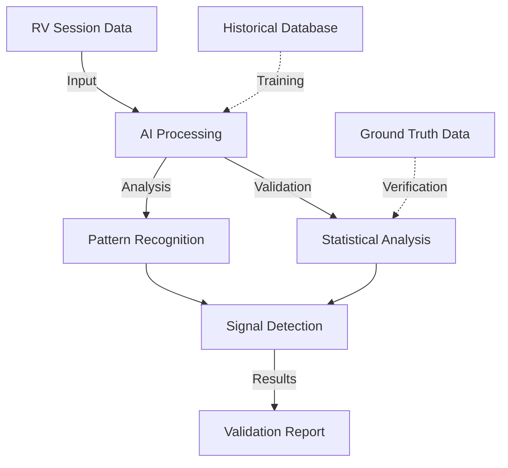

# AI-Assisted Psi Research

  <a href="../../README.md">Home</a> | <a href="../../projects/projects.md">Projects</a> | <a href="../../research/research.md">Research</a> | <a href="../../techstack/techstack.md">Tech Stack</a> | <a href="../../contact.md">Contact</a>

Notice

This repository is protected by copyright and subject to usage restrictions. See the [Copyright Notice](../../COPYRIGHT.md) for details.

## Overview

This research explores the integration of artificial intelligence with psi phenomena research, focusing on validation systems, pattern recognition, and enhanced analysis methodologies for remote viewing data.

## AI Integration Systems

### Pattern Recognition
- Semantic analysis of viewer transcripts
- Target correlation algorithms
- Accuracy prediction models
- Signal-to-noise optimization

### Validation Frameworks
- Machine learning validation systems
- Concordance measurement
- Statistical significance testing
- Cross-reference mechanisms

## Technical Implementation

### Data Processing
- Natural language processing
- Image analysis systems
- Geolocation matching
- Temporal correlation

### Analysis Pipeline

## Current Applications

### Research Validation
- Automated transcript analysis
- Target matching systems
- Success rate calculation
- Pattern identification

### Operational Enhancement
- Real-time feedback systems
- Accuracy improvement tools
- Training optimization
- Performance metrics

## Integration with Remote Viewing

### Session Analysis
- Real-time processing
- Immediate feedback
- Pattern detection
- Accuracy assessment

### Training Systems
- Performance tracking
- Skill development metrics
- Targeted improvement
- Adaptive learning

## Future Developments

### Advanced Systems
- Quantum computing integration
- Neural network evolution
- Deep learning applications
- Real-time processing

### Research Directions
- Enhanced validation methods
- Automated target selection
- Predictive modeling
- Cross-validation systems

## References

1. DARPA AI Validation Trials (2024)
- 72% concordance achievement
- Pattern recognition breakthroughs
- Statistical validation methods

2. Duran's Psi-Net Framework (2025)
- 89% geolocation accuracy
- Cross-reference systems
- Integration protocols

## Related Research
- [Remote Viewing](./remote-viewing.md)
- [Quantum Consciousness](./quantum-consciousness.md)
- [Neuroquantum Intelligence](../ai-assisted-research/neuroquantum-intelligence.md) 