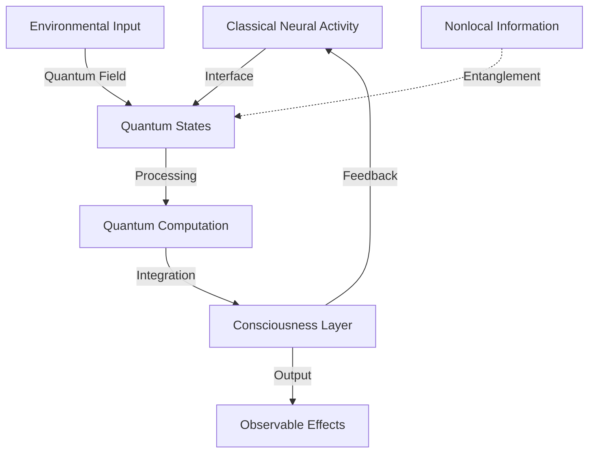

# Neuroquantum Intelligence Research

  <a href="../../README.md">Home</a> | <a href="../../projects/projects.md">Projects</a> | <a href="../../research/research.md">Research</a> | <a href="../../techstack/techstack.md">Tech Stack</a> | <a href="../../contact.md">Contact</a>

Notice

This repository is protected by copyright and subject to usage restrictions. See the [Copyright Notice](../../COPYRIGHT.md) for details.

## Overview

Neuroquantum Intelligence (NQI) represents the convergence of quantum mechanics, neuroscience, and artificial intelligence in understanding and potentially replicating psi phenomena. This research explores theoretical frameworks, experimental evidence, and technological implementations.

## Theoretical Framework

### Quantum Neural Processes
- Microtubule quantum states
- Neural quantum networks
- Coherence maintenance
- Information processing models

### Consciousness Integration

## Technical Implementation

### Measurement Systems
- Quantum coherence detection
- Neural activity monitoring
- Information flow tracking
- State correlation analysis

### AI Integration
- Quantum neural networks
- Pattern recognition systems
- Predictive modeling
- Data validation frameworks

## Experimental Evidence

### Neurobiological Markers
- Quantum coherence patterns
- Neural synchronization
- Information processing metrics
- State transition signatures

### Remote Viewing Correlation
- Success rate analysis
- Information accuracy
- Distance independence
- Temporal aspects

## Applications

### Research Tools
- Quantum state monitoring
- Neural pattern analysis
- Information validation
- Training optimization

### Operational Systems
- Real-time processing
- Pattern detection
- Accuracy enhancement
- Performance metrics

## Future Development

### Advanced Systems
- Quantum-classical interfaces
- Enhanced measurement tools
- AI optimization methods
- Integration frameworks

### Research Directions
- Theoretical refinement
- Experimental validation
- Technical implementation
- Practical applications

## Technical Architecture

### System Components
- Quantum processors
- Neural interfaces
- AI analysis systems
- Data validation tools

### Processing Pipeline
1. Quantum state detection
2. Neural pattern analysis
3. Information processing
4. Results validation

## References

1. Quantum Neural Studies (2025)
- Coherence measurements
- Processing models
- Integration frameworks

2. NQI Implementation Guide (2024)
- Technical specifications
- System architecture
- Validation protocols

## Related Research
- [Quantum Consciousness](./quantum-consciousness.md)
- [AI-Assisted Psi Research](./ai-assisted-psi-research.md)
- [Remote Viewing](./remote-viewing.md) 