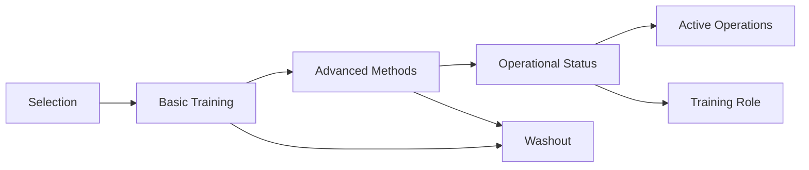

# Project Stargate Analysis

  <a href="../../README.md">Home</a> | <a href="../../projects/projects.md">Projects</a> | <a href="../../research/research.md">Research</a> | <a href="../../techstack/techstack.md">Tech Stack</a> | <a href="../../contact.md">Contact</a>

Notice

This repository is protected by copyright and subject to usage restrictions. See the [Copyright Notice](../../COPYRIGHT.md) for details.

## Overview

Project Stargate was a classified U.S. government program that investigated remote viewing and other psi phenomena from 1972 to 1995. This analysis examines declassified documents, methodological developments, and operational outcomes of the program.

## Historical Context

### Program Evolution
- SCANATE (1972-1973)
- Project Grill Flame (1977-1979)
- Center Lane Program (1983-1985)
- Sun Streak (1986-1990)
- Project Stargate (1990-1995)

### Key Personnel
- Ingo Swann - Method Development
- Pat Price - Operational Viewer
- Joseph McMoneagle - Viewer #001
- Edwin May - Research Director
- Russell Targ - SRI Research Lead

## Methodological Development

### Coordinate Remote Viewing (CRV)
- Stage I: Basic Perception
- Stage II: Sensory Data
- Stage III: Dimensional Data
- Stage IV: Analytical Data
- Stage V: Integration
- Stage VI: Three-Dimensional Modeling

### Training Protocols

## Operational Results

### Success Metrics
- Statistical significance
- Operational utility
- Information accuracy
- Cost-benefit analysis

### Notable Operations
- Soviet Submarine Detection
- Iranian Hostage Crisis
- KH-11 Satellite Analysis
- Strategic Intelligence Collection

## Scientific Validation

### Research Studies
- SRI Experiments
- SAIC Replication
- AIR Assessment
- Independent Analyses

### Statistical Evidence
- Effect sizes
- Replication rates
- Control comparisons
- Methodological rigor

## Legacy and Impact

### Modern Applications
- Intelligence gathering
- Scientific research
- Archaeological discovery
- Missing persons cases

### Continuing Influence
- Contemporary RV methods
- Training protocols
- Validation systems
- Operational procedures

## Declassified Documents

### Key Findings
- Operational successes
- Methodology development
- Training effectiveness
- Program limitations

### Document Categories
- Training manuals
- Operation reports
- Research studies
- Program evaluations

## References

1. CIA Star Gate Archive (1995)
- Declassified documents
- Program evaluations
- Operational reports

2. May & McMoneagle (2024)
- Methodology analysis
- Success metrics
- Training protocols

## Related Research
- [Remote Viewing](./remote-viewing.md)
- [AI-Assisted Psi Research](./ai-assisted-psi-research.md)
- [Intelligence Applications](../intelligence-and-defense/intelligence-applications.md) 