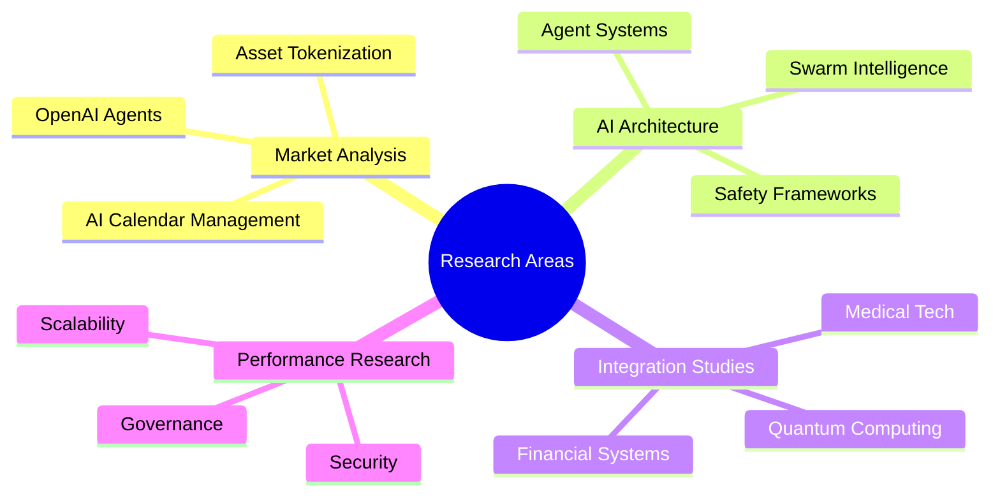
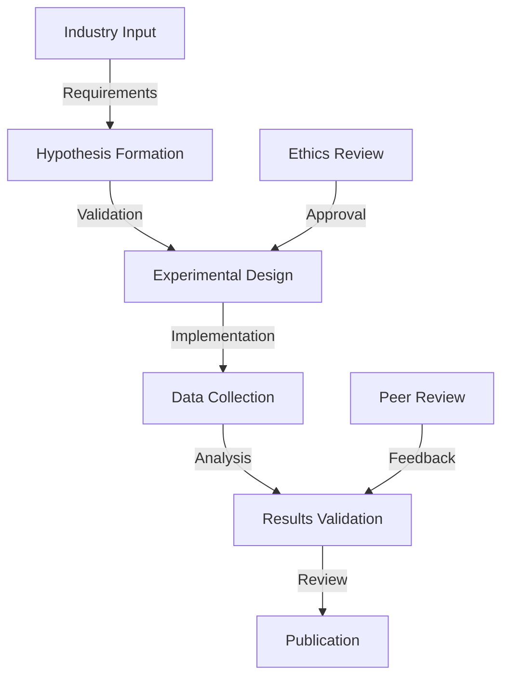

# Research Overview

  <a href="../README.md">Home</a> | <a href="../projects/projects.md">Projects</a> | <a href="research.md">Research</a> | <a href="../techstack/techstack.md">Tech Stack</a> | <a href="../contact.md">Contact</a>

Notice

This repository is protected by copyright and subject to usage restrictions. See the [Copyright Notice](../COPYRIGHT.md) for details.

## Research Portfolio

## Active Research Initiatives

### [Market Analysis](market-analysis/)
Our market analysis research focuses on emerging technologies and their economic implications, utilizing advanced econometric models and machine learning algorithms for predictive analytics.

#### Current Studies
- [OpenAI Agents Platform Analysis](market-analysis/openai-agents/analysis.md)
  - Technical architecture evaluation using distributed systems theory
  - Market impact assessment through Monte Carlo simulations
  - Economic implications study with agent-based modeling
  > Employing stochastic process analysis and game theory to model agent interactions and market dynamics in multi-agent systems.

- [Real-World Asset Tokenization](market-analysis/rwa-tokenization/analysis.md)
  - Blockchain integration frameworks with ZK-proof systems
  - Market dynamics research using econometric models
  - Regulatory compliance studies with formal verification
  > Implementing ERC-3643 and ERC-721 standards with custom extensions for regulatory compliance and automated market making.

- [AI Calendar Management](market-analysis/ai-calendar-management/analysis.md)
  - Productivity impact analysis using time-series forecasting
  - Integration architecture with distributed systems
  - Market transformation study through behavioral economics
  > Utilizing NLP transformers and reinforcement learning for contextual understanding and optimal scheduling.

### [Published Research](papers/)

#### [Foundational AI Agents](papers/agent-architecture/)
Advanced research in autonomous systems architecture, focusing on formal verification, safety guarantees, and emergent behaviors.

- [Agent Architecture Principles](papers/agent-architecture/principles.md)
  > Implementing hierarchical reinforcement learning with formal safety constraints and probabilistic guarantees.
- [Autonomous Systems Design](papers/autonomous-systems/design.md)
  > Developing verifiable autonomous systems using category theory and abstract interpretation.
- [Safety Mechanisms in AI](papers/ai-safety/mechanisms.md)
  > Implementing robust safety frameworks through formal verification and runtime monitoring.

#### [Swarm Intelligence](papers/swarm-intelligence/)
Research in distributed intelligence and emergent behaviors, focusing on billion-scale agent networks and biomimetic algorithms.

- [Billion-Scale Networks](papers/swarm-intelligence/billion-scale.md)
  > Implementing gossip protocols and consensus mechanisms for massive-scale coordination.
- [Biomimetic Behaviors](papers/biomimetic-systems/behaviors.md)
  > Developing nature-inspired algorithms for collective decision-making and adaptation.
- [Distributed Intelligence](papers/distributed-ai/intelligence.md)
  > Creating scalable distributed learning systems with Byzantine fault tolerance.

## [Research Frameworks](frameworks/)

### [Methodology](frameworks/methodology/)

### [Core Research Areas](frameworks/core/)

1. **[Agent Architecture](frameworks/core/agent-architecture/)**
   > Implementing decentralized orchestration through probabilistic programming and formal verification methods. Our approach combines category theory for compositional reasoning with statistical guarantees for safety properties.
   - [Swarm intelligence principles](frameworks/core/agent-architecture/swarm.md)
   - [Decentralized orchestration](frameworks/core/agent-architecture/orchestration.md)
   - [Biomimetic design patterns](frameworks/core/agent-architecture/biomimetic.md)
   - [Safety mechanisms](frameworks/core/agent-architecture/safety.md)
   - [Scalability frameworks](frameworks/core/agent-architecture/scalability.md)

2. **[System Integration](frameworks/core/system-integration/)**
   > Developing cross-platform integration systems using formal methods and verified implementations. Our framework ensures compositional correctness through type-theoretic approaches.
   - [Medical nanorobotics](frameworks/core/system-integration/medical.md)
   - [Financial systems](frameworks/core/system-integration/financial.md)
   - [Edge computing](frameworks/core/system-integration/edge.md)
   - [Quantum resistance](frameworks/core/system-integration/quantum.md)
   - [Cross-platform compatibility](frameworks/core/system-integration/compatibility.md)

3. **[Performance & Safety](frameworks/core/performance-safety/)**
   > Implementing comprehensive performance monitoring and safety verification through formal methods and runtime verification techniques.
   - [Energy efficiency metrics](frameworks/core/performance-safety/energy.md)
   - [Scalability benchmarks](frameworks/core/performance-safety/scalability.md)
   - [Security protocols](frameworks/core/performance-safety/security.md)
   - [Governance models](frameworks/core/performance-safety/governance.md)
   - [Risk assessment frameworks](frameworks/core/performance-safety/risk.md)

## [Collaboration Network](collaboration/)

### [Research Partners](collaboration/partners/)
- Academic Institutions
  - [MIT Media Lab](collaboration/partners/mit.md): AI Ethics & Governance
  - [Stanford AI Lab](collaboration/partners/stanford.md): Agent Systems
  - [Berkeley RISE Lab](collaboration/partners/berkeley.md): Distributed Systems
- Industry Collaborators
  - [OpenAI](collaboration/partners/openai.md): Language Models
  - [DeepMind](collaboration/partners/deepmind.md): Reinforcement Learning
  - [Anthropic](collaboration/partners/anthropic.md): AI Safety
- Research Laboratories
  - [CERN](collaboration/partners/cern.md): Quantum Computing
  - [Los Alamos](collaboration/partners/los-alamos.md): Security
  - [Fermilab](collaboration/partners/fermilab.md): High-Performance Computing

### [Open Source Initiatives](opensource/)
> Our open-source projects implement cutting-edge research in agent systems, swarm intelligence, and safety frameworks.
- [Agent Framework](https://github.com/rolodexter/agent-framework): Formal verification-based agent system
- [Swarm Protocol](https://github.com/rolodexter/swarm-protocol): Byzantine fault-tolerant coordination
- [Safety Toolkit](https://github.com/rolodexter/safety-toolkit): Runtime verification suite

## [Research Principles](principles/)

### [Methodology Standards](principles/methodology/)
1. **[Rigorous Experimentation](principles/methodology/experimentation.md)**
   > Implementing reproducible research through automated verification and statistical validation.
   - Reproducible results through containerization
   - Documented procedures with formal specifications
   - Version control with semantic versioning
   - Data validation using formal methods

2. **[Peer Review Process](principles/methodology/peer-review.md)**
   > Utilizing distributed review systems with formal verification of claims.
   - Internal review board with expertise matching
   - External expert panel selection algorithms
   - Community feedback aggregation
   - Continuous improvement through metrics

3. **[Ethical Considerations](principles/methodology/ethics.md)**
   > Implementing ethical guidelines through formal verification and runtime monitoring.
   - Safety protocols with formal guarantees
   - Privacy standards with zero-knowledge proofs
   - Bias mitigation through formal fairness metrics
   - Environmental impact assessment frameworks

## [Resources](resources/)

### [Documentation](docs/)
- [Research Papers](papers/): Peer-reviewed publications
- [Technical Documentation](docs/): Implementation details
- [Data Sets](datasets/): Benchmark collections
- [Tools and Methods](tools/): Research infrastructure

### [Quick Links](links/)
- [Submit Research Proposal](forms/research-proposal.md)
- [Access Data Sets](datasets/README.md)
- [Join Collaboration](collaboration/README.md)
- [Ethics Guidelines](guidelines/ethics.md)

---

Last Updated: March 2025  
Contact: research@rolodexter.ai 