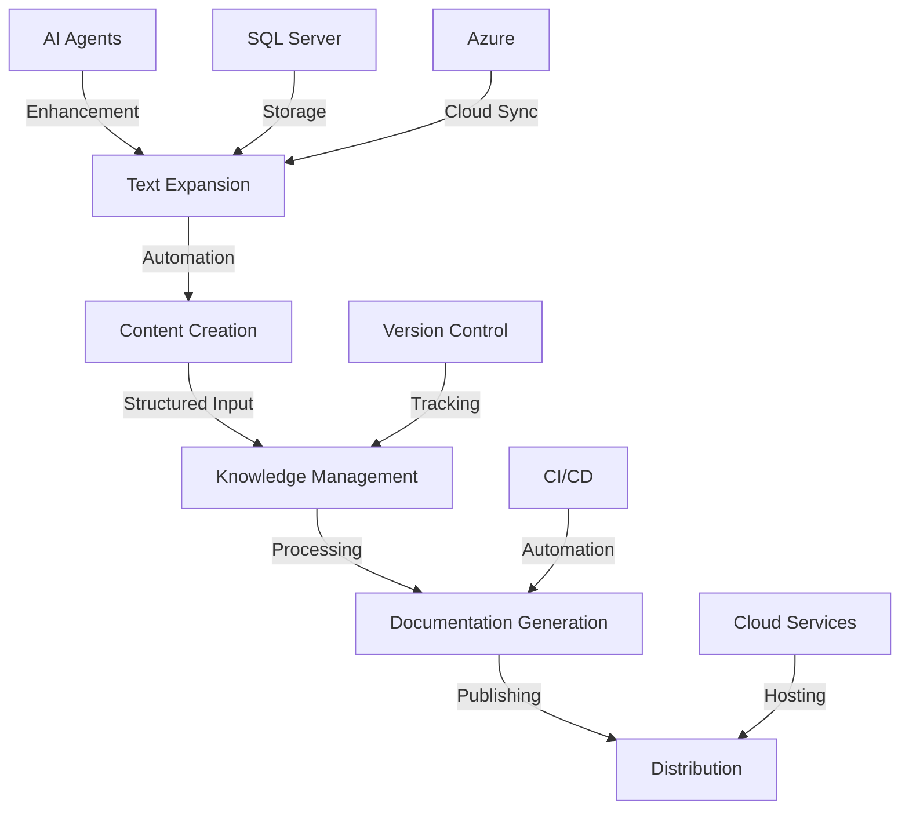
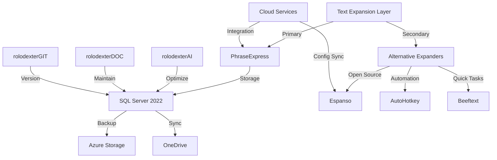
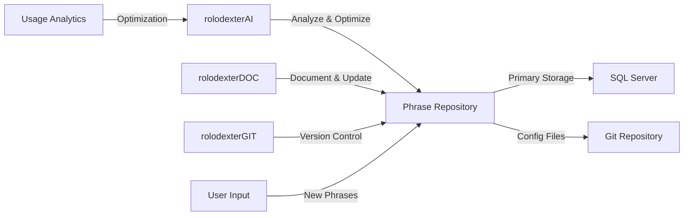
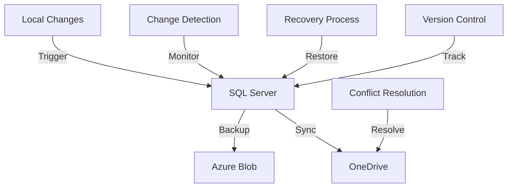
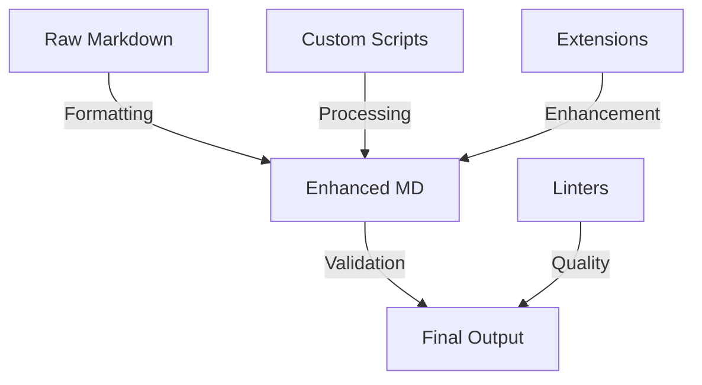
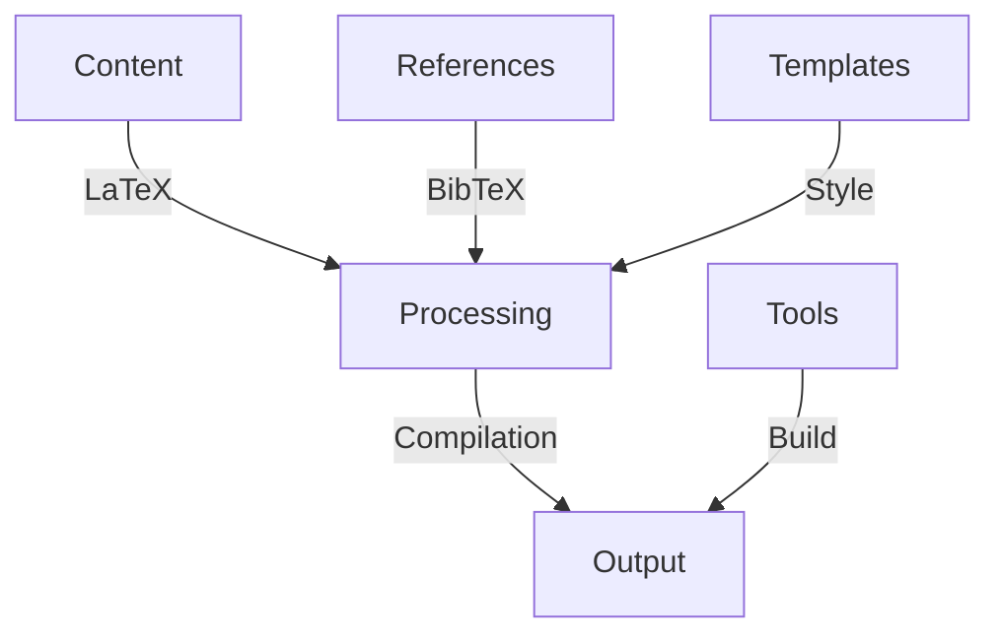
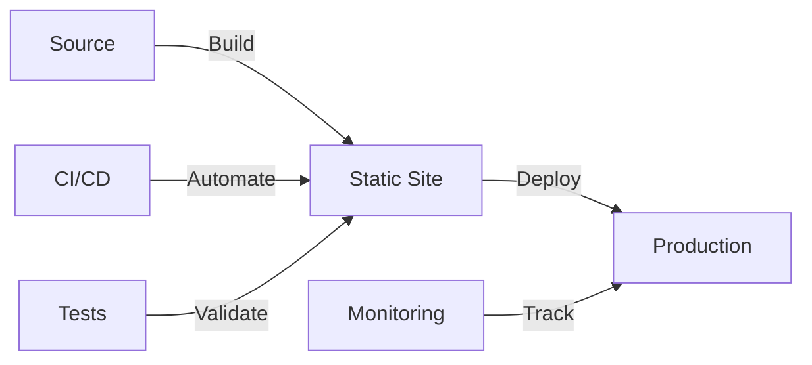

# Documentation Tools

<p align="center">
  <a href="../../README.md">
    
  </a>
</p>

<p align="center">
  <a href="../../README.md">Home</a> | <a href="../../projects/projects.md">Projects</a> | <a href="../../research/research.md">Research</a> | <a href="../../techstack/techstack.md">Tech Stack</a> | <a href="../../contact.md">Contact</a>
</p>

<details>
<summary>Notice</summary>

This repository is protected by copyright and subject to usage restrictions. See the [Copyright Notice](../../COPYRIGHT.md) for details.
</details>

## Documentation Architecture



## Knowledge Management

### [Obsidian](https://obsidian.md/)
> Implementation of graph-based knowledge management using Dataview plugin for SQL-like queries, custom JavaScript for automation, and Python integration for AI-enhanced note processing. Utilizes YAML frontmatter for metadata management.
- Primary knowledge base and note-taking system
- Graph visualization for knowledge connections
- Custom plugins for AI integration
- Version control integration

### [Overleaf](https://www.overleaf.com/)
> LaTeX-based collaborative writing platform with Git backend integration. Implements custom document classes and BibTeX for reference management. Uses CI/CD for automated PDF generation.
- Scientific article writing and collaboration
- LaTeX document preparation
- Research paper templates
- Pre-print formatting

### [GitBook](https://www.gitbook.com/)
> Modern documentation platform with React-based components and GraphQL API. Implements OpenAPI specification for API documentation and custom JavaScript for interactive elements.
- Technical documentation hosting
- API documentation
- Integration guides
- User manuals

## Text Expansion System



### Multi-Expander Architecture
> Enterprise text expansion infrastructure utilizing multiple specialized tools for different use cases, with PhraseExpress as the primary system backed by SQL Server 2022, and complementary open-source solutions for specific workflows.

#### Primary System: PhraseExpress
> Enterprise-grade text expansion system utilizing SQL Server 2022 for phrase storage, Azure Blob Storage for backup, and OneDrive for cross-device synchronization. Implements custom T-SQL procedures for phrase management.

##### Database Architecture
- SQL Server 2022 backend
  - Normalized tables for phrases, categories, and metadata
  - Full-text search indexing for rapid retrieval
  - Transaction logging with change tracking
  - Temporal tables for version history

##### Cloud Integration
- Azure Blob Storage backup
  - Automated daily snapshots
  - Point-in-time recovery
  - Geo-redundant storage
- OneDrive real-time sync
  - Multi-device deployment
  - Conflict resolution
  - Delta synchronization

#### Complementary Systems

##### [Espanso](https://espanso.org)
> Privacy-focused, open-source text expander utilizing YAML configuration and shell integration for developer workflows.
- Cross-platform compatibility
- Shell command integration
- Custom Python/Ruby matches
- Git-based config management

##### [AutoHotkey](https://www.autohotkey.com)
> Scripting-based automation tool for complex text expansion and system automation tasks.
- Custom macro scripting
- System-wide hotkeys
- GUI automation
- Complex text manipulation

##### [Beeftext](https://beeftext.org)
> Lightweight text expander for quick tasks and simple substitutions.
- Portable deployment
- Simple combo shortcuts
- Unicode support
- CSV import/export

#### AI Agent Integration



##### Agent Responsibilities
- **rolodexterAI**
  - Phrase optimization algorithms
  - Usage pattern analysis
  - Suggestion generation
  - Context awareness

- **rolodexterDOC**
  - Documentation maintenance
  - Category organization
  - Metadata management
  - Usage guidelines

- **rolodexterGIT**
  - Version control
  - Change tracking
  - Backup coordination
  - Sync management

#### Integration Points

##### Database Connectivity
```sql
-- Example phrase management stored procedure
CREATE PROCEDURE [dbo].[usp_ManagePhrase]
    @PhraseID uniqueidentifier,
    @Content nvarchar(max),
    @Category nvarchar(100),
    @Tags nvarchar(500),
    @LastModifiedBy nvarchar(50)
AS
BEGIN
    SET NOCOUNT ON;
    
    MERGE INTO Phrases WITH (HOLDLOCK)
    USING (SELECT @PhraseID AS ID) AS Source
    ON Phrases.PhraseID = Source.ID
    WHEN MATCHED THEN
        UPDATE SET 
            Content = @Content,
            Category = @Category,
            Tags = @Tags,
            LastModified = GETUTCDATE(),
            LastModifiedBy = @LastModifiedBy
    WHEN NOT MATCHED THEN
        INSERT (PhraseID, Content, Category, Tags, CreatedBy)
        VALUES (@PhraseID, @Content, @Category, @Tags, @LastModifiedBy);
END
```

##### Cloud Storage Integration


## Markdown Enhancement



### Custom Tools
> Implementation of custom Node.js and Python scripts for markdown processing. Utilizes AST manipulation for consistent formatting and metadata injection.
- Markdown formatters with custom rulesets
- Header standardization using regex patterns
- Link validators with HTTP status checking
- Meta-documentation generators

### Extensions
> VS Code extension integration using Language Server Protocol (LSP) for real-time markdown enhancement and validation.
- Markdown Preview Enhanced with KaTeX
- Markdown All in One with TOC generation
- markdownlint with custom rules
- Paste Image with cloud storage

## Scientific Writing



### LaTeX Tools
> Implementation of TeX Live 2023 with custom package management and document classes. Utilizes Lua scripts for advanced formatting.
- TeXworks with custom macros
- MiKTeX package management
- BibTeX with custom styles
- Template inheritance system

### Reference Management
> Zotero-based reference management with custom CSL styles and SQL-based data organization.
- Zotero with WebDAV sync
- Mendeley API integration
- Papers with ML tagging
- EndNote XML export

## Documentation Automation



### Tools
> Implementation of static site generators with custom plugins and themes. Utilizes GitHub Actions for automated deployment.
- mdBook with Rust extensions
- Docusaurus React components
- Sphinx with Python docstrings
- MkDocs with Material theme

### Custom Scripts
> Python and Node.js automation scripts with extensive test coverage and error handling.
- Auto-formatting with AST parsing
- Link checking with parallel requests
- TOC generation with depth control
- Cross-reference validation

## Integration & Workflows

### Version Control
> Git-based documentation management with custom hooks and automated quality checks.
- Git LFS for binary assets
- Pre-commit hooks for validation
- Branch protection rules
- Automated merging

### Automation
> CI/CD pipeline implementation using GitHub Actions and custom Docker containers.
- Documentation testing with Jest
- Automated builds with cache
- Link validation with retry logic
- Format checking with custom rules

---

Last Updated: March 2025  
Contact: docs@rolodexter.ai 