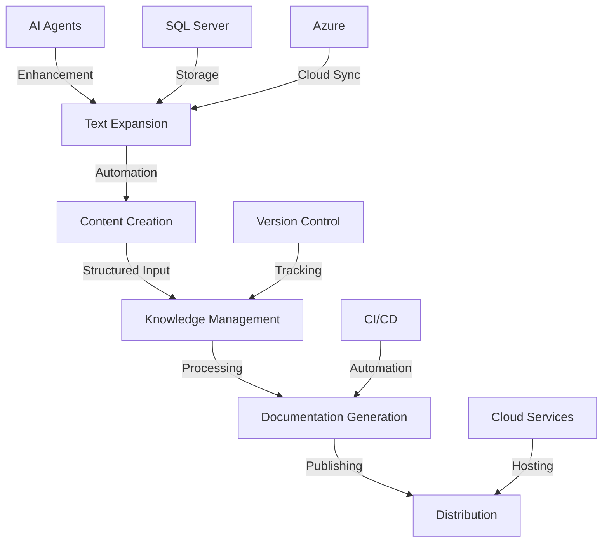
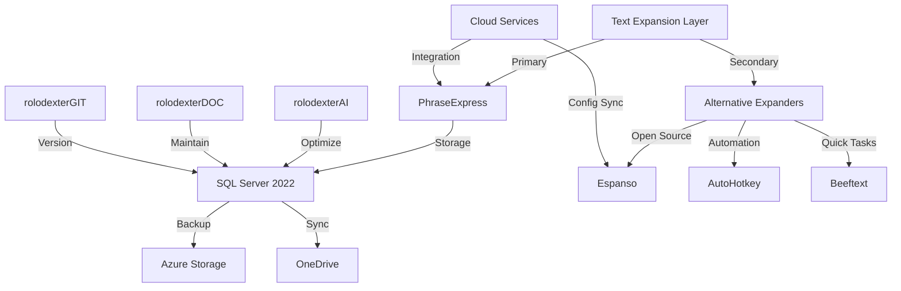
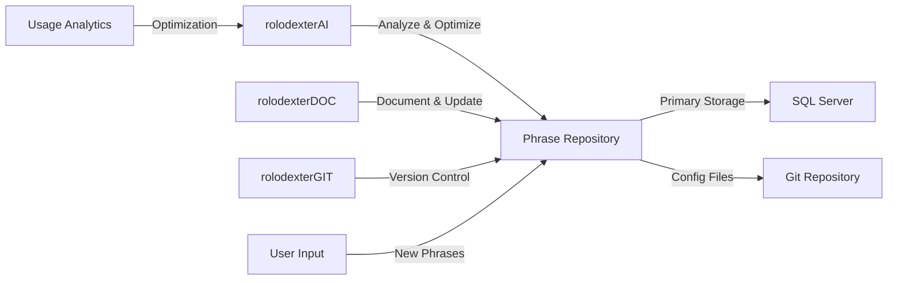
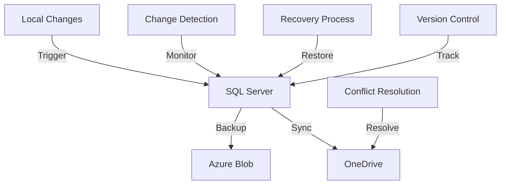
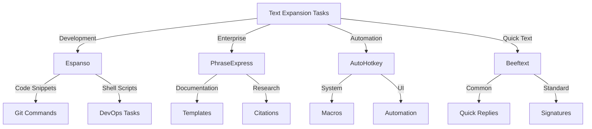
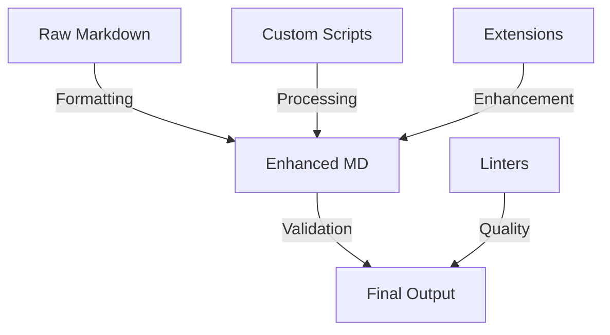
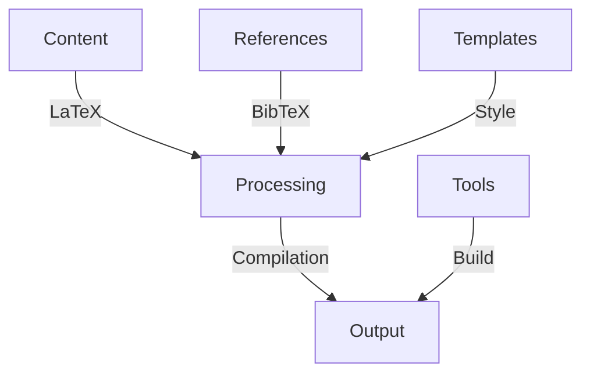
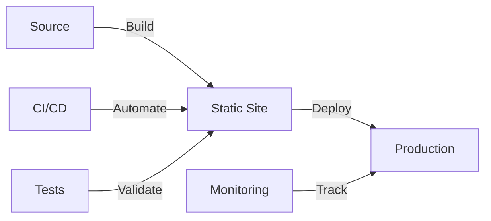
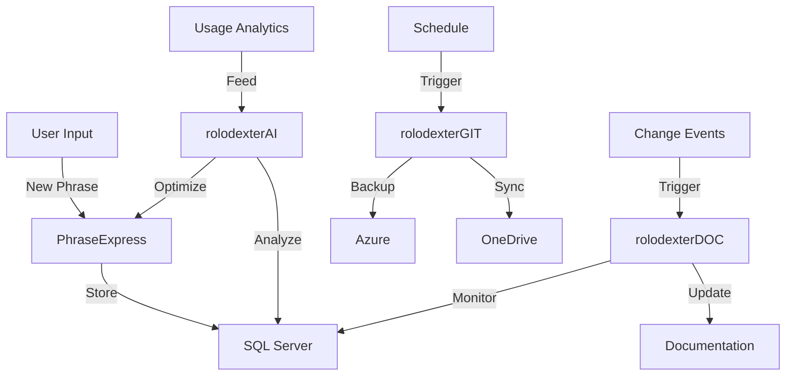

# Documentation Tools

<p align="center">
  <a href="../../README.md">
    
  </a>
</p>

<p align="center">
  <a href="../../README.md">Home</a> | <a href="../../projects/projects.md">Projects</a> | <a href="../../research/research.md">Research</a> | <a href="../../techstack/techstack.md">Tech Stack</a> | <a href="../../contact.md">Contact</a>
</p>

<details>
<summary>Notice</summary>

This repository is protected by copyright and subject to usage restrictions. See the [Copyright Notice](../../COPYRIGHT.md) for details.
</details>

## Documentation Architecture



## Knowledge Management

### [Obsidian](https://obsidian.md/)
> Implementation of graph-based knowledge management using Dataview plugin for SQL-like queries, custom JavaScript for automation, and Python integration for AI-enhanced note processing. Utilizes YAML frontmatter for metadata management.
- Primary knowledge base and note-taking system
- Graph visualization for knowledge connections
- Custom plugins for AI integration
- Version control integration

### [Overleaf](https://www.overleaf.com/)
> LaTeX-based collaborative writing platform with Git backend integration. Implements custom document classes and BibTeX for reference management. Uses CI/CD for automated PDF generation.
- Scientific article writing and collaboration
- LaTeX document preparation
- Research paper templates
- Pre-print formatting

### [GitBook](https://www.gitbook.com/)
> Modern documentation platform with React-based components and GraphQL API. Implements OpenAPI specification for API documentation and custom JavaScript for interactive elements.
- Technical documentation hosting
- API documentation
- Integration guides
- User manuals

## Text Expansion System



### Multi-Expander Architecture
> Enterprise text expansion infrastructure utilizing multiple specialized tools for different use cases, with PhraseExpress as the primary system backed by SQL Server 2022, and complementary open-source solutions for specific workflows.

#### Primary System: PhraseExpress
> Enterprise-grade text expansion system utilizing SQL Server 2022 for phrase storage, Azure Blob Storage for backup, and OneDrive for cross-device synchronization. Implements custom T-SQL procedures for phrase management.

##### Database Architecture
- SQL Server 2022 backend
  - Normalized tables for phrases, categories, and metadata
  - Full-text search indexing for rapid retrieval
  - Transaction logging with change tracking
  - Temporal tables for version history

##### Cloud Integration
- Azure Blob Storage backup
  - Automated daily snapshots
  - Point-in-time recovery
  - Geo-redundant storage
- OneDrive real-time sync
  - Multi-device deployment
  - Conflict resolution
  - Delta synchronization

#### Complementary Systems

##### [Espanso](https://espanso.org)
> Privacy-focused, open-source text expander utilizing YAML configuration and shell integration for developer workflows.
- Cross-platform compatibility
- Shell command integration
- Custom Python/Ruby matches
- Git-based config management

##### [AutoHotkey](https://www.autohotkey.com)
> Scripting-based automation tool for complex text expansion and system automation tasks.
- Custom macro scripting
- System-wide hotkeys
- GUI automation
- Complex text manipulation

##### [Beeftext](https://beeftext.org)
> Lightweight text expander for quick tasks and simple substitutions.
- Portable deployment
- Simple combo shortcuts
- Unicode support
- CSV import/export

#### AI Agent Integration



##### Agent Responsibilities
- **rolodexterAI**
  - Phrase optimization algorithms
  - Usage pattern analysis
  - Suggestion generation
  - Context awareness

- **rolodexterDOC**
  - Documentation maintenance
  - Category organization
  - Metadata management
  - Usage guidelines

- **rolodexterGIT**
  - Version control
  - Change tracking
  - Backup coordination
  - Sync management

#### Integration Points

##### Database Connectivity
```sql
-- Example phrase management stored procedure
CREATE PROCEDURE [dbo].[usp_ManagePhrase]
    @PhraseID uniqueidentifier,
    @Content nvarchar(max),
    @Category nvarchar(100),
    @Tags nvarchar(500),
    @LastModifiedBy nvarchar(50)
AS
BEGIN
    SET NOCOUNT ON;
    
    MERGE INTO Phrases WITH (HOLDLOCK)
    USING (SELECT @PhraseID AS ID) AS Source
    ON Phrases.PhraseID = Source.ID
    WHEN MATCHED THEN
        UPDATE SET 
            Content = @Content,
            Category = @Category,
            Tags = @Tags,
            LastModified = GETUTCDATE(),
            LastModifiedBy = @LastModifiedBy
    WHEN NOT MATCHED THEN
        INSERT (PhraseID, Content, Category, Tags, CreatedBy)
        VALUES (@PhraseID, @Content, @Category, @Tags, @LastModifiedBy);
END
```

##### Cloud Storage Integration


### Use Case Specialization



#### Development Workflows (Espanso)
> Specialized for developer tasks with shell integration and dynamic content generation.

```yaml
# config/espanso.yml
matches:
  - trigger: ":git"
    replace: "{{output}}"
    vars:
      - name: output
        type: shell
        params:
          cmd: "git status"
  
  - trigger: ":docker"
    replace: "{{output}}"
    vars:
      - name: output
        type: choice
        params:
          values:
            - "docker-compose up -d"
            - "docker ps"
            - "docker logs -f"

  - trigger: ":pr"
    replace: |
      ## Description
      {{description}}
      
      ## Changes
      - 
      
      ## Testing
      - [ ] Unit Tests
      - [ ] Integration Tests
    vars:
      - name: description
        type: form
        params:
          layout: "Description: "
```

#### Enterprise Documentation (PhraseExpress)
> Advanced template system with SQL Server backend for enterprise-wide standardization.

```sql
-- Database Schema
CREATE TABLE Phrases (
    PhraseID uniqueidentifier PRIMARY KEY,
    Content nvarchar(max),
    Category nvarchar(100),
    Tags nvarchar(500),
    CreatedBy nvarchar(50),
    CreatedDate datetime2 DEFAULT GETUTCDATE(),
    LastModified datetime2,
    LastModifiedBy nvarchar(50),
    IsActive bit DEFAULT 1,
    Version int DEFAULT 1
);

CREATE TABLE Categories (
    CategoryID int IDENTITY(1,1) PRIMARY KEY,
    Name nvarchar(100) UNIQUE,
    ParentID int FOREIGN KEY REFERENCES Categories(CategoryID),
    Description nvarchar(500),
    IsSystem bit DEFAULT 0
);

CREATE TABLE PhraseHistory (
    HistoryID bigint IDENTITY(1,1) PRIMARY KEY,
    PhraseID uniqueidentifier,
    Content nvarchar(max),
    ModifiedBy nvarchar(50),
    ModifiedDate datetime2 DEFAULT GETUTCDATE(),
    Version int,
    ChangeType char(1), -- 'I'nsert, 'U'pdate, 'D'elete
    FOREIGN KEY (PhraseID) REFERENCES Phrases(PhraseID)
);

-- Advanced Search Procedure
CREATE PROCEDURE [dbo].[usp_SearchPhrases]
    @SearchTerm nvarchar(500),
    @Category nvarchar(100) = NULL,
    @Tags nvarchar(500) = NULL,
    @ModifiedSince datetime2 = NULL
AS
BEGIN
    SET NOCOUNT ON;
    
    SELECT p.PhraseID,
           p.Content,
           p.Category,
           p.Tags,
           p.LastModified,
           p.Version
    FROM Phrases p
    WHERE (@SearchTerm IS NULL OR 
           CONTAINS(p.Content, @SearchTerm) OR
           CONTAINS(p.Tags, @SearchTerm))
    AND (@Category IS NULL OR p.Category = @Category)
    AND (@Tags IS NULL OR p.Tags LIKE '%' + @Tags + '%')
    AND (@ModifiedSince IS NULL OR p.LastModified >= @ModifiedSince)
    AND p.IsActive = 1
    ORDER BY p.LastModified DESC;
END
```

#### System Automation (AutoHotkey)
> Complex system automation and text manipulation scripts.

```autohotkey
; Advanced Text Processing
#NoEnv
SetWorkingDir %A_ScriptDir%

; Quick documentation template
:*:@doc::
(
/**
 * @function: 
 * @param: 
 * @returns: 
 * @description: 
 */
)

; Git workflow automation
:*:@git::
InputBox, commit, Commit Message, Enter commit message:
if ErrorLevel
    return
Run, git add .
Run, git commit -m "%commit%"
Run, git push
return

; Advanced text processing
^!t::
{
    ; Get selected text
    SavedClip := ClipboardAll
    Clipboard := ""
    Send ^c
    ClipWait, 1
    if ErrorLevel
        return
    
    ; Process text
    text := Clipboard
    text := RegExReplace(text, "^\s+|\s+$", "")
    text := RegExReplace(text, "\R\R+", "`n`n")
    
    ; Send processed text
    Clipboard := text
    Send ^v
    Sleep 50
    Clipboard := SavedClip
    return
}
```

#### Quick Text (Beeftext)
> Lightweight text expansion for common patterns.

```json
{
  "combos": [
    {
      "trigger": "#email",
      "text": "contact@rolodexter.ai"
    },
    {
      "trigger": "#sig",
      "text": "Best regards,\nRolodexter Team"
    },
    {
      "trigger": "#date",
      "text": "$[DATE:yyyy-MM-dd]"
    }
  ]
}
```

## Markdown Enhancement



### Custom Tools
> Implementation of custom Node.js and Python scripts for markdown processing. Utilizes AST manipulation for consistent formatting and metadata injection.
- Markdown formatters with custom rulesets
- Header standardization using regex patterns
- Link validators with HTTP status checking
- Meta-documentation generators

### Extensions
> VS Code extension integration using Language Server Protocol (LSP) for real-time markdown enhancement and validation.
- Markdown Preview Enhanced with KaTeX
- Markdown All in One with TOC generation
- markdownlint with custom rules
- Paste Image with cloud storage

## Scientific Writing



### LaTeX Tools
> Implementation of TeX Live 2023 with custom package management and document classes. Utilizes Lua scripts for advanced formatting.
- TeXworks with custom macros
- MiKTeX package management
- BibTeX with custom styles
- Template inheritance system

### Reference Management
> Zotero-based reference management with custom CSL styles and SQL-based data organization.
- Zotero with WebDAV sync
- Mendeley API integration
- Papers with ML tagging
- EndNote XML export

## Documentation Automation



### Tools
> Implementation of static site generators with custom plugins and themes. Utilizes GitHub Actions for automated deployment.
- mdBook with Rust extensions
- Docusaurus React components
- Sphinx with Python docstrings
- MkDocs with Material theme

### Custom Scripts
> Python and Node.js automation scripts with extensive test coverage and error handling.
- Auto-formatting with AST parsing
- Link checking with parallel requests
- TOC generation with depth control
- Cross-reference validation

## Integration & Workflows

### Version Control
> Git-based documentation management with custom hooks and automated quality checks.
- Git LFS for binary assets
- Pre-commit hooks for validation
- Branch protection rules
- Automated merging

### Automation
> CI/CD pipeline implementation using GitHub Actions and custom Docker containers.
- Documentation testing with Jest
- Automated builds with cache
- Link validation with retry logic
- Format checking with custom rules

### AI Agent Integration Patterns

#### rolodexterAI Implementation
```python
class PhraseOptimizer:
    def __init__(self, db_connection):
        self.db = db_connection
        self.nlp = spacy.load('en_core_web_lg')
        
    async def analyze_usage_patterns(self):
        """Analyzes phrase usage patterns and suggests optimizations."""
        query = """
        SELECT PhraseID, Content, UsageCount, LastUsed
        FROM Phrases
        WHERE IsActive = 1
        AND LastAnalyzed < DATEADD(day, -7, GETUTCDATE())
        """
        phrases = await self.db.fetch_all(query)
        
        for phrase in phrases:
            doc = self.nlp(phrase.Content)
            suggestions = self.generate_suggestions(doc)
            await self.update_suggestions(phrase.PhraseID, suggestions)
    
    def generate_suggestions(self, doc):
        """Generates optimization suggestions using NLP."""
        suggestions = []
        # Analyze phrase structure
        if len(doc) > 100:
            suggestions.append({
                'type': 'length',
                'suggestion': 'Consider breaking into smaller phrases'
            })
        
        # Check for common patterns
        patterns = self.identify_patterns(doc)
        if patterns:
            suggestions.append({
                'type': 'pattern',
                'suggestion': f'Similar patterns found: {patterns}'
            })
            
        return suggestions

    async def update_suggestions(self, phrase_id, suggestions):
        """Updates phrase suggestions in the database."""
        query = """
        UPDATE Phrases 
        SET Suggestions = @suggestions,
            LastAnalyzed = GETUTCDATE()
        WHERE PhraseID = @phrase_id
        """
        await self.db.execute(query, {
            'suggestions': json.dumps(suggestions),
            'phrase_id': phrase_id
        })
```

#### rolodexterDOC Integration
```python
class DocumentationManager:
    def __init__(self, db_connection, git_repo):
        self.db = db_connection
        self.repo = git_repo
        
    async def update_documentation(self):
        """Updates documentation based on phrase changes."""
        changes = await self.get_recent_changes()
        for change in changes:
            await self.process_change(change)
            await self.update_git_repo(change)
    
    async def get_recent_changes(self):
        """Retrieves recent phrase changes."""
        query = """
        SELECT ph.PhraseID,
               ph.Content,
               ph.ModifiedBy,
               ph.ModifiedDate,
               ph.Version,
               ph.ChangeType
        FROM PhraseHistory ph
        WHERE ph.ModifiedDate > DATEADD(hour, -24, GETUTCDATE())
        ORDER BY ph.ModifiedDate DESC
        """
        return await self.db.fetch_all(query)
    
    async def process_change(self, change):
        """Updates documentation for a phrase change."""
        if change.ChangeType == 'I':
            await self.document_new_phrase(change)
        elif change.ChangeType == 'U':
            await self.document_update(change)
        elif change.ChangeType == 'D':
            await self.document_deletion(change)
```

#### rolodexterGIT Integration
```python
class VersionController:
    def __init__(self, db_connection, backup_service):
        self.db = db_connection
        self.backup = backup_service
        
    async def sync_changes(self):
        """Synchronizes changes across systems."""
        await self.backup_to_azure()
        await self.sync_to_onedrive()
        await self.update_git_repo()
    
    async def backup_to_azure(self):
        """Handles Azure backup process."""
        timestamp = datetime.utcnow().strftime('%Y%m%d_%H%M%S')
        backup_file = f'phrases_backup_{timestamp}.bak'
        
        # Create backup
        query = """
        BACKUP DATABASE PhraseDB
        TO DISK = @backup_file
        WITH FORMAT, COMPRESSION
        """
        await self.db.execute(query, {'backup_file': backup_file})
        
        # Upload to Azure
        await self.backup.upload_blob(
            container='phrase-backups',
            blob_name=backup_file,
            file_path=backup_file
        )
    
    async def sync_to_onedrive(self):
        """Syncs changes to OneDrive."""
        changes = await self.get_pending_changes()
        for change in changes:
            await self.upload_to_onedrive(change)
            await self.mark_synced(change.PhraseID)
```

### Integration Workflows



---

Last Updated: March 2025  
Contact: docs@rolodexter.ai 