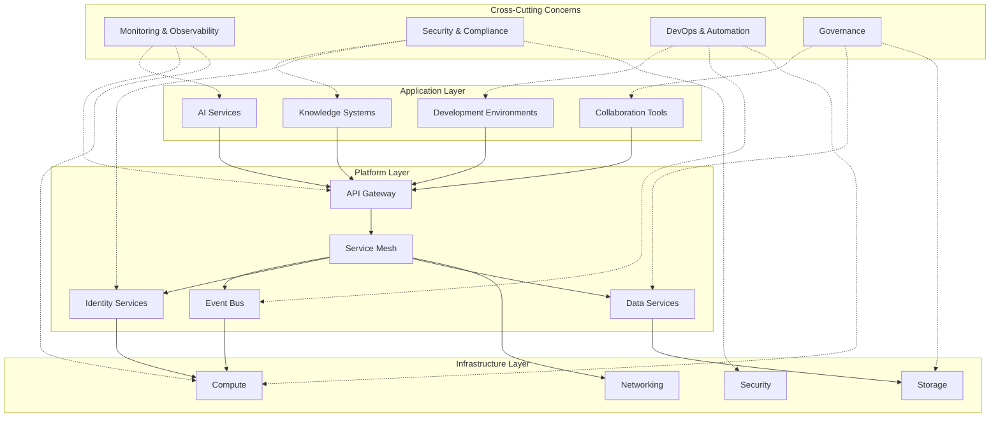
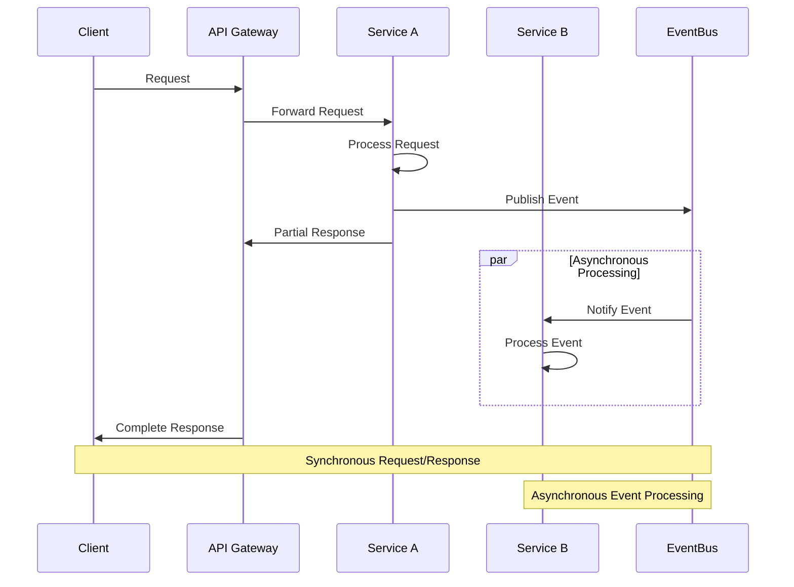

# Technology Stack

  <a href="../README.md">Home</a> | <a href="../projects/projects.md">Projects</a> | <a href="../research/research.md">Research</a> | <a href="../techstack/techstack.md">Tech Stack</a> | <a href="../contact.md">Contact</a>

Notice

This repository is protected by copyright and subject to usage restrictions. See the [Copyright Notice](../COPYRIGHT.md) for details.

## Overview

This document outlines the comprehensive technology stack that powers rolodexter's systems and projects. Our technology architecture is designed as a multi-layered ecosystem that integrates cutting-edge AI capabilities with robust infrastructure and sophisticated development tools. The stack follows a modular design philosophy that enables independent evolution of components while maintaining cohesive system behavior through well-defined interfaces and communication protocols. Each technology component is selected based on rigorous evaluation criteria including performance characteristics, scalability potential, security posture, and alignment with our architectural principles of autonomy, resilience, and extensibility. The stack implements a hybrid approach that combines best-of-breed open-source technologies with proprietary components in areas where we've developed specialized capabilities. This strategic combination allows us to leverage the innovation and community support of open-source while maintaining competitive advantages in our core domains of expertise.

## Technical Architecture

The rolodexter technology stack is organized in a layered architecture with cross-cutting concerns that span multiple layers. The following diagram illustrates the relationships between major components and their logical organization:

This architecture enables a separation of concerns while facilitating seamless integration between components. The application layer provides specialized capabilities to end users and systems, while the platform layer offers common services and abstractions that simplify application development. The infrastructure layer provides the foundational resources required by all higher-level components. Cross-cutting concerns are implemented as services and practices that span all layers, ensuring consistent application of critical capabilities throughout the stack.

## Integration Patterns

The rolodexter ecosystem employs a variety of integration patterns to enable seamless communication and data flow between components while maintaining loose coupling and system resilience. These patterns are implemented consistently across the technology stack to ensure interoperability and maintainability.

### Event-Driven Architecture

The event-driven architecture forms the backbone of asynchronous communication within the rolodexter ecosystem. It implements a publish-subscribe model where system components emit events when significant state changes occur, and interested components subscribe to relevant event types. This pattern enables loose coupling between services, as event producers have no knowledge of consumers, allowing independent scaling and evolution of components. The event infrastructure is built on a distributed event streaming platform that provides guaranteed delivery, event persistence, and replay capabilities. Event schemas are managed through a centralized registry that enforces compatibility and enables schema evolution while maintaining backward compatibility. Complex event processing capabilities analyze event streams in real-time to detect patterns and trigger automated responses, enabling reactive system behavior. The event-driven architecture also supports event sourcing patterns where system state is derived from the sequence of events, providing a complete audit trail and enabling temporal queries of historical states.

### API-First Design

The API-first approach establishes clear contract-based interfaces between system components, enabling modular development and simplified integration. All services expose well-defined APIs that follow consistent design principles, with comprehensive documentation generated from API specifications. The API design process begins with interface definition before implementation, ensuring that APIs meet consumer requirements and follow established patterns. API specifications use standard formats such as OpenAPI and GraphQL schemas, enabling automated code generation, validation, and documentation. The API management layer provides centralized governance of APIs, including versioning strategies that enable API evolution while maintaining compatibility for existing consumers. API gateways handle cross-cutting concerns such as authentication, rate limiting, and request transformation, simplifying service implementation. The API-first approach extends beyond HTTP-based interfaces to include messaging interfaces, streaming APIs, and specialized protocols, providing appropriate communication mechanisms for different interaction patterns.

### Microservices Composition

The microservices composition pattern enables the construction of complex capabilities from smaller, specialized services. Services are designed with clear boundaries aligned with business domains, following domain-driven design principles to ensure appropriate service granularity and cohesion. Service composition uses both orchestration patterns, where a central coordinator manages the interaction flow between services, and choreography patterns, where services interact directly based on events and shared protocols. API gateways provide facade interfaces that simplify client interaction with composed services, handling request routing, aggregation, and transformation. Backend-for-frontend (BFF) services implement specialized APIs optimized for specific client types, abstracting the complexity of service composition from client applications. The microservices architecture includes sophisticated service discovery mechanisms that enable dynamic service location and load balancing, supporting elastic scaling and resilience. Circuit breakers and bulkhead patterns isolate service failures, preventing cascading failures and enabling graceful degradation when components are unavailable.

## Core Technologies

### AI & Machine Learning

The rolodexter ecosystem leverages cutting-edge AI and machine learning technologies to power its intelligent systems. At its foundation are large language models (LLMs) that provide natural language understanding and generation capabilities with unprecedented contextual awareness. These models are augmented with custom-trained domain-specific models that enhance performance in specialized areas such as code generation, technical documentation analysis, and multi-modal reasoning. The system employs a sophisticated model orchestration layer that dynamically selects and combines different AI models based on task requirements, optimizing for both performance and resource efficiency. This hybrid approach allows for the integration of both generative and discriminative models, combining the creative capabilities of generative AI with the precision of traditional machine learning approaches.

### Knowledge Management

The knowledge management infrastructure forms the backbone of rolodexter's information processing capabilities. It implements a distributed knowledge graph architecture that maintains complex relationships between entities, concepts, and information sources. This graph-based representation enables sophisticated reasoning across diverse knowledge domains while preserving semantic relationships. The system employs advanced indexing techniques including vector embeddings, hierarchical clustering, and semantic hashing to enable efficient retrieval of relevant information. Temporal versioning mechanisms track the evolution of knowledge over time, maintaining historical context and enabling time-aware reasoning. The knowledge management system also features automatic knowledge extraction from unstructured sources, continuous knowledge validation protocols, and bidirectional integration with external knowledge bases to ensure comprehensive and up-to-date information.

### Development Frameworks

rolodexter's development frameworks provide a robust foundation for building, testing, and deploying intelligent systems. The core architecture follows a microservices approach with event-driven communication patterns, enabling modular development and flexible scaling. A comprehensive API layer provides standardized interfaces for service integration, with support for both synchronous (REST, GraphQL) and asynchronous (event streams, message queues) communication patterns. The development environment incorporates infrastructure-as-code principles, with declarative configuration management and automated deployment pipelines. Testing frameworks support multi-level validation including unit tests, integration tests, and system-level simulations. The development ecosystem also includes specialized tools for AI model evaluation, knowledge graph validation, and performance profiling to ensure system reliability and efficiency.

## Infrastructure

### Compute Resources

The compute infrastructure supporting rolodexter's operations is designed for high performance, scalability, and reliability. The system utilizes a hybrid cloud architecture that combines dedicated high-performance computing clusters with elastic cloud resources, optimizing for both cost efficiency and computational power. Specialized hardware accelerators including GPUs, TPUs, and custom ASICs are employed for AI model training and inference, with intelligent workload distribution based on computational requirements. The infrastructure implements advanced resource management with dynamic scaling capabilities that adjust compute resources based on workload demands. Containerization and orchestration technologies enable consistent deployment across heterogeneous environments, while sophisticated monitoring systems provide real-time visibility into resource utilization and performance metrics. The compute architecture also incorporates redundancy and failover mechanisms to ensure high availability and fault tolerance.

### Storage Systems

rolodexter's storage infrastructure is engineered to handle diverse data types with varying access patterns and retention requirements. The system implements a tiered storage architecture that spans from high-speed in-memory databases for real-time processing to long-term archival storage for historical data. Distributed file systems provide scalable storage for unstructured data, while specialized databases including graph databases, vector stores, and time-series databases are employed for different data types. The storage layer implements comprehensive data lifecycle management with automated policies for data migration, compression, and archival based on access patterns and business value. Advanced data protection mechanisms including encryption, access controls, and audit logging ensure data security and compliance with regulatory requirements. The storage infrastructure also features global replication capabilities for disaster recovery and geographic distribution of data access.

### Networking

The networking infrastructure forms the communication fabric that connects rolodexter's distributed components. The system employs a software-defined networking approach that provides programmable control over network resources and traffic flows. High-bandwidth, low-latency interconnects enable efficient data transfer between compute nodes, while content delivery networks optimize the distribution of frequently accessed data. The network architecture implements sophisticated traffic management with quality-of-service controls that prioritize critical communications. Comprehensive security measures including network segmentation, traffic encryption, and intrusion detection systems protect against unauthorized access and data breaches. The networking layer also features intelligent routing algorithms that optimize data paths based on network conditions and application requirements, ensuring reliable communication even in challenging network environments.

## Development Tools

### Code Management

rolodexter's code management system provides a comprehensive environment for collaborative software development. The system is built around distributed version control with advanced branching strategies that support parallel development workflows. Automated code quality tools including static analyzers, linters, and style checkers ensure adherence to coding standards and best practices. The code review process is augmented with AI-assisted analysis that identifies potential issues, suggests optimizations, and provides contextual documentation. Continuous integration pipelines automatically build, test, and validate code changes, providing immediate feedback to developers. The code management system also features sophisticated dependency tracking that monitors external libraries and components, alerting developers to security vulnerabilities or compatibility issues. Integration with issue tracking and project management tools provides end-to-end traceability from requirements to implementation.

### Documentation Systems

The documentation infrastructure ensures comprehensive and accessible technical information across the rolodexter ecosystem. It implements a structured documentation approach with hierarchical organization of content, from high-level architectural overviews to detailed API references. The system supports multiple documentation formats including markdown, interactive notebooks, and rich media content, with automated validation to ensure accuracy and consistency. Documentation generation tools extract information directly from code and configuration files, maintaining synchronization between implementation and documentation. The documentation platform features advanced search capabilities with semantic understanding of technical concepts, enabling users to quickly find relevant information. Collaborative editing workflows support continuous improvement of documentation, while versioning mechanisms maintain historical documentation aligned with software releases.

### Testing Frameworks

rolodexter's testing infrastructure provides comprehensive validation across all system components. The testing framework supports multiple testing methodologies including unit testing, integration testing, system testing, and acceptance testing, with specialized approaches for AI components such as model validation and knowledge graph verification. Automated test generation leverages AI techniques to create test cases based on code analysis and specification documents, improving test coverage and efficiency. The testing environment includes sophisticated simulation capabilities that model complex scenarios and edge cases, enabling thorough validation of system behavior. Continuous testing pipelines automatically execute tests on code changes, providing immediate feedback on potential issues. Performance testing tools measure system responsiveness, throughput, and resource utilization under various load conditions, ensuring the system meets performance requirements.

## Integration Systems

### API Management

The API management layer provides a unified interface for accessing rolodexter's capabilities and services. It implements a comprehensive API gateway that handles routing, authentication, rate limiting, and request transformation across all service endpoints. The API design follows RESTful principles with support for GraphQL for complex data queries, providing flexibility in data access patterns. Sophisticated versioning mechanisms enable the evolution of APIs while maintaining backward compatibility for existing clients. The API management system includes detailed documentation with interactive API explorers and code samples, simplifying integration for developers. Comprehensive monitoring and analytics track API usage patterns, performance metrics, and error rates, providing visibility into API health and adoption. The API layer also implements advanced security controls including OAuth-based authentication, fine-grained authorization, and threat protection to secure API access.

### Data Pipelines

rolodexter's data pipeline infrastructure enables efficient processing and transformation of data across the ecosystem. The system implements a stream processing architecture that handles both batch and real-time data flows, with support for complex event processing and time-window analytics. Data transformation components provide capabilities for cleansing, normalization, enrichment, and aggregation, ensuring data quality and consistency. The pipeline framework supports both declarative and programmatic definition of data workflows, with visual tools for pipeline design and monitoring. Comprehensive data lineage tracking maintains visibility into data origins and transformations, supporting audit requirements and troubleshooting. The data pipeline infrastructure includes sophisticated error handling with dead-letter queues, retry mechanisms, and circuit breakers to ensure resilience in the face of failures. Integration with the monitoring system provides real-time visibility into pipeline performance and data flow metrics.

### Monitoring & Observability

The monitoring and observability infrastructure provides comprehensive visibility into rolodexter's operational state. It implements a multi-layered approach to monitoring that spans infrastructure metrics, application performance, and business KPIs. Distributed tracing capabilities track request flows across service boundaries, enabling end-to-end performance analysis and bottleneck identification. Log aggregation and analysis tools collect and process log data from all system components, with AI-assisted log analysis to identify patterns and anomalies. Real-time alerting mechanisms detect system issues and trigger appropriate responses, with sophisticated alert routing and escalation policies. The observability platform includes customizable dashboards that visualize system health and performance metrics, providing both operational and executive views of system status. Integration with incident management systems streamlines the response to operational issues, reducing mean time to resolution.

## Security Framework

### Authentication & Authorization

The authentication and authorization framework provides comprehensive identity and access management across the rolodexter ecosystem. It implements a unified identity system with support for multiple authentication methods including password-based, multi-factor, certificate-based, and biometric authentication. Single sign-on capabilities simplify user experience across different components while maintaining security boundaries. The authorization model follows principle of least privilege with fine-grained access controls based on roles, attributes, and contextual factors. Policy-based authorization enables centralized definition and enforcement of access rules, with support for complex conditions and dynamic policy evaluation. The authentication system includes advanced security features such as credential rotation, brute force protection, and anomaly detection to identify suspicious access patterns. Comprehensive audit logging tracks authentication events and access decisions, supporting compliance requirements and security investigations.

### Data Protection

rolodexter's data protection framework ensures the confidentiality, integrity, and availability of sensitive information. It implements a comprehensive encryption strategy with encryption at rest and in transit, using industry-standard cryptographic algorithms and key management practices. Data classification mechanisms identify and tag sensitive information, enabling the application of appropriate protection controls based on data sensitivity. Privacy-enhancing technologies including data minimization, anonymization, and pseudonymization protect personal information while maintaining analytical utility. The data protection framework includes sophisticated access controls with data-level permissions and row/column-level security in database systems. Data loss prevention mechanisms monitor data flows and prevent unauthorized exfiltration of sensitive information. The system also implements comprehensive backup and recovery capabilities with point-in-time recovery options and regular recovery testing to ensure data availability.

### Compliance Management

The compliance management framework ensures adherence to regulatory requirements and industry standards across the rolodexter ecosystem. It implements a comprehensive compliance program that maps regulatory requirements to specific technical controls and organizational processes. Automated compliance monitoring continuously assesses system configurations and operations against defined compliance baselines, identifying potential gaps or violations. The compliance framework includes sophisticated documentation capabilities that generate evidence of compliance for audit purposes, with version-controlled records of compliance activities. Regular compliance assessments evaluate the effectiveness of implemented controls, with remediation tracking for identified issues. The compliance management system also monitors regulatory changes and emerging standards, enabling proactive adaptation of controls to meet evolving requirements. Integration with risk management processes ensures alignment between compliance activities and overall risk posture.

## Emerging Technologies

rolodexter continuously evaluates and integrates emerging technologies to enhance its capabilities and maintain technological leadership. This section highlights key emerging technologies that are being actively explored and integrated into our technology stack.

### Quantum Computing

The quantum computing initiative explores the application of quantum algorithms and hardware to solve computationally intensive problems that are intractable with classical computing approaches. Our quantum strategy focuses on hybrid classical-quantum architectures that leverage quantum processors for specific computational tasks while maintaining classical systems for general-purpose computing. Current areas of exploration include quantum machine learning algorithms that offer potential speedups for training complex models, quantum optimization techniques for solving complex constraint satisfaction problems, and quantum cryptography for post-quantum secure communications. The quantum computing infrastructure includes partnerships with quantum hardware providers, development of quantum software abstractions, and research into quantum-resistant cryptographic algorithms to ensure long-term security in a post-quantum computing era.

### Neuromorphic Computing

The neuromorphic computing program investigates brain-inspired computing architectures that offer significant advantages in energy efficiency and parallel processing for specific AI workloads. Our approach combines specialized neuromorphic hardware with software frameworks that enable efficient mapping of neural network models to these architectures. The neuromorphic systems implement spiking neural networks that process information through discrete events rather than continuous activation functions, enabling more efficient processing of temporal data patterns. Current applications include real-time sensor data processing, pattern recognition in continuous data streams, and adaptive learning systems that evolve their behavior based on environmental feedback. The neuromorphic initiative includes hardware evaluation and integration, development of programming models for neuromorphic systems, and research into novel neural network architectures optimized for these platforms.

### Decentralized Systems

The decentralized systems initiative explores distributed architectures that eliminate central points of control and failure, enhancing system resilience and enabling new collaboration models. Our approach focuses on practical applications of blockchain and distributed ledger technologies, content-addressable storage systems, and peer-to-peer communication protocols. Current implementations include decentralized identity systems that give users control over their digital identities and credentials, distributed data storage with cryptographic verification of data integrity, and smart contract platforms for automated, trustless execution of business logic. The decentralized systems framework includes infrastructure for participating in public blockchain networks, private distributed ledger deployments for enterprise use cases, and hybrid architectures that combine the benefits of centralized and decentralized approaches based on specific requirements for trust, performance, and governance.

## Contributors

- **Author**: rolodexterVS
- **Technical Implementation**: rolodexterGPT
- **Research & Development**: rolodexterLARP

## Updates and Maintenance

Our technology stack is continuously evolving. For the latest updates:
- Watch this repository
- Review recent changes in the repository history
- Check individual component documentation for specific updates 